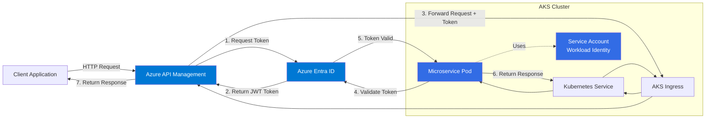

# AKS RBAC with Azure Entra ID Authentication - Complete Implementation Guide

## Table of Contents
1. [Overview](#overview)
2. [Architecture](#architecture)
3. [Prerequisites](#prerequisites)
4. [Step 1: Azure Entra ID Setup](#step-1-azure-entra-id-setup)
5. [Step 2: AKS Cluster Configuration](#step-2-aks-cluster-configuration)
6. [Step 3: Kubernetes RBAC Configuration](#step-3-kubernetes-rbac-configuration)
7. [Step 4: Microservice Deployment](#step-4-microservice-deployment)
8. [Step 5: APIM Configuration](#step-5-apim-configuration)
9. [Step 6: Testing & Validation](#step-6-testing--validation)
10. [Troubleshooting](#troubleshooting)

---

## Overview

This guide provides step-by-step instructions for implementing Role-Based Access Control (RBAC) with an Azure Kubernetes Service (AKS) cluster using Azure Entra ID (formerly Azure AD) for authentication. The implementation demonstrates secure communication between Azure API Management (APIM) and a microservice running in an AKS pod using **Azure Workload Identity**.

### What You'll Build

- **APIM** uses its managed identity to obtain OAuth 2.0 tokens from Azure Entra ID
- **APIM** forwards the token to the AKS microservice in the Authorization header
- **AKS Microservice** validates the token using workload identity federation with Entra ID
- **End-to-end authentication** without storing credentials in the application

### Key Technologies

- **Azure Kubernetes Service (AKS)** - Container orchestration platform
- **Azure Entra ID** - Identity and access management
- **Azure Workload Identity** - Federated identity for Kubernetes workloads
- **Azure API Management (APIM)** - API gateway
- **.NET Core 8.0** - Microservice implementation
- **Kubernetes RBAC** - Fine-grained access control

---

## Architecture



### Authentication Flow

1. **Client → APIM**: Client sends request to APIM endpoint
2. **APIM → Entra ID**: APIM uses its system-assigned managed identity to request an access token
3. **Entra ID → APIM**: Entra ID validates the managed identity and returns a JWT token
4. **APIM → AKS**: APIM forwards the request to the AKS microservice with the token in the Authorization header
5. **Microservice → Entra ID**: Microservice validates the token using workload identity federation
6. **Microservice → Client**: Upon successful validation, microservice processes the request and returns the response

---

## Prerequisites

### Azure Resources
- [ ] Active Azure subscription with appropriate permissions
- [ ] Existing AKS cluster (public cluster)
- [ ] Azure CLI installed and configured
- [ ] kubectl installed and configured
- [ ] Docker installed (for building container images)

### Required Permissions
- [ ] **Azure Entra ID**: Application Administrator or Global Administrator role
- [ ] **Azure Subscription**: Contributor or Owner role
- [ ] **AKS Cluster**: Azure Kubernetes Service RBAC Admin role

### Tools Installation

```bash
# Install Azure CLI (macOS)
brew update && brew install azure-cli

# Install kubectl
az aks install-cli

# Install Docker Desktop
# Download from: https://www.docker.com/products/docker-desktop

# Verify installations
az --version
kubectl version --client
docker --version
```

### Environment Variables

Create a file to store your configuration values:

```bash
# config/environment.env
export AZURE_SUBSCRIPTION_ID="your-subscription-id"
export RESOURCE_GROUP="your-aks-resource-group"
export AKS_CLUSTER_NAME="your-aks-cluster-name"
export LOCATION="australiaeast"  # or your preferred region
export ACR_NAME="your-acr-name"
export APIM_NAME="your-apim-name"
export APIM_RESOURCE_GROUP="your-apim-resource-group"
export NAMESPACE="hello-world"
export SERVICE_ACCOUNT_NAME="hello-world-sa"
export APP_NAME="hello-world-service"
```

---

## Step 1: Azure Entra ID Setup

### 1.1 Login to Azure

```bash
# Login to Azure
az login

# Set your subscription
az account set --subscription "${AZURE_SUBSCRIPTION_ID}"

# Verify current subscription
az account show --output table
```

### 1.2 Create App Registration for Microservice (Resource/API)

This app registration represents your microservice as a protected resource.

```bash
# Create app registration for the microservice
MICROSERVICE_APP_NAME="aks-hello-world-api"

MICROSERVICE_APP_ID=$(az ad app create \
  --display-name "${MICROSERVICE_APP_NAME}" \
  --sign-in-audience AzureADMyOrg \
  --query appId \
  --output tsv)

echo "Microservice App ID: ${MICROSERVICE_APP_ID}"

# Create service principal for the app
az ad sp create --id "${MICROSERVICE_APP_ID}"
```

### 1.3 Expose API Scope

The microservice needs to expose an API scope that APIM can request access to.

```bash
# Generate a new GUID for the scope
SCOPE_ID=$(uuidgen)

# Create the API scope
cat > api-scope.json <<EOF
{
  "oauth2PermissionScopes": [
    {
      "adminConsentDescription": "Allow APIM to access the Hello World API",
      "adminConsentDisplayName": "Access Hello World API",
      "id": "${SCOPE_ID}",
      "isEnabled": true,
      "type": "Admin",
      "userConsentDescription": "Allow APIM to access the Hello World API on your behalf",
      "userConsentDisplayName": "Access Hello World API",
      "value": "API.Access"
    }
  ]
}
EOF

# Update the app to expose the API
az ad app update \
  --id "${MICROSERVICE_APP_ID}" \
  --identifier-uris "api://${MICROSERVICE_APP_ID}"

# Note: You may need to add the scope via Azure Portal
# Go to: Azure Portal > Entra ID > App Registrations > Your App > Expose an API
```

### 1.4 Create App Registration for APIM (Client Application)

This app registration represents APIM as a client that will access the microservice.

```bash
# Create app registration for APIM
APIM_APP_NAME="apim-client-app"

APIM_APP_ID=$(az ad app create \
  --display-name "${APIM_APP_NAME}" \
  --sign-in-audience AzureADMyOrg \
  --query appId \
  --output tsv)

echo "APIM App ID: ${APIM_APP_ID}"

# Create service principal for APIM app
az ad sp create --id "${APIM_APP_ID}"
```

### 1.5 Grant API Permissions

Grant the APIM app permission to access the microservice API.

```bash
# Get the service principal object ID for the microservice
MICROSERVICE_SP_ID=$(az ad sp show --id "${MICROSERVICE_APP_ID}" --query id --output tsv)

# Add API permission (this needs to be done via Portal for delegated permissions)
# Go to: Azure Portal > Entra ID > App Registrations > APIM App > API Permissions
# Click "Add a permission" > "My APIs" > Select your microservice app
# Select the "API.Access" permission > Click "Add permissions"
# Click "Grant admin consent"
```

> [!IMPORTANT]
> **Manual Step Required**: You must grant admin consent for the API permissions through the Azure Portal:
> 1. Navigate to **Azure Portal** > **Entra ID** > **App Registrations**
> 2. Select the **APIM app registration**
> 3. Go to **API Permissions** > **Add a permission** > **My APIs**
> 4. Select your **microservice app**
> 5. Select the **API.Access** permission
> 6. Click **Grant admin consent for [Your Tenant]**

### 1.6 Get Tenant Information

```bash
# Get your tenant ID
TENANT_ID=$(az account show --query tenantId --output tsv)
echo "Tenant ID: ${TENANT_ID}"

# Save configuration
cat > config/entra-id-config.env <<EOF
export TENANT_ID="${TENANT_ID}"
export MICROSERVICE_APP_ID="${MICROSERVICE_APP_ID}"
export APIM_APP_ID="${APIM_APP_ID}"
EOF

echo "✅ Azure Entra ID setup complete!"
echo "Configuration saved to config/entra-id-config.env"
```

---

## Step 2: AKS Cluster Configuration

### 2.1 Connect to Your AKS Cluster

```bash
# Get AKS credentials
az aks get-credentials \
  --resource-group "${RESOURCE_GROUP}" \
  --name "${AKS_CLUSTER_NAME}" \
  --overwrite-existing

# Verify connection
kubectl cluster-info
kubectl get nodes
```

### 2.2 Enable Workload Identity on AKS

Check if workload identity is already enabled on your cluster:

```bash
# Check if workload identity is enabled
az aks show \
  --resource-group "${RESOURCE_GROUP}" \
  --name "${AKS_CLUSTER_NAME}" \
  --query "oidcIssuerProfile.enabled" \
  --output tsv

az aks show \
  --resource-group "${RESOURCE_GROUP}" \
  --name "${AKS_CLUSTER_NAME}" \
  --query "securityProfile.workloadIdentity.enabled" \
  --output tsv
```

If not enabled, enable workload identity:

```bash
# Enable OIDC issuer
az aks update \
  --resource-group "${RESOURCE_GROUP}" \
  --name "${AKS_CLUSTER_NAME}" \
  --enable-oidc-issuer

# Enable workload identity
az aks update \
  --resource-group "${RESOURCE_GROUP}" \
  --name "${AKS_CLUSTER_NAME}" \
  --enable-workload-identity
```

> [!NOTE]
> Enabling workload identity may take several minutes. The cluster will remain available during this update.

### 2.3 Get OIDC Issuer URL

```bash
# Get the OIDC issuer URL
OIDC_ISSUER_URL=$(az aks show \
  --resource-group "${RESOURCE_GROUP}" \
  --name "${AKS_CLUSTER_NAME}" \
  --query "oidcIssuerProfile.issuerUrl" \
  --output tsv)

echo "OIDC Issuer URL: ${OIDC_ISSUER_URL}"

# Save to config
echo "export OIDC_ISSUER_URL=\"${OIDC_ISSUER_URL}\"" >> config/entra-id-config.env
```

### 2.4 Verify RBAC is Enabled

```bash
# Check if RBAC is enabled
az aks show \
  --resource-group "${RESOURCE_GROUP}" \
  --name "${AKS_CLUSTER_NAME}" \
  --query "enableRbac" \
  --output tsv
```

If RBAC is not enabled, you'll need to enable it (this may require cluster recreation in some cases).

### 2.5 Setup Azure Container Registry (ACR)

```bash
# Check if ACR exists
ACR_EXISTS=$(az acr show --name "${ACR_NAME}" --query "id" --output tsv 2>/dev/null)

if [ -z "$ACR_EXISTS" ]; then
  echo "Creating Azure Container Registry..."
  az acr create \
    --resource-group "${RESOURCE_GROUP}" \
    --name "${ACR_NAME}" \
    --sku Basic
else
  echo "ACR already exists: ${ACR_NAME}"
fi

# Attach ACR to AKS cluster
az aks update \
  --resource-group "${RESOURCE_GROUP}" \
  --name "${AKS_CLUSTER_NAME}" \
  --attach-acr "${ACR_NAME}"

echo "✅ AKS cluster configuration complete!"
```

---

## Step 3: Kubernetes RBAC Configuration

### 3.1 Create Namespace

```bash
# Create namespace for the application
kubectl create namespace "${NAMESPACE}" --dry-run=client -o yaml | kubectl apply -f -

# Verify namespace creation
kubectl get namespace "${NAMESPACE}"
```

### 3.2 Create Service Account with Workload Identity

Create a Kubernetes service account that will be linked to the Azure Entra ID app registration.

```bash
# Apply the RBAC configuration
kubectl apply -f k8s-manifests/rbac.yaml

# Verify service account creation
kubectl get serviceaccount -n "${NAMESPACE}"
```

The `rbac.yaml` file (which we'll create later) includes:
- Service account with workload identity annotations
- Role for accessing Kubernetes resources
- RoleBinding to associate the role with the service account

### 3.3 Create Federated Identity Credential

Link the Kubernetes service account to the Azure Entra ID app registration:

```bash
# Create federated identity credential
az identity federated-credential create \
  --name "aks-hello-world-federated-identity" \
  --identity-name "${MICROSERVICE_APP_NAME}" \
  --resource-group "${RESOURCE_GROUP}" \
  --issuer "${OIDC_ISSUER_URL}" \
  --subject "system:serviceaccount:${NAMESPACE}:${SERVICE_ACCOUNT_NAME}" \
  --audience "api://AzureADTokenExchange"
```

> [!NOTE]
> If you don't have a managed identity created for the microservice, you'll need to create one first:
> ```bash
> az identity create \
>   --name "${MICROSERVICE_APP_NAME}" \
>   --resource-group "${RESOURCE_GROUP}" \
>   --location "${LOCATION}"
> ```

**Alternative approach using App Registration:**

```bash
# Create federated credential for the app registration
CREDENTIAL_NAME="kubernetes-federated-credential"

az ad app federated-credential create \
  --id "${MICROSERVICE_APP_ID}" \
  --parameters "{
    \"name\": \"${CREDENTIAL_NAME}\",
    \"issuer\": \"${OIDC_ISSUER_URL}\",
    \"subject\": \"system:serviceaccount:${NAMESPACE}:${SERVICE_ACCOUNT_NAME}\",
    \"audiences\": [\"api://AzureADTokenExchange\"]
  }"

# Verify the federated credential
az ad app federated-credential list --id "${MICROSERVICE_APP_ID}"
```

### 3.4 Verify Configuration

```bash
# Check service account annotations
kubectl describe serviceaccount "${SERVICE_ACCOUNT_NAME}" -n "${NAMESPACE}"

# Expected output should include:
# Annotations: azure.workload.identity/client-id: <MICROSERVICE_APP_ID>
# Labels: azure.workload.identity/use: "true"

echo "✅ Kubernetes RBAC configuration complete!"
```

---

## Step 4: Microservice Deployment

### 4.1 Build the Docker Image

```bash
# Navigate to the microservice directory
cd hello-world-service

# Build the Docker image
docker build -t "${ACR_NAME}.azurecr.io/${APP_NAME}:v1" .

# Verify the image
docker images | grep "${APP_NAME}"
```

### 4.2 Push Image to ACR

```bash
# Login to ACR
az acr login --name "${ACR_NAME}"

# Push the image
docker push "${ACR_NAME}.azurecr.io/${APP_NAME}:v1"

# Verify the image in ACR
az acr repository show \
  --name "${ACR_NAME}" \
  --repository "${APP_NAME}"
```

### 4.3 Update Kubernetes Manifests

Update the deployment manifest with your specific values:

```bash
# Replace placeholders in deployment.yaml
sed -i '' "s|<ACR_NAME>|${ACR_NAME}|g" ../k8s-manifests/deployment.yaml
sed -i '' "s|<TENANT_ID>|${TENANT_ID}|g" ../k8s-manifests/deployment.yaml
sed -i '' "s|<MICROSERVICE_APP_ID>|${MICROSERVICE_APP_ID}|g" ../k8s-manifests/deployment.yaml
sed -i '' "s|<NAMESPACE>|${NAMESPACE}|g" ../k8s-manifests/deployment.yaml
sed -i '' "s|<SERVICE_ACCOUNT_NAME>|${SERVICE_ACCOUNT_NAME}|g" ../k8s-manifests/deployment.yaml

# For Linux, use:
# sed -i "s|<ACR_NAME>|${ACR_NAME}|g" ../k8s-manifests/deployment.yaml
```

### 4.4 Deploy to AKS

```bash
# Navigate back to root directory
cd ..

# Apply all Kubernetes manifests
kubectl apply -f k8s-manifests/namespace.yaml
kubectl apply -f k8s-manifests/rbac.yaml
kubectl apply -f k8s-manifests/deployment.yaml
kubectl apply -f k8s-manifests/service.yaml
kubectl apply -f k8s-manifests/ingress.yaml

# Wait for deployment to be ready
kubectl rollout status deployment/hello-world-deployment -n "${NAMESPACE}"

# Verify pods are running
kubectl get pods -n "${NAMESPACE}"

# Check pod logs
kubectl logs -l app=hello-world -n "${NAMESPACE}"
```

### 4.5 Test the Service Internally

```bash
# Port-forward to test the service
kubectl port-forward -n "${NAMESPACE}" svc/hello-world-service 8080:80

# In another terminal, test the health endpoint
curl http://localhost:8080/health

# Expected output: {"status":"Healthy"}
```

### 4.6 Get Service External IP (if using LoadBalancer)

```bash
# Get the external IP of the service
kubectl get service hello-world-service -n "${NAMESPACE}"

# Wait for EXTERNAL-IP to be assigned (may take a few minutes)
# Note: If using ClusterIP, you'll access via APIM or Ingress instead
```

---

## Step 5: APIM Configuration

### 5.1 Create or Verify APIM Instance

```bash
# Check if APIM exists
APIM_EXISTS=$(az apim show \
  --name "${APIM_NAME}" \
  --resource-group "${APIM_RESOURCE_GROUP}" \
  --query "id" \
  --output tsv 2>/dev/null)

if [ -z "$APIM_EXISTS" ]; then
  echo "Creating APIM instance (this may take 30-45 minutes)..."
  az apim create \
    --name "${APIM_NAME}" \
    --resource-group "${APIM_RESOURCE_GROUP}" \
    --publisher-name "Your Organization" \
    --publisher-email "admin@yourorg.com" \
    --sku-name Developer \
    --location "${LOCATION}"
else
  echo "APIM already exists: ${APIM_NAME}"
fi
```

> [!WARNING]
> Creating an APIM instance can take 30-45 minutes. Consider using an existing instance if available.

### 5.2 Enable System-Assigned Managed Identity

```bash
# Enable system-assigned managed identity on APIM
az apim update \
  --name "${APIM_NAME}" \
  --resource-group "${APIM_RESOURCE_GROUP}" \
  --set identity.type=SystemAssigned

# Get the managed identity principal ID
APIM_PRINCIPAL_ID=$(az apim show \
  --name "${APIM_NAME}" \
  --resource-group "${APIM_RESOURCE_GROUP}" \
  --query "identity.principalId" \
  --output tsv)

echo "APIM Managed Identity Principal ID: ${APIM_PRINCIPAL_ID}"
```

### 5.3 Grant APIM Managed Identity Access to Microservice API

```bash
# Assign the APIM managed identity to the microservice app role
# This requires creating an app role first in the microservice app registration

# Get the microservice service principal object ID
MICROSERVICE_SP_OBJECT_ID=$(az ad sp show \
  --id "${MICROSERVICE_APP_ID}" \
  --query "id" \
  --output tsv)

# Note: You may need to grant this permission via Azure Portal
# Go to: Azure Portal > Entra ID > Enterprise Applications > Your Microservice App
# > Permissions > Add assignment > Select APIM managed identity
```

> [!IMPORTANT]
> **Manual Step Required**: Grant the APIM managed identity access to the microservice API:
> 1. Navigate to **Azure Portal** > **Entra ID** > **App Registrations**
> 2. Select your **microservice app registration**
> 3. Go to **App roles** > **Create app role**:
>    - Display name: `API.Access`
>    - Allowed member types: `Applications`
>    - Value: `API.Access`
>    - Description: `Allow applications to access the API`
> 4. Go to **Enterprise Applications** > Find your microservice app
> 5. Go to **Users and groups** > **Add user/group**
> 6. Select the **APIM managed identity** and assign the `API.Access` role

### 5.4 Get AKS Service Backend URL

```bash
# Get the service endpoint
# Option 1: If using LoadBalancer service
SERVICE_IP=$(kubectl get service hello-world-service -n "${NAMESPACE}" \
  -o jsonpath='{.status.loadBalancer.ingress[0].ip}')
BACKEND_URL="http://${SERVICE_IP}"

# Option 2: If using Ingress
INGRESS_IP=$(kubectl get ingress hello-world-ingress -n "${NAMESPACE}" \
  -o jsonpath='{.status.loadBalancer.ingress[0].ip}')
BACKEND_URL="http://${INGRESS_IP}"

# Option 3: If using internal service (ClusterIP)
# You'll need to use the internal service DNS name
BACKEND_URL="http://hello-world-service.${NAMESPACE}.svc.cluster.local"

echo "Backend URL: ${BACKEND_URL}"
```

### 5.5 Create API in APIM

```bash
# Create API
az apim api create \
  --resource-group "${APIM_RESOURCE_GROUP}" \
  --service-name "${APIM_NAME}" \
  --api-id "hello-world-api" \
  --path "hello" \
  --display-name "Hello World API" \
  --service-url "${BACKEND_URL}" \
  --protocols "https"

# Create operation for /api/hello endpoint
az apim api operation create \
  --resource-group "${APIM_RESOURCE_GROUP}" \
  --service-name "${APIM_NAME}" \
  --api-id "hello-world-api" \
  --url-template "/api/hello" \
  --method "GET" \
  --display-name "Get Hello"

# Create operation for /health endpoint
az apim api operation create \
  --resource-group "${APIM_RESOURCE_GROUP}" \
  --service-name "${APIM_NAME}" \
  --api-id "hello-world-api" \
  --url-template "/health" \
  --method "GET" \
  --display-name "Health Check"
```

### 5.6 Configure Authentication Policy

Apply the authentication policy that uses managed identity to acquire tokens:

```bash
# Apply the policy from the config file
az apim api policy create \
  --resource-group "${APIM_RESOURCE_GROUP}" \
  --service-name "${APIM_NAME}" \
  --api-id "hello-world-api" \
  --xml-file config/apim-policy.xml
```

The policy includes:
- `authentication-managed-identity` to acquire token from Entra ID
- `set-header` to forward the token to the backend
- CORS configuration
- Rate limiting

### 5.7 Get APIM Gateway URL

```bash
# Get APIM gateway URL
APIM_GATEWAY_URL=$(az apim show \
  --name "${APIM_NAME}" \
  --resource-group "${APIM_RESOURCE_GROUP}" \
  --query "gatewayUrl" \
  --output tsv)

echo "APIM Gateway URL: ${APIM_GATEWAY_URL}"
echo "Test URL: ${APIM_GATEWAY_URL}/hello/api/hello"

# Save to config
cat >> config/apim-config.env <<EOF
export APIM_GATEWAY_URL="${APIM_GATEWAY_URL}"
export APIM_PRINCIPAL_ID="${APIM_PRINCIPAL_ID}"
EOF

echo "✅ APIM configuration complete!"
```

---

## Step 6: Testing & Validation

### 6.1 Test Health Endpoint

```bash
# Get APIM subscription key
APIM_SUBSCRIPTION_KEY=$(az apim subscription list \
  --resource-group "${APIM_RESOURCE_GROUP}" \
  --service-name "${APIM_NAME}" \
  --query "[0].primaryKey" \
  --output tsv)

# Test health endpoint
curl -H "Ocp-Apim-Subscription-Key: ${APIM_SUBSCRIPTION_KEY}" \
  "${APIM_GATEWAY_URL}/hello/health"

# Expected output: {"status":"Healthy"}
```

### 6.2 Test Authenticated Endpoint

```bash
# Test the authenticated /api/hello endpoint
curl -H "Ocp-Apim-Subscription-Key: ${APIM_SUBSCRIPTION_KEY}" \
  "${APIM_GATEWAY_URL}/hello/api/hello"

# Expected output should include:
# {
#   "message": "Hello from AKS!",
#   "authenticated": true,
#   "claims": { ... },
#   "timestamp": "..."
# }
```

### 6.3 Verify Token Flow

Check the logs to verify the authentication flow:

```bash
# Check APIM logs (via Azure Portal)
# Go to: Azure Portal > APIM > APIs > Hello World API > Test

# Check microservice logs
kubectl logs -l app=hello-world -n "${NAMESPACE}" --tail=50

# You should see logs indicating:
# - Token received
# - Token validated
# - Claims extracted
```

### 6.4 Test RBAC Enforcement

Test that requests without valid tokens are rejected:

```bash
# Try to access the service directly without going through APIM
# (This should fail if properly configured)
SERVICE_IP=$(kubectl get service hello-world-service -n "${NAMESPACE}" \
  -o jsonpath='{.status.loadBalancer.ingress[0].ip}')

curl http://${SERVICE_IP}/api/hello

# Expected: 401 Unauthorized
```

### 6.5 Verify Workload Identity

```bash
# Check the pod's service account token
POD_NAME=$(kubectl get pods -n "${NAMESPACE}" -l app=hello-world \
  -o jsonpath='{.items[0].metadata.name}')

kubectl exec -n "${NAMESPACE}" "${POD_NAME}" -- \
  cat /var/run/secrets/azure/tokens/azure-identity-token

# This should show a JWT token issued by the AKS OIDC issuer
```

### 6.6 End-to-End Test Script

Run the comprehensive test script:

```bash
# Make the test script executable
chmod +x scripts/test-api.sh

# Run the test script
./scripts/test-api.sh

# The script will:
# 1. Test health endpoint
# 2. Test authenticated endpoint
# 3. Verify token claims
# 4. Test RBAC enforcement
# 5. Display results
```

---

## Troubleshooting

### Common Issues and Solutions

#### Issue 1: Workload Identity Not Working

**Symptoms:**
- Pods fail to authenticate
- Logs show "Failed to acquire token"

**Solutions:**

```bash
# Verify workload identity is enabled on cluster
az aks show \
  --resource-group "${RESOURCE_GROUP}" \
  --name "${AKS_CLUSTER_NAME}" \
  --query "securityProfile.workloadIdentity.enabled"

# Check service account annotations
kubectl describe sa "${SERVICE_ACCOUNT_NAME}" -n "${NAMESPACE}"

# Verify federated credential
az ad app federated-credential list --id "${MICROSERVICE_APP_ID}"

# Check pod labels
kubectl get pods -n "${NAMESPACE}" -o yaml | grep -A 5 "labels:"
```

#### Issue 2: APIM Cannot Acquire Token

**Symptoms:**
- APIM returns 500 error
- APIM logs show authentication failure

**Solutions:**

```bash
# Verify APIM managed identity is enabled
az apim show \
  --name "${APIM_NAME}" \
  --resource-group "${APIM_RESOURCE_GROUP}" \
  --query "identity"

# Check if APIM has permission to access the microservice API
# Go to Azure Portal > Entra ID > Enterprise Applications > Microservice App
# > Users and groups > Verify APIM managed identity is assigned

# Test token acquisition manually
# Use APIM Test Console in Azure Portal
```

#### Issue 3: Token Validation Fails in Microservice

**Symptoms:**
- Microservice returns 401 Unauthorized
- Logs show "Token validation failed"

**Solutions:**

```bash
# Check environment variables in pod
kubectl exec -n "${NAMESPACE}" "${POD_NAME}" -- env | grep AZURE

# Verify the tenant ID and client ID are correct
kubectl get deployment hello-world-deployment -n "${NAMESPACE}" -o yaml | grep -A 10 "env:"

# Check if the token audience matches
# The token audience should be: api://<MICROSERVICE_APP_ID>

# View detailed logs
kubectl logs -n "${NAMESPACE}" "${POD_NAME}" --tail=100
```

#### Issue 4: Cannot Access Service from APIM

**Symptoms:**
- APIM cannot reach the backend service
- Connection timeout errors

**Solutions:**

```bash
# Verify service is running
kubectl get svc -n "${NAMESPACE}"

# Check if service has endpoints
kubectl get endpoints -n "${NAMESPACE}"

# Verify ingress configuration
kubectl describe ingress hello-world-ingress -n "${NAMESPACE}"

# Test service internally
kubectl run -it --rm debug --image=curlimages/curl --restart=Never -- \
  curl http://hello-world-service.${NAMESPACE}.svc.cluster.local/health
```

#### Issue 5: Federated Credential Issues

**Symptoms:**
- "Invalid federated credential" error
- Token exchange fails

**Solutions:**

```bash
# Verify OIDC issuer URL is correct
echo "${OIDC_ISSUER_URL}"

# Check federated credential configuration
az ad app federated-credential list --id "${MICROSERVICE_APP_ID}" --output table

# Verify subject matches the service account
# Subject should be: system:serviceaccount:<NAMESPACE>:<SERVICE_ACCOUNT_NAME>

# Recreate federated credential if needed
az ad app federated-credential delete \
  --id "${MICROSERVICE_APP_ID}" \
  --federated-credential-id "<credential-id>"

az ad app federated-credential create \
  --id "${MICROSERVICE_APP_ID}" \
  --parameters "{...}"
```

### Debugging Commands

```bash
# View all resources in namespace
kubectl get all -n "${NAMESPACE}"

# Describe pod for detailed information
kubectl describe pod "${POD_NAME}" -n "${NAMESPACE}"

# View pod events
kubectl get events -n "${NAMESPACE}" --sort-by='.lastTimestamp'

# Check pod logs with timestamps
kubectl logs "${POD_NAME}" -n "${NAMESPACE}" --timestamps=true

# Execute commands in pod
kubectl exec -it "${POD_NAME}" -n "${NAMESPACE}" -- /bin/sh

# View APIM logs
az apim api diagnostic create \
  --resource-group "${APIM_RESOURCE_GROUP}" \
  --service-name "${APIM_NAME}" \
  --api-id "hello-world-api" \
  --diagnostic-id "applicationinsights"
```

### Useful Links

- [Azure Workload Identity Documentation](https://azure.github.io/azure-workload-identity/)
- [AKS Workload Identity Overview](https://learn.microsoft.com/en-us/azure/aks/workload-identity-overview)
- [APIM Authentication Policies](https://learn.microsoft.com/en-us/azure/api-management/api-management-authentication-policies)
- [Azure Entra ID App Registrations](https://learn.microsoft.com/en-us/azure/active-directory/develop/quickstart-register-app)
- [Kubernetes RBAC](https://kubernetes.io/docs/reference/access-authn-authz/rbac/)

---

## Summary

You have successfully implemented:

✅ Azure Entra ID app registrations for APIM and microservice  
✅ AKS cluster with workload identity enabled  
✅ Kubernetes RBAC with service account and federated credentials  
✅ .NET Core microservice with Azure Entra ID authentication  
✅ APIM configuration with managed identity authentication  
✅ End-to-end secure communication flow  

### Next Steps

1. **Production Hardening**:
   - Implement network policies
   - Add pod security policies
   - Configure resource quotas
   - Set up monitoring and alerting

2. **Security Enhancements**:
   - Enable Azure Policy for AKS
   - Implement Azure Key Vault for secrets
   - Configure Azure Defender for containers
   - Set up audit logging

3. **Scaling**:
   - Configure horizontal pod autoscaling
   - Set up cluster autoscaling
   - Implement caching strategies
   - Optimize resource requests/limits

4. **Monitoring**:
   - Set up Azure Monitor for containers
   - Configure Application Insights
   - Create custom dashboards
   - Set up alerts for critical metrics

---

**Document Version:** 1.0  
**Last Updated:** 2025-11-26  
**Author:** Antigravity AI Assistant
