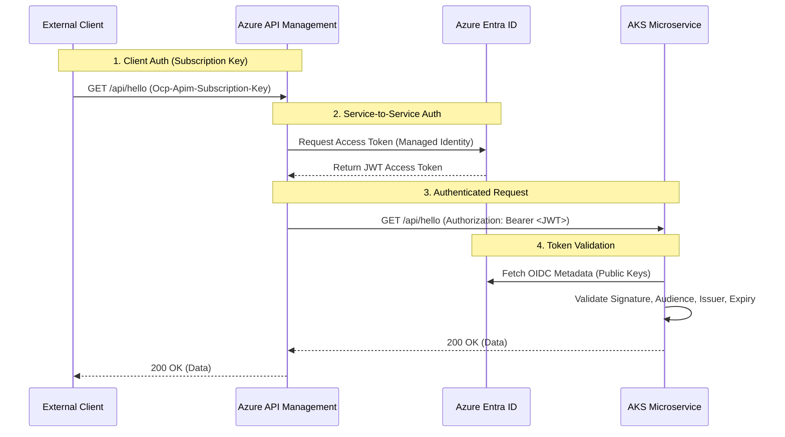

# Authentication Deep Dive: AKS Hello World Service

## 1. Executive Summary

This document provides a comprehensive engineering analysis of how the Hello World microservice running on Azure Kubernetes Service (AKS) authenticates requests. It covers the fundamental concepts, the architectural flow, and a detailed code-level explanation of the implementation.

The service uses **OAuth 2.0** with **JSON Web Tokens (JWT)** for authentication, leveraging **Azure Entra ID** (formerly Azure AD) as the Identity Provider (IdP). It implements the **Workload Identity** pattern to securely validate tokens without managing secrets.

## 2. Fundamental Concepts

To understand the authentication flow, we must first establish the core concepts:

### 2.1 OAuth 2.0 & OpenID Connect (OIDC)
- **OAuth 2.0**: The industry-standard protocol for authorization. It allows a user (or application) to grant a third-party website access to their resources without exposing their credentials.
- **JWT (JSON Web Token)**: A compact, URL-safe means of representing claims to be transferred between two parties. It is the "access card" in our system.
- **Bearer Token**: A type of access token that gives access to the "bearer" (whoever holds the token).

### 2.2 The Actors
1. **Client (APIM)**: The entity requesting access to the API.
2. **Resource Server (AKS Microservice)**: The API hosting the protected data.
3. **Authorization Server (Azure Entra ID)**: The trusted entity that issues tokens.

### 2.3 Workload Identity
A mechanism that allows a Kubernetes pod to assume an Azure AD identity (Service Principal) without storing secrets (like client secrets or certificates) in the pod. It relies on a trust relationship between the Kubernetes Service Account and Azure AD.

## 3. Authentication Architecture

### 3.1 High-Level Flow



### 3.2 The JWT Token Structure

The token received by the microservice looks like this (decoded):

```json
{
  "typ": "JWT",
  "alg": "RS256",
  "kid": "..."
}
.
{
  "aud": "api://[API_APP_ID]",       // Audience: Who is this token for? (The Microservice)
  "iss": "https://sts.windows.net/[TENANT_ID]/", // Issuer: Who created this? (Entra ID)
  "iat": 1615...,                    // Issued At
  "exp": 1615...,                    // Expiration Time
  "appid": "[APIM_CLIENT_ID]",       // App ID: Who is the caller? (APIM)
  "roles": ["API.Access"],           // Roles: What permissions do they have?
  "tid": "[TENANT_ID]"               // Tenant ID
}
.
[Signature]
```

## 4. Code-Level Implementation

The implementation uses **ASP.NET Core 8.0** and the `Microsoft.Identity.Web` library, which abstracts much of the complexity.

### 4.1 Configuration (`appsettings.json`)

This file tells the application *who* to trust and *who* it is.

```json
"AzureAd": {
  "Instance": "https://login.microsoftonline.com/",
  "TenantId": "<TENANT_ID>",          // The Azure AD Tenant to trust
  "ClientId": "<API_APP_ID>",         // The Application ID of this service
  "Audience": "api://<API_APP_ID>"    // The expected 'aud' claim in tokens
}
```

### 4.2 Startup Configuration (`Program.cs`)

This is where the authentication middleware is configured.

```csharp
// 1. Add Authentication Services
builder.Services.AddAuthentication(JwtBearerDefaults.AuthenticationScheme)
    .AddMicrosoftIdentityWebApi(builder.Configuration.GetSection("AzureAd"));
```

**What this does under the hood:**
1. Configures the JWT Bearer authentication handler.
2. Sets up OIDC discovery to automatically fetch Azure AD's public signing keys from `https://login.microsoftonline.com/{TenantId}/v2.0/.well-known/openid-configuration`.
3. Configures validation parameters:
   - **ValidateIssuer**: Checks if `iss` matches the expected Azure AD tenant.
   - **ValidateAudience**: Checks if `aud` matches `api://<API_APP_ID>`.
   - **ValidateLifetime**: Checks if the token is expired (`exp`).
   - **ValidateIssuerSigningKey**: Verifies the signature using the fetched public keys.

```csharp
// 2. Add Authorization Services
builder.Services.AddAuthorization();

// ...

// 3. Enable Middleware Pipeline
app.UseAuthentication(); // Decodes token & populates HttpContext.User
app.UseAuthorization();  // Checks if User meets policy requirements
```

**Critical Order**: `UseAuthentication` MUST come before `UseAuthorization`.

### 4.3 The Controller (`HelloController.cs`)

This is where the protection is applied to endpoints.

```csharp
[Authorize] // <--- This attribute enforces authentication
[ApiController]
[Route("api/[controller]")]
public class HelloController : ControllerBase
{
    // ...
}
```

**How `[Authorize]` works:**
1. If a request arrives without an `Authorization` header -> Returns **401 Unauthorized**.
2. If the token is invalid (expired, wrong audience, bad signature) -> Returns **401 Unauthorized**.
3. If the token is valid -> The request proceeds to the method.

### 4.4 Accessing Identity Data

Inside the controller, we can access the caller's information via `User.Claims`.

```csharp
[HttpGet]
public IActionResult Get()
{
    // Extract claims from the validated token
    var claims = User.Claims.Select(c => new { c.Type, c.Value });
    
    // Specifically looking for the 'appid' claim (Client ID of caller)
    var appId = User.FindFirst("appid")?.Value;
    
    // Looking for roles
    var roles = User.FindAll(ClaimTypes.Role).Select(r => r.Value);

    return Ok(new { 
        Message = "Hello from Authenticated Endpoint!", 
        CallerAppId = appId,
        Roles = roles,
        AllClaims = claims
    });
}
```

## 5. Workload Identity Integration

While the *authentication* (validating tokens) happens in code, the *identity* of the pod itself (for outbound calls, if any) is handled by Kubernetes and Azure infrastructure.

### 5.1 The Trust Chain

1. **Kubernetes Service Account**:
   ```yaml
   apiVersion: v1
   kind: ServiceAccount
   metadata:
     annotations:
       azure.workload.identity/client-id: "<API_APP_ID>"
   ```

2. **Federated Identity Credential** (in Azure AD):
   - Links the **App Registration** (`<API_APP_ID>`)
   - To the **Kubernetes Service Account** (`system:serviceaccount:hello-world:hello-world-sa`)
   - Via the **OIDC Issuer** of the AKS cluster.

### 5.2 How it works at runtime
1. The AKS OIDC issuer signs a token for the Service Account.
2. The Azure Identity SDK (used by `Microsoft.Identity.Web`) exchanges this K8s token for an Azure AD access token.
3. This allows the app to authenticate *outbound* to Azure resources (like Key Vault or SQL) if needed, though our current example primarily focuses on *inbound* token validation.

## 6. Security Best Practices Implemented

1. **Zero Trust**: We verify the token on every request. We don't assume that because it came from inside the network (or from APIM) it is safe.
2. **Audience Validation**: We strictly enforce that the token must be intended for *us* (`api://<API_APP_ID>`).
3. **Role-Based Access Control (RBAC)**: We check for specific roles (`API.Access`) to ensure the caller is authorized, not just authenticated.
4. **No Secrets**: We use Managed Identities and Workload Identity, eliminating the need to manage client secrets or certificates in configuration files.
5. **Least Privilege**: The APIM managed identity is granted only the specific `API.Access` role, nothing more.

## 7. Troubleshooting Authentication

If you get a **401 Unauthorized**:

1. **Check the Token**: Decode the JWT (using jwt.ms) and verify:
   - `aud`: Does it match your `appsettings.json`?
   - `iss`: Is it from the correct tenant?
   - `exp`: Is it expired?

2. **Check the Logs**: The application logs (configured in `Program.cs`) will output detailed validation errors:
   ```
   "AuthenticationFailed: IDX10214: Audience validation failed..."
   ```

3. **Check APIM**: Ensure APIM is actually sending the token.
   - Use the "Test" tab in APIM.
   - Check the `trace` to see the `authentication-managed-identity` policy execution.

## 8. Summary

The authentication mechanism is a robust, industry-standard implementation of OAuth 2.0. It relies on a chain of trust established through:
1. **Azure Entra ID** as the source of truth.
2. **Cryptographic signatures** to verify token integrity.
3. **Strict claim validation** (Audience, Issuer, Expiry) to ensure security context.
4. **Code-level middleware** (`Microsoft.Identity.Web`) to enforce these checks automatically.

## 9. End-to-End Request Walkthrough

To visualize exactly how the authentication works, let's trace the lifecycle of a request from the moment it hits APIM to the moment the microservice returns a response.

### Step 1: APIM Acquires Token (Infrastructure Layer)
Before APIM forwards the request, it must obtain an access token.
1.  **Policy Trigger**: The `<authentication-managed-identity>` policy executes.
2.  **IMDS Call**: APIM makes a local HTTP request to the Azure Instance Metadata Service (IMDS) at `http://169.254.169.254/metadata/identity/oauth2/token`.
    *   **Request**: "I am the System Assigned Identity of this APIM instance. Please give me an access token for the resource `api://[API_APP_ID]`."
3.  **Entra ID Validation**:
    *   IMDS forwards the request to Azure Entra ID.
    *   Entra ID checks: "Does this Managed Identity (Service Principal) have the `API.Access` permission on the target Application?"
4.  **Token Issuance**:
    *   If authorized, Entra ID generates a signed JWT.
    *   The token includes claims: `iss` (Tenant), `sub` (APIM Principal ID), `aud` (Microservice App ID), `roles` (API.Access).
5.  **Header Injection**: APIM receives the token and injects it into the `Authorization` header: `Bearer eyJ0eXAi...`

### Step 2: Pod Initialization (Workload Identity Layer)
When the AKS pod starts up, it prepares for validation.
1.  **OIDC Discovery**: The `AddMicrosoftIdentityWebApi` middleware initializes.
2.  **Metadata Fetch**: The pod makes an outbound HTTPS request to `https://login.microsoftonline.com/[TENANT_ID]/v2.0/.well-known/openid-configuration`.
    *   **Why?**: To find the `jwks_uri` (JSON Web Key Set URI).
3.  **Key Caching**: The pod fetches the public signing keys from the `jwks_uri` and caches them in memory.
    *   **Note**: This does *not* require the pod to have a Workload Identity itself, only internet access. However, if the pod needed to call *outbound* (e.g. to KeyVault), it would use the projected Service Account token (`/var/run/secrets/azure/tokens/azure-identity-token`) to authenticate with Entra ID.

### Step 3: The Incoming Request (Application Layer)
The request arrives at the pod.
**Header**: `Authorization: Bearer eyJ0eXAi...`

### Step 4: Middleware Interception (`Program.cs`)
The request hits the ASP.NET Core middleware pipeline.
1.  **`app.UseAuthentication()`**: This middleware runs first.
    *   It detects the `Authorization` header.
    *   It parses the "Bearer" token.
    *   **Validation Logic**:
        *   **Signature**: It uses the cached Public Keys (from Step 2) to verify the token's digital signature. This proves the token came from Entra ID and hasn't been tampered with.
        *   **Audience (`aud`)**: It checks if the token is meant for *this* app (`api://[API_APP_ID]`).
        *   **Issuer (`iss`)**: It checks if the token came from the expected Tenant.
        *   **Expiry (`exp`)**: It checks if the current time is before the expiration time.
    *   **Outcome**: If valid, it creates a `ClaimsPrincipal` and assigns it to `HttpContext.User`.

### Step 5: Authorization Check (`Program.cs` & Controller)
The request continues down the pipeline.
1.  **`app.UseAuthorization()`**: This middleware runs next.
2.  **`[Authorize]` Attribute**: Found on `HelloController`.
    *   It asks: "Is `HttpContext.User` authenticated?"
    *   **Outcome**: If yes, proceed. If no, return `401 Unauthorized`.

### Step 6: Controller Execution (`HelloController.cs`)
The `Get()` method executes.
1.  **Accessing Identity**: The code accesses `User.Claims`.
    *   `User.FindFirst("appid")` retrieves the Client ID of the caller (APIM's Managed Identity).
    *   `User.FindAll(ClaimTypes.Role)` retrieves the roles assigned to the caller (e.g., `API.Access`).
2.  **Business Logic**: The controller constructs the response object using these claims.

### Step 7: The Response
**Actor**: AKS Microservice
**Action**: Returns HTTP 200 OK.
**Body**:
```json
{
  "message": "Hello from Authenticated Endpoint!",
  "callerAppId": "ded658c3-...",
  "roles": ["API.Access"]
}
```
