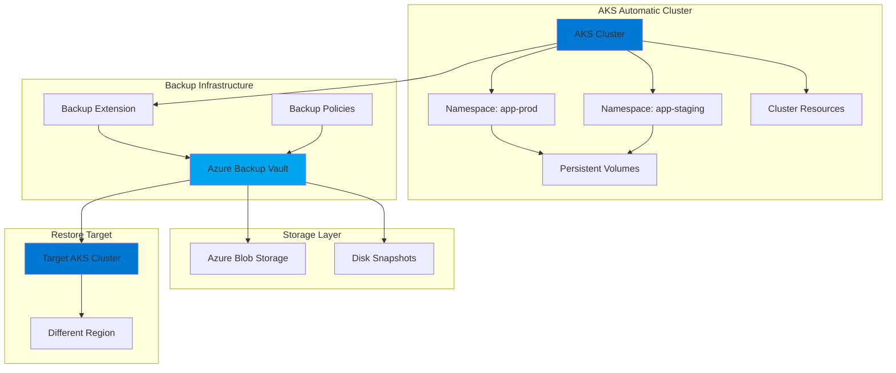
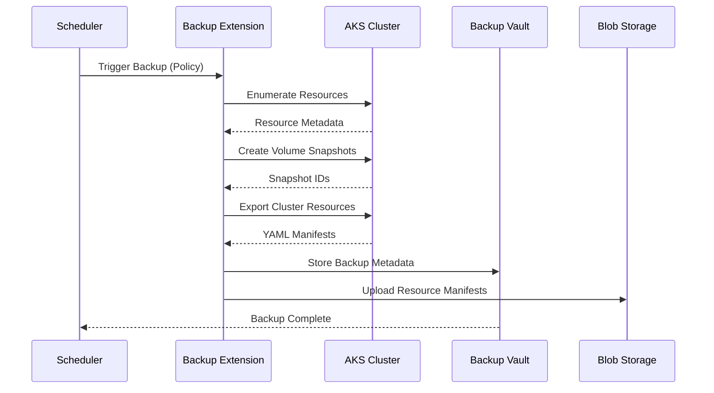
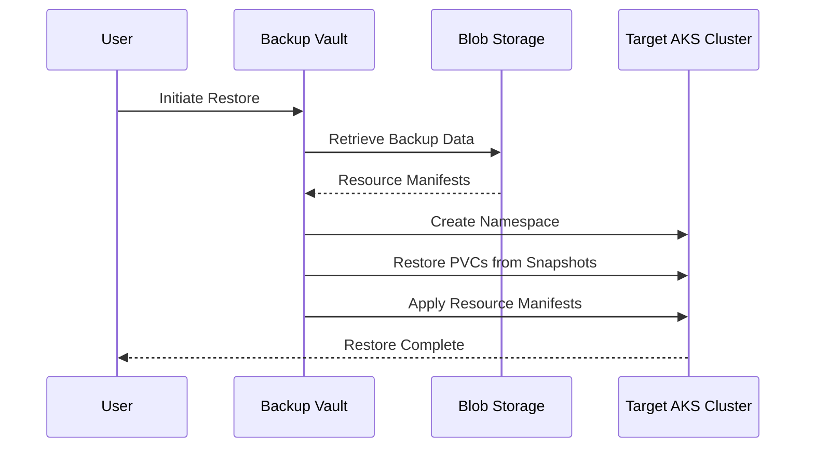

# AKS Automatic Cluster Backup - Architecture & Design

## Executive Summary

This document outlines the architecture and design for a comprehensive backup and disaster recovery solution for Azure Kubernetes Service (AKS) Automatic clusters using Azure Backup for AKS. The solution provides application-consistent backups, cross-region restore capabilities, and automated retention management.

## Table of Contents

- [Solution Overview](#solution-overview)
- [Architecture](#architecture)
- [Components](#components)
- [Backup Scope](#backup-scope)
- [Recovery Objectives](#recovery-objectives)
- [Security & Compliance](#security--compliance)
- [Cost Considerations](#cost-considerations)

---

## Solution Overview

### Purpose

Provide enterprise-grade backup and disaster recovery capabilities for AKS Automatic clusters to:
- Protect against data loss from accidental deletion
- Enable point-in-time recovery for applications
- Support cross-region disaster recovery
- Meet compliance and regulatory requirements
- Minimize Recovery Time Objective (RTO) and Recovery Point Objective (RPO)

### Key Features

- **Application-Consistent Backups** - Captures cluster state, configurations, and persistent volumes
- **Namespace Granularity** - Backup and restore at namespace level
- **Cross-Region Restore** - Disaster recovery to different Azure regions
- **Automated Scheduling** - Daily, weekly, and monthly backup policies
- **Retention Management** - Configurable retention periods (7 days to 12 months)
- **Encryption** - Data encrypted at rest and in transit
- **RBAC Integration** - Azure AD-based access control

---

## Architecture

### High-Level Architecture



### Data Flow

#### Backup Flow



#### Restore Flow



---

## Components

### 1. Azure Backup Vault

**Purpose:** Central management and storage for backup data

**Configuration:**
- **Redundancy:** Geo-redundant storage (GRS) for cross-region protection
- **Soft Delete:** 14-day retention for deleted backups
- **Immutability:** Optional vault lock for compliance
- **Access Control:** Azure RBAC with least privilege

**Responsibilities:**
- Store backup metadata and recovery points
- Manage backup policies and schedules
- Coordinate restore operations
- Track backup job status and history

### 2. AKS Backup Extension

**Purpose:** Agent deployed in AKS cluster to perform backup operations

**Deployment:**
- Installed as Kubernetes extension via Azure CLI or Terraform
- Runs in `azure-backup` namespace
- Requires cluster admin permissions
- Communicates with Backup Vault via Azure APIs

**Capabilities:**
- Discover cluster resources (Deployments, StatefulSets, ConfigMaps, Secrets, etc.)
- Create disk snapshots for persistent volumes
- Export resource definitions as YAML
- Execute pre/post backup hooks
- Report backup status to Vault

### 3. Backup Policies

**Purpose:** Define backup schedule, retention, and scope

**Policy Types:**

#### Daily Backup Policy
- **Frequency:** Every day at 2:00 AM UTC
- **Retention:** 7 days
- **Use Case:** Short-term recovery, operational mistakes

#### Weekly Backup Policy
- **Frequency:** Every Sunday at 3:00 AM UTC
- **Retention:** 4 weeks
- **Use Case:** Medium-term recovery, compliance

#### Monthly Backup Policy
- **Frequency:** First day of month at 4:00 AM UTC
- **Retention:** 12 months
- **Use Case:** Long-term archival, audit requirements

**Policy Configuration:**
```yaml
Backup Scope:
  - Included Namespaces: [app-prod, app-staging, databases]
  - Excluded Namespaces: [kube-system, kube-public, azure-backup]
  - Include Cluster Resources: true
  - Include Persistent Volumes: true
```

### 4. Storage Account

**Purpose:** Store backup artifacts (resource manifests, metadata)

**Configuration:**
- **Type:** Standard LRS or GRS
- **Access Tier:** Cool (for cost optimization)
- **Encryption:** Microsoft-managed keys or customer-managed keys
- **Network:** Private endpoint for secure access

**Contents:**
- Kubernetes resource YAML files
- Backup metadata and checksums
- Restore point catalogs
- Backup logs and reports

### 5. Managed Identity

**Purpose:** Secure authentication for backup operations

**Type:** User-assigned managed identity

**Permissions Required:**
- **AKS Cluster:** Contributor role
- **Storage Account:** Storage Blob Data Contributor
- **Backup Vault:** Backup Contributor
- **Disk Snapshots:** Disk Snapshot Contributor

---

## Backup Scope

### What Gets Backed Up

#### Cluster Resources
- ✅ Deployments
- ✅ StatefulSets
- ✅ DaemonSets
- ✅ Services
- ✅ ConfigMaps
- ✅ Secrets (encrypted)
- ✅ Ingress
- ✅ PersistentVolumeClaims
- ✅ Custom Resource Definitions (CRDs)
- ✅ Custom Resources

#### Persistent Volumes
- ✅ Azure Disk-based PVs (via snapshots)
- ✅ Azure Files-based PVs (via blob backup)
- ⚠️ NFS/HostPath volumes (not supported)

#### Cluster Configuration
- ✅ RBAC roles and bindings
- ✅ Network policies
- ✅ Resource quotas
- ✅ Limit ranges

### What Does NOT Get Backed Up

- ❌ Running pod state (ephemeral)
- ❌ Node-level configurations
- ❌ AKS control plane settings
- ❌ Azure resources outside cluster (Load Balancers, Public IPs)
- ❌ Helm release metadata (unless stored in cluster)
- ❌ Container images (must be in registry)

### Namespace Filtering

**Included by Default:**
- All user namespaces

**Excluded by Default:**
- `kube-system` - Kubernetes system components
- `kube-public` - Public cluster info
- `kube-node-lease` - Node heartbeat data
- `azure-backup` - Backup extension itself

**Custom Filtering:**
```yaml
# Include specific namespaces
includedNamespaces:
  - production
  - staging
  - databases

# Exclude specific namespaces
excludedNamespaces:
  - temp
  - dev-sandbox
```

---

## Recovery Objectives

### Recovery Point Objective (RPO)

**Definition:** Maximum acceptable data loss measured in time

**Targets:**

| Backup Policy | RPO | Use Case |
|--------------|-----|----------|
| Daily | 24 hours | Standard applications |
| Hourly (custom) | 1 hour | Critical databases |
| On-demand | 0 (current state) | Pre-maintenance backup |

**Achieving RPO:**
- Automated daily backups ensure max 24-hour data loss
- On-demand backups before changes reduce RPO to zero
- Multiple backup policies provide flexibility

### Recovery Time Objective (RTO)

**Definition:** Maximum acceptable downtime for recovery

**Targets:**

| Restore Scenario | RTO Target | Factors |
|-----------------|------------|---------|
| Namespace restore (same cluster) | 15-30 minutes | Namespace size, PV count |
| Full cluster restore (same region) | 1-2 hours | Cluster size, resource count |
| Cross-region DR | 2-4 hours | Network transfer, region availability |

**RTO Optimization:**
- Pre-provision target cluster for DR
- Use geo-redundant storage for faster cross-region access
- Automate restore procedures with scripts
- Regular DR testing to validate RTO

### Service Level Objectives (SLO)

**Backup Success Rate:** 99.5%
- Max 1-2 failed backups per month
- Automated retry on transient failures
- Alert on consecutive failures

**Backup Completion Time:** < 30 minutes
- For clusters with < 100 namespaces
- For total PV size < 1 TB
- Parallel snapshot creation

**Restore Success Rate:** 99%
- Validated through monthly DR tests
- Documented restore procedures
- Automated validation scripts

---

## Security & Compliance

### Data Encryption

**At Rest:**
- Backup data encrypted with AES-256
- Disk snapshots encrypted with platform-managed keys
- Option for customer-managed keys (CMK) via Azure Key Vault

**In Transit:**
- TLS 1.2+ for all Azure API communications
- HTTPS for blob storage access
- Private endpoints for network isolation

### Access Control

**Azure RBAC Roles:**

| Role | Permissions | Assigned To |
|------|------------|-------------|
| Backup Contributor | Create/manage backups | Backup operators |
| Backup Operator | Trigger backups, view status | DevOps team |
| Backup Reader | View backup data | Auditors |
| Restore Operator | Perform restores | SRE team |

**Kubernetes RBAC:**
- Backup extension uses cluster admin service account
- Namespace-scoped restore permissions
- Audit logging for all backup operations

### Compliance

**Data Residency:**
- Backups stored in same region as cluster (by default)
- Cross-region replication for DR (configurable)
- Geo-redundant storage for compliance requirements

**Retention Policies:**
- Configurable retention (7 days to 10 years)
- Immutable backups for regulatory compliance
- Audit trail for backup/restore operations

**Standards Supported:**
- ISO 27001 (Azure Backup certified)
- SOC 2 Type II
- HIPAA (with BAA)
- GDPR (data residency controls)

### Secrets Management

**Backup:**
- Kubernetes Secrets backed up in encrypted form
- No plaintext secrets in backup storage
- Secrets encrypted with cluster encryption key

**Restore:**
- Secrets restored with original encryption
- Option to re-encrypt with new keys
- Rotation of secrets post-restore recommended

---

## Cost Considerations

### Cost Components

#### 1. Azure Backup Vault
- **Protected Instances:** Charged per AKS cluster
- **Pricing:** ~$10-20/month per cluster

#### 2. Backup Storage
- **Blob Storage:** Cool tier recommended
- **Pricing:** ~$0.01/GB/month
- **Example:** 100 GB backup data = $1/month

#### 3. Disk Snapshots
- **Incremental Snapshots:** Only changed blocks
- **Pricing:** ~$0.05/GB/month
- **Example:** 500 GB PVs with 10% daily change = $2.50/month

#### 4. Data Transfer
- **Same Region:** Free
- **Cross-Region Restore:** ~$0.02/GB
- **Example:** 100 GB restore = $2

### Cost Optimization Strategies

**1. Retention Tuning**
```
Daily backups: 7 days (not 30)
Weekly backups: 4 weeks (not 12)
Monthly backups: 12 months (not 24)
```
**Savings:** ~40% reduction in storage costs

**2. Namespace Filtering**
- Exclude non-critical namespaces (dev, test)
- Backup only production and staging
**Savings:** ~30% reduction in backup size

**3. Incremental Snapshots**
- Azure automatically uses incremental snapshots
- Only changed blocks consume storage
**Savings:** ~60-80% vs full snapshots

**4. Storage Tier**
- Use Cool tier for backups (rarely accessed)
- Use Archive tier for long-term retention (>90 days)
**Savings:** ~50% vs Hot tier

### Cost Example

**Scenario:** Medium AKS cluster
- 3 namespaces (prod, staging, db)
- 500 GB total PV storage
- Daily backups (7 days) + Monthly backups (12 months)

**Monthly Cost Breakdown:**
```
Backup Vault:           $15
Daily Backups (7):      $35  (500 GB × 7 × $0.01)
Monthly Backups (12):   $60  (500 GB × 12 × $0.01)
Incremental Snapshots:  $25  (500 GB × 10% change × $0.05)
Total:                  $135/month
```

**Annual Cost:** ~$1,620

---

## Design Decisions

### Why Azure Backup for AKS?

**Alternatives Considered:**

| Solution | Pros | Cons | Decision |
|----------|------|------|----------|
| **Velero** | Open source, flexible | Self-managed, complex setup | ❌ Not chosen |
| **Azure Backup** | Managed, integrated | Azure-only | ✅ **Selected** |
| **Custom Scripts** | Full control | High maintenance | ❌ Not chosen |
| **Kasten K10** | Feature-rich | Additional cost | ❌ Not chosen |

**Rationale:**
- Native Azure integration
- Managed service (no maintenance)
- Built-in compliance features
- Cross-region DR support
- Lower total cost of ownership

### Backup Frequency

**Daily backups chosen because:**
- Balances RPO (24 hours) with cost
- Sufficient for most applications
- Can supplement with on-demand backups

**Hourly backups NOT chosen because:**
- 24x higher storage costs
- Minimal RPO improvement for most workloads
- Can be added for critical namespaces if needed

### Storage Redundancy

**GRS (Geo-Redundant Storage) chosen because:**
- Cross-region DR capability
- Automatic replication to paired region
- Minimal cost increase (~2x LRS)

**ZRS (Zone-Redundant Storage) NOT chosen because:**
- Same-region only (no DR)
- Not available in all regions

---

## Disaster Recovery Strategy

### DR Scenarios

#### Scenario 1: Namespace Deletion
- **Impact:** Single application unavailable
- **Recovery:** Restore namespace from latest backup
- **RTO:** 15-30 minutes
- **Procedure:** [RESTORE_PROCEDURES.md](RESTORE_PROCEDURES.md)

#### Scenario 2: Cluster Corruption
- **Impact:** Entire cluster unstable
- **Recovery:** Restore to new cluster in same region
- **RTO:** 1-2 hours
- **Procedure:** [DISASTER_RECOVERY.md](DISASTER_RECOVERY.md)

#### Scenario 3: Region Outage
- **Impact:** Cluster and region unavailable
- **Recovery:** Restore to cluster in paired region
- **RTO:** 2-4 hours
- **Procedure:** [DISASTER_RECOVERY.md](DISASTER_RECOVERY.md)

### DR Testing

**Quarterly DR Drills:**
1. Select random backup
2. Restore to test cluster
3. Validate application functionality
4. Measure actual RTO
5. Document lessons learned
6. Update procedures

---

## Monitoring & Alerting

### Backup Monitoring

**Metrics to Track:**
- Backup success/failure rate
- Backup duration
- Backup size (trend)
- Storage consumption
- Snapshot count

**Alerts:**
- Backup failure (immediate)
- Backup duration > 1 hour (warning)
- Storage > 80% quota (warning)
- No backup in 48 hours (critical)

### Integration Points

- **Azure Monitor:** Backup job metrics
- **Log Analytics:** Backup logs and diagnostics
- **Azure Alerts:** Notification on failures
- **Grafana:** Custom backup dashboards

---

## Next Steps

1. **Review and Approve** this architecture document
2. **Deploy Infrastructure** using Terraform (see [DEPLOYMENT.md](DEPLOYMENT.md))
3. **Configure Policies** based on RPO/RTO requirements
4. **Test Backups** with non-production namespaces
5. **Validate Restore** procedures
6. **Schedule DR Drills** quarterly
7. **Monitor and Optimize** costs and performance

---

## References

- [Azure Backup for AKS Documentation](https://learn.microsoft.com/azure/backup/azure-kubernetes-service-backup-overview)
- [AKS Automatic Cluster Documentation](https://learn.microsoft.com/azure/aks/intro-aks-automatic)
- [Azure Backup Pricing](https://azure.microsoft.com/pricing/details/backup/)
- [Disaster Recovery Best Practices](https://learn.microsoft.com/azure/aks/operator-best-practices-multi-region)

---

**Document Version:** 1.0  
**Last Updated:** 2025-12-09  
**Owner:** Platform Engineering Team
