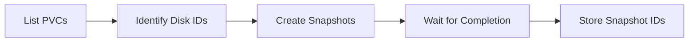
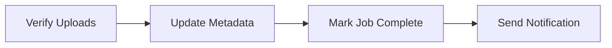
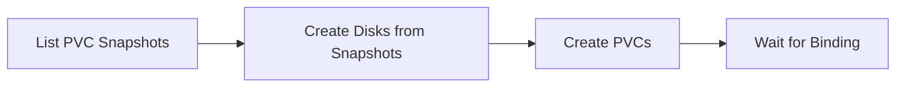
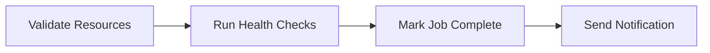

# AKS Backup - Engineering Implementation Guide

This guide provides technical implementation details for the AKS backup solution using Azure Backup for AKS.

## Azure Backup for AKS Overview

### How It Works

Azure Backup for AKS uses a **backup extension** deployed in your cluster that:
1. Discovers Kubernetes resources in specified namespaces
2. Creates incremental disk snapshots for persistent volumes
3. Exports resource definitions as YAML manifests
4. Stores backup data in Azure Backup Vault and Blob Storage
5. Enables restore to same or different cluster/region

### Key Capabilities

- **Application-Consistent:** Captures complete application state
- **Incremental:** Only backs up changed data (cost-efficient)
- **Namespace-Scoped:** Granular backup and restore
- **Cross-Region:** Disaster recovery to paired regions
- **Automated:** Policy-driven scheduling and retention

## Technical Architecture

### Backup Extension Components

The backup extension deploys several components in the `azure-backup` namespace:

```
azure-backup/
├── backup-controller (Deployment)
│   └── Manages backup operations
├── backup-agent (DaemonSet)
│   └── Runs on each node for volume snapshots
├── backup-webhook (Service)
│   └── Validates backup configurations
└── backup-storage (ConfigMap)
    └── Stores backup metadata
```

### Resource Discovery

The extension discovers resources using Kubernetes API:

```go
// Pseudo-code for resource discovery
func DiscoverResources(namespace string) []Resource {
    resources := []Resource{}
    
    // Core resources
    resources.append(ListDeployments(namespace))
    resources.append(ListStatefulSets(namespace))
    resources.append(ListServices(namespace))
    resources.append(ListConfigMaps(namespace))
    resources.append(ListSecrets(namespace))
    
    // Storage resources
    resources.append(ListPVCs(namespace))
    
    // Custom resources
    crds := ListCRDs()
    for crd in crds {
        resources.append(ListCustomResources(crd, namespace))
    }
    
    return resources
}
```

### Snapshot Mechanism

**For Azure Disk PVs:**
1. Extension identifies PVCs bound to Azure Disks
2. Creates incremental snapshot via Azure Disk API
3. Snapshot stored in same region as disk
4. Metadata stored in Backup Vault

**For Azure Files PVs:**
1. Extension identifies PVCs bound to Azure Files
2. Triggers file share snapshot
3. Snapshot managed by Azure Files service

### Backup Data Storage

**Blob Storage Structure:**
```
backup-container/
├── cluster-{id}/
│   ├── backup-{timestamp}/
│   │   ├── namespaces/
│   │   │   ├── prod/
│   │   │   │   ├── deployments.yaml
│   │   │   │   ├── services.yaml
│   │   │   │   ├── configmaps.yaml
│   │   │   │   └── secrets.yaml.enc
│   │   │   └── staging/
│   │   │       └── ...
│   │   ├── pvcs/
│   │   │   └── pvc-metadata.json
│   │   └── cluster-resources/
│   │       ├── crds.yaml
│   │       └── rbac.yaml
│   └── backup-{timestamp-2}/
│       └── ...
```

## Backup Process Deep Dive

### Phase 1: Pre-Backup


**Actions:**
- Validate backup policy configuration
- Check managed identity has required permissions
- Enumerate target namespaces
- Create backup job in Backup Vault
- Initialize backup metadata

### Phase 2: Resource Export


**Actions:**
- Query Kubernetes API for all resources
- Serialize resources to YAML format
- Encrypt Secrets with backup encryption key
- Compress YAML files
- Upload to Blob Storage with checksum

### Phase 3: Volume Snapshots



**Actions:**
- List all PVCs in target namespaces
- Extract Azure Disk resource IDs
- Trigger incremental snapshot creation
- Poll for snapshot completion
- Store snapshot metadata in Backup Vault

### Phase 4: Post-Backup



**Actions:**
- Verify all blobs uploaded successfully
- Update backup metadata with resource count
- Mark backup job as complete in Vault
- Send completion notification (if configured)
- Update backup metrics

## Restore Process Deep Dive

### Phase 1: Pre-Restore


**Actions:**
- User selects backup recovery point
- Validate target cluster is accessible
- Check restore permissions
- Create restore job in Backup Vault

### Phase 2: Namespace Recreation


**Actions:**
- Download namespace definition from backup
- Create namespace in target cluster
- Apply original labels and annotations
- Restore resource quotas and limit ranges

### Phase 3: Volume Restore



**Actions:**
- Retrieve snapshot IDs from backup metadata
- Create new Azure Disks from snapshots
- Create PVCs referencing new disks
- Wait for PVCs to bind to PVs

### Phase 4: Resource Restore


**Actions:**
- Download resource YAML files from Blob Storage
- Decrypt Secrets with restore encryption key
- Apply resources in dependency order:
  1. ConfigMaps and Secrets
  2. Services
  3. Deployments and StatefulSets
  4. Ingress and other resources
- Verify pods are running

### Phase 5: Post-Restore



**Actions:**
- Verify all resources created successfully
- Run application health checks (if configured)
- Mark restore job as complete
- Send completion notification

## Performance Considerations

### Backup Performance

**Factors Affecting Backup Duration:**

| Factor | Impact | Optimization |
|--------|--------|--------------|
| Number of resources | High | Filter namespaces |
| PV size | Medium | Use incremental snapshots |
| Number of PVs | High | Parallel snapshot creation |
| Network bandwidth | Low | Use private endpoints |

**Optimization Strategies:**

1. **Namespace Filtering**
   ```yaml
   # Backup only critical namespaces
   includedNamespaces:
     - production
     - databases
   ```

2. **Parallel Snapshots**
   ```yaml
   # Extension automatically parallelizes
   # No configuration needed
   maxParallelSnapshots: 10  # Default
   ```

3. **Incremental Snapshots**
   - Automatically enabled by Azure
   - Only changed blocks backed up
   - Reduces backup time by 60-80%

### Restore Performance

**Factors Affecting Restore Duration:**

| Factor | Impact | Optimization |
|--------|--------|--------------|
| PV size | High | Pre-provision disks |
| Number of resources | Medium | Batch apply resources |
| Cross-region transfer | High | Use GRS for faster access |
| Pod startup time | Medium | Optimize container images |

**Optimization Strategies:**

1. **Pre-Provisioned Target Cluster**
   - Keep DR cluster running
   - Pre-configure node pools
   - Reduces RTO by 30-50%

2. **Parallel Resource Creation**
   ```bash
   # Apply resources in parallel
   kubectl apply -f namespace1/ &
   kubectl apply -f namespace2/ &
   wait
   ```

3. **Disk Restore Optimization**
   - Use Premium SSD for faster restore
   - Restore to same region when possible
   - Use disk snapshots in same availability zone

## Network Requirements

### Outbound Connectivity

The backup extension requires outbound access to:

| Endpoint | Port | Purpose |
|----------|------|---------|
| `*.backup.windowsazure.com` | 443 | Backup Vault API |
| `*.blob.core.windows.net` | 443 | Blob Storage |
| `*.disk.azure.com` | 443 | Disk Snapshot API |
| `management.azure.com` | 443 | Azure Resource Manager |

### Private Endpoint Support

**Recommended for Production:**

```hcl
# Terraform example
resource "azurerm_private_endpoint" "backup_vault" {
  name                = "pe-backup-vault"
  location            = azurerm_resource_group.backup.location
  resource_group_name = azurerm_resource_group.backup.name
  subnet_id           = azurerm_subnet.backup.id

  private_service_connection {
    name                           = "psc-backup-vault"
    private_connection_resource_id = azurerm_data_protection_backup_vault.aks.id
    subresource_names              = ["AzureBackup"]
    is_manual_connection           = false
  }
}
```

**Benefits:**
- No public internet exposure
- Traffic stays on Azure backbone
- Improved security posture
- Compliance with network isolation requirements

## Storage and Encryption

### Encryption at Rest

**Backup Vault:**
- Encrypted with platform-managed keys (default)
- Option for customer-managed keys (CMK)

**Blob Storage:**
- AES-256 encryption
- Supports CMK via Azure Key Vault

**Disk Snapshots:**
- Encrypted with same key as source disk
- Supports Azure Disk Encryption (ADE)

### Encryption in Transit

All data transfer uses TLS 1.2+:
- Kubernetes API → Backup Extension: TLS 1.2
- Backup Extension → Backup Vault: HTTPS/TLS 1.3
- Backup Extension → Blob Storage: HTTPS/TLS 1.3

### Customer-Managed Keys (CMK)

**Setup:**

```hcl
# Key Vault
resource "azurerm_key_vault" "backup" {
  name                = "kv-backup-cmk"
  location            = azurerm_resource_group.backup.location
  resource_group_name = azurerm_resource_group.backup.name
  tenant_id           = data.azurerm_client_config.current.tenant_id
  sku_name            = "premium"
  
  purge_protection_enabled   = true
  soft_delete_retention_days = 90
}

# Encryption Key
resource "azurerm_key_vault_key" "backup" {
  name         = "backup-encryption-key"
  key_vault_id = azurerm_key_vault.backup.id
  key_type     = "RSA"
  key_size     = 2048
  
  key_opts = [
    "decrypt",
    "encrypt",
    "sign",
    "unwrapKey",
    "verify",
    "wrapKey",
  ]
}

# Backup Vault with CMK
resource "azurerm_data_protection_backup_vault" "aks" {
  name                = "bv-aks-backup"
  resource_group_name = azurerm_resource_group.backup.name
  location            = azurerm_resource_group.backup.location
  datastore_type      = "VaultStore"
  redundancy          = "GeoRedundant"
  
  identity {
    type = "SystemAssigned"
  }
  
  encryption {
    key_vault_key_id          = azurerm_key_vault_key.backup.id
    infrastructure_encryption = "Enabled"
  }
}
```

## Monitoring and Diagnostics

### Backup Metrics

**Available Metrics:**

| Metric | Description | Alert Threshold |
|--------|-------------|-----------------|
| `BackupSuccessRate` | % of successful backups | < 95% |
| `BackupDuration` | Time to complete backup | > 30 min |
| `BackupSize` | Total backup data size | Trend analysis |
| `SnapshotCount` | Number of snapshots | Quota check |
| `RestoreSuccessRate` | % of successful restores | < 99% |

**Azure Monitor Integration:**

```bash
# Enable diagnostic settings
az monitor diagnostic-settings create \
  --name backup-diagnostics \
  --resource <backup-vault-id> \
  --workspace <log-analytics-workspace-id> \
  --logs '[{"category": "AzureBackupReport", "enabled": true}]' \
  --metrics '[{"category": "AllMetrics", "enabled": true}]'
```

### Logging

**Log Categories:**

1. **AzureBackupReport**
   - Backup job status
   - Resource counts
   - Duration metrics

2. **AddonAzureBackupJobs**
   - Detailed job logs
   - Error messages
   - Retry attempts

3. **AddonAzureBackupAlerts**
   - Backup failures
   - Policy violations
   - Quota warnings

**Query Examples:**

```kusto
// Failed backups in last 24 hours
AzureBackupReport
| where TimeGenerated > ago(24h)
| where OperationName == "Backup"
| where Status == "Failed"
| project TimeGenerated, ResourceName, ErrorMessage

// Backup duration trend
AzureBackupReport
| where OperationName == "Backup"
| where Status == "Completed"
| summarize AvgDuration=avg(DurationInSeconds) by bin(TimeGenerated, 1d)
| render timechart
```

## Troubleshooting Common Issues

### Extension Installation Failures

**Symptom:** Extension fails to install

**Common Causes:**
1. Insufficient permissions
2. Network connectivity issues
3. Incompatible AKS version

**Resolution:**
```bash
# Check extension status
az k8s-extension show \
  --name azure-backup \
  --cluster-name <aks-cluster> \
  --resource-group <rg> \
  --cluster-type managedClusters

# View extension logs
kubectl logs -n azure-backup -l app=backup-controller
```

### Backup Failures

**Symptom:** Backup job fails

**Common Causes:**
1. PVC not bound
2. Snapshot quota exceeded
3. Storage account access denied

**Resolution:**
```bash
# Check PVC status
kubectl get pvc -A

# Check snapshot quota
az snapshot list --query "length(@)"

# Verify storage account access
az storage account show \
  --name <storage-account> \
  --query "networkRuleSet.defaultAction"
```

### Restore Failures

**Symptom:** Restore job fails

**Common Causes:**
1. Target namespace already exists
2. Insufficient cluster resources
3. RBAC permission issues

**Resolution:**
```bash
# Delete existing namespace
kubectl delete namespace <namespace> --wait=false

# Check cluster capacity
kubectl top nodes

# Verify RBAC
kubectl auth can-i create deployments --namespace <namespace>
```

## Best Practices

### Backup Strategy

1. **Multiple Policies**
   - Daily for operational recovery
   - Weekly for compliance
   - Monthly for long-term archival

2. **Namespace Organization**
   - Group related apps in same namespace
   - Separate prod/staging/dev
   - Use labels for backup filtering

3. **Testing**
   - Monthly restore tests
   - Quarterly DR drills
   - Document actual RTO/RPO

### Security Hardening

1. **Least Privilege**
   - Use managed identity (not service principal)
   - Scope permissions to specific resources
   - Regular access reviews

2. **Network Isolation**
   - Use private endpoints
   - Disable public access to storage
   - Network security groups

3. **Encryption**
   - Enable CMK for sensitive data
   - Rotate keys annually
   - Audit key access

### Cost Optimization

1. **Retention Tuning**
   - Align with compliance requirements
   - Delete old backups
   - Use lifecycle policies

2. **Namespace Filtering**
   - Exclude non-critical namespaces
   - Backup only stateful apps
   - Use labels for selection

3. **Storage Tier**
   - Cool tier for backups
   - Archive tier for long-term retention
   - Automated tiering policies

---

For deployment instructions, see [DEPLOYMENT.md](DEPLOYMENT.md).

For restore procedures, see [RESTORE_PROCEDURES.md](RESTORE_PROCEDURES.md).

For troubleshooting, see [TROUBLESHOOTING.md](TROUBLESHOOTING.md).
