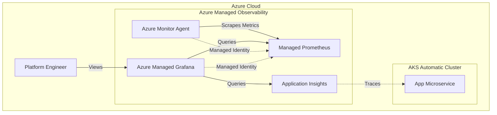
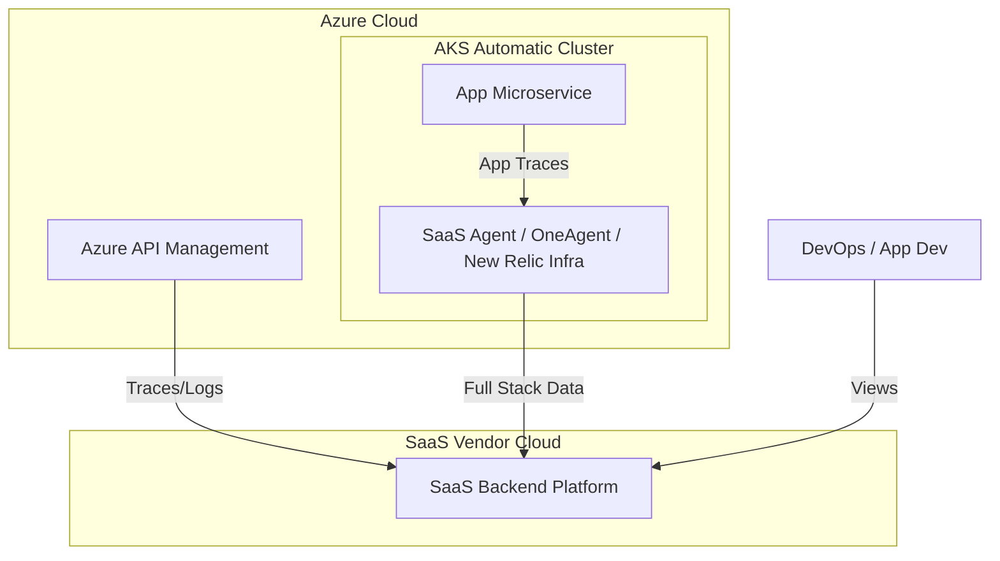

# Architecture, Design, and Engineering Options Paper
## AKS Automatic Observability: Azure Managed vs. SaaS Platforms

**Date:** January 21, 2026
**Version:** 1.1
**Target Audience:** Principle Architects, Head of Engineering, Platform Engineering Leads

---

## 1. Executive Summary & High-Level Comparison

This paper evaluates two primary observability strategies for Azure Kubernetes Service (AKS) Automatic: the Azure-native **Managed Prometheus & Grafana** stack versus generic **SaaS Observability Platforms** (e.g., Dynatrace, Datadog, **New Relic**).

### 1.1 Summary Comparison Table

| Feature category | Azure Managed (Prometheus/Grafana) | SaaS (Dynatrace / Datadog / New Relic) |
| :--- | :--- | :--- |
| **Primary Focus** | **Infrastructure & Platform.** Deep integration with AKS and Azure Resource Manager. | **Application & Business.** End-to-end transaction tracing, code-level profiling, and AI-driven root cause analysis. |
| **Licensing Cost** | **Hybrid Model.**  1. **Metrics:** Consumption-based (very cheap). 2. **Grafana:** **Per-user license** (Standard plan) for active users. | **Node + Ingestion Model.**  1. **Host:** High cost per node (expensive for large clusters). 2. **Ingestion:** Cost per GB of logs/traces. |
| **APIM to Microservice Tracing** | **Fragmented.** leveraging Application Insights for APIM and distributed tracing. Requires stitching contexts or using Azure Monitor workbooks. | **Unified.** Seamless "Single Pane of Glass" tracing from APIM gateway (via OpenTelemetry/Plugin) down to the AKS pod and database query. |
| **Ease of Implementation** | **Low Complexity.** Native "checkbox" enablement. Identity-based security (no API keys). | **Medium Complexity.** Requires managing 3rd party agents, Helm charts, secret rotation, and eBPF kernel compatibility. |
| **Ideal Use Case** | Platform Engineering teams managing large-scale infrastructure cost-effectively. | Application Development teams requiring instant "Click-to-code" troubleshooting. |

---

## 2. Architecture & Design Options

### 2.1 Option A: Azure Managed Observability (Native Stack)
This option utilizes the First-Party (1P) services integrated directly into the Azure fabric.

#### **Architecture Diagram**

#### **Architecture Components**
*   **Collection Layer**: The **Azure Monitor Agent (AMA)** runs as a daemonset.
*   **Storage Layer**: **Azure Monitor Managed Service for Prometheus** (Metrics) and **Application Insights** (Traces).
*   **Visualization Layer**: **Azure Managed Grafana**.
    *   *Note on Licensing:* While the backend service is consumption-based, **Azure Managed Grafana instances require per-user licensing** (e.g., ~$6/user/month for Standard) for anyone who actively logs in to view dashboards.

### 2.2 Option B: Generic SaaS Observability (SaaS Stack)
Includes **Dynatrace, Datadog, and New Relic**.

#### **Architecture Diagram**

#### **Architecture Components**
*   **Collection Layer**: Proprietary Agents (e.g., Dynatrace OneAgent, New Relic Infrastructure Agent). These often use **eBPF** for deep, low-overhead kernel monitoring.
*   **APIM Integration**: Most SaaS vendors provide specific policies or OpenTelemetry exporters for Azure API Management to stitch the request ID from the Gateway to the Backend Microservice.
*   **Storage & Visualization**: Fully external SaaS.

---

## 3. Application Observability: The APIM to Microservice Flow

**The Narrative Change:**
Modern application observability is not just about "is the pod running?"—it is about **"What happened to Request ID X?"** as it traversed the enterprise gateway (APIM) and hit the microservice in AKS.

### 3.1 The Azure Native Challenge
*   **Flow:** Client -> APIM -> AKS Pod.
*   **Implementation:** You must enable Application Insights on APIM and *separately* instrument the AKS Microservice (using the App Insights SDK or OpenTelemetry Distro).
*   **Visibility:** While data exists in both places, connecting them in a "Service Map" often requires using the Application Map feature in the Azure Portal or building custom queries in Grafana to join the data. It is often less intuitive than SaaS alternatives.

### 3.2 The SaaS Advantage (New Relic / Dynatrace / Datadog)
*   **Flow:** Client -> APIM -> AKS Pod.
*   **Implementation:**
    *   **APIM:** Configure generic OpenTelemetry policy to send traces to the SaaS endpoint.
    *   **AKS:** The SaaS agent (e.g., New Relic Java Agent) automatically picks up the `traceparent` header passed by APIM.
*   **Visibility:** SaaS platforms excel here. They visualize the entire chain automatically. A slow API call identifies exactly whether the latency was in the APIM Policy execution, the network hop, or the SQL query executed by the AKS pod.
    *   **Dynatrace:** Uses "PurePath" technology to automatically thread this context.
    *   **New Relic:** "Service Maps" automatically visualize the APIM node connected to the Kubernetes Deployment node.

---

## 4. Engineering Constraints on AKS Automatic
When deploying third-party SaaS agents on AKS Automatic, specific platform constraints must be engineered around:

*   **DaemonSet Resource Limits:** AKS Automatic manages node resources strictly. Third-party agents *must* have explicit Resource Requests and Limits defined.
*   **Privileged Access:** eBPF agents must be compatible with the "Azure Linux" implementation used by AKS Automatic nodes.
*   **Kubelet Certificate Rotation:** Agents must support auto-discovery via the API server rather than mounting host certificates (`/etc/kubernetes/certs`) which rotate frequently in managed environments.
*   **Operator Lifecycle:** Vendors (Dynatrace, Datadog, New Relic) strongly recommend using their **Operators** (managed deployments) over raw DaemonSets on auto-managed clusters to better handle node scaling events.

---

## 5. Co-existence Strategy: Maximizing Value

**Can they co-exist? Yes.**
**Should they? Yes, to balance Cost vs. Insight.**

### 5.1 The "Why"
*   **Cost:** Storing petabytes of raw infrastructure metrics (CPU ticks) in New Relic or Datadog is extremely expensive. Azure Managed Prometheus does this cheaply.
*   **Context:** Debugging a race condition in a microservice requires the high-fidelity tracing and code profiling that SaaS tools provide superiorly.

### 5.2 The "How" (Architecture)
1.  **Layer 1 (The Platform - Azure Native):** 
    *   Use **Managed Prometheus** for all Cluster/Node health.
    *   Use **Managed Grafana** for Platform Engineering dashboards (Capacity, Node Health).
    *   *Cost Savings:* Disable infrastructure metric ingestion in the SaaS agent.
2.  **Layer 2 (The Application - SaaS):**
    *   Use **New Relic / Dynatrace** agents for Application Tracing and APIM integration.
    *   Focus ingestion budget on high-value traces and custom business metrics.
3.  **The Link:**
    *   Embed "Deep Links" in Grafana dashboards that point to the specific Service entity in the SaaS tool, enabling a seamless workflow for engineers.
