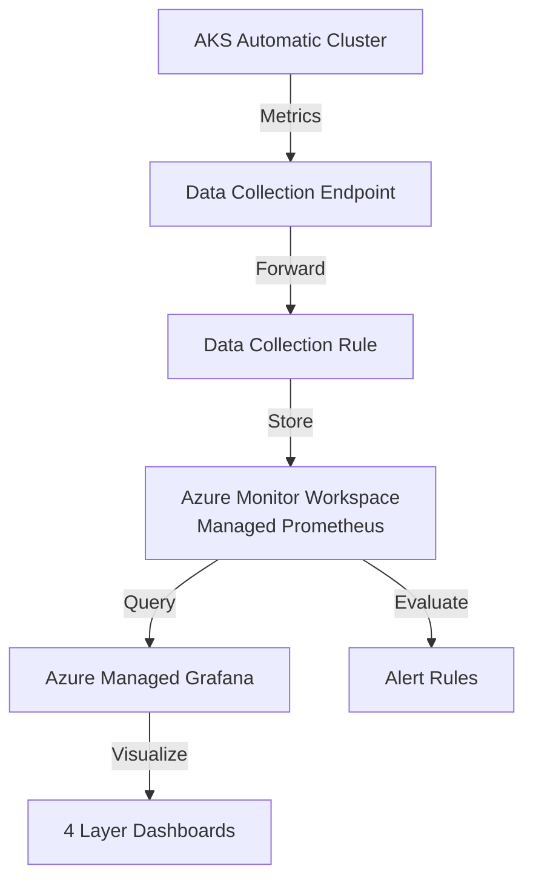

# AKS Observability with Azure Managed Prometheus & Grafana

Complete infrastructure-as-code solution for comprehensive AKS cluster monitoring using Azure Managed Prometheus and Azure Managed Grafana, organized across 4 observability layers.

## 📊 Overview

This project provides production-ready monitoring for AKS Automatic clusters with:

- **Azure Monitor Workspace (Managed Prometheus)** - Scalable metrics collection and storage
- **Azure Managed Grafana** - Pre-configured dashboards for 4 observability layers
- **Prometheus Alert Rules** - Critical alerts for capacity, health, and performance
- **Recording Rules** - Pre-computed metrics for dashboard performance

## 🏗️ Architecture



## 📁 Project Structure

```
aks-obs/
├── terraform/                  # Infrastructure as Code
│   ├── main.tf                # Main Terraform configuration
│   ├── variables.tf           # Input variables
│   ├── outputs.tf             # Output values
│   └── terraform.tfvars.example
├── dashboards/                # Grafana Dashboard JSON
│   ├── layer1-cluster-capacity-health.json
│   ├── layer2-node-infrastructure.json
│   ├── layer3-workload-pod-health.json
│   └── layer4-network-storage.json
├── prometheus/                # Prometheus Rules
│   ├── alert-rules.yaml      # Alert definitions
│   └── recording-rules.yaml  # Recording rules
└── docs/                      # Documentation
    ├── DEPLOYMENT.md
    ├── CONFIGURATION.md
    └── TROUBLESHOOTING.md
```

## 🎯 Observability Layers

### Layer 1: Cluster Capacity & Health
- **Cluster CPU/Memory Commit %** - Resource reservation vs capacity
- **Cluster Actual Usage %** - Real resource consumption
- **Node Count** - Ready vs Not Ready nodes
- **Pods in Pending State** - Capacity exhaustion indicator

### Layer 2: Node & Infrastructure Metrics
- **Node CPU/Memory Pressure** - Eviction risk detection
- **Disk I/O & IOPS** - Storage performance monitoring
- **Inodes Usage** - File system health
- **Disk Space Used** - Storage capacity tracking

### Layer 3: Workload & Pod Health
- **CrashLoopBackOffs** - Application restart detection
- **OOMKills** - Out of memory events
- **CPU Throttling** - Performance degradation indicator
- **Deployment Replicas** - Availability monitoring

### Layer 4: Network & Storage
- **Network Packet Drops** - CNI and VM limit issues
- **Persistent Volume Usage** - Storage capacity for stateful apps
- **CoreDNS Latency** - Service mesh communication health

## 🚀 Quick Start

### Prerequisites

- Azure CLI installed and authenticated
- Terraform >= 1.5.0
- Existing AKS Automatic cluster
- kubectl configured for your cluster

### Deployment

1. **Clone and configure**
   ```bash
   cd aks-obs/terraform
   cp terraform.tfvars.example terraform.tfvars
   # Edit terraform.tfvars with your AKS cluster details
   ```

2. **Deploy infrastructure**
   ```bash
   terraform init
   terraform plan
   terraform apply
   ```

3. **Import Grafana dashboards**
   - Access Grafana URL from Terraform outputs
   - Import dashboard JSON files from `dashboards/` directory

4. **Deploy Prometheus rules**
   ```bash
   kubectl apply -f ../prometheus/alert-rules.yaml
   kubectl apply -f ../prometheus/recording-rules.yaml
   ```

## 📚 Documentation

- **[Deployment Guide](docs/DEPLOYMENT.md)** - Step-by-step deployment instructions
- **[Configuration Guide](docs/CONFIGURATION.md)** - Detailed metric explanations and customization
- **[Troubleshooting Guide](docs/TROUBLESHOOTING.md)** - Common issues and solutions

## 🔔 Alert Coverage

The solution includes 25+ pre-configured alerts covering:

- **Capacity Alerts** - CPU/Memory commit thresholds, pending pods
- **Infrastructure Alerts** - Node pressure, disk space, resource usage
- **Workload Alerts** - CrashLoops, OOMKills, CPU throttling
- **Network/Storage Alerts** - Packet drops, PV capacity, CoreDNS issues

## 💰 Cost Considerations

Azure resources created by this solution:

- **Azure Monitor Workspace** - Charged per GB ingested and retained
- **Azure Managed Grafana** - Standard SKU pricing
- **Data Collection** - Minimal egress costs

Estimated cost: $50-200/month depending on cluster size and metrics volume.

## 🔧 Customization

All thresholds and configurations are customizable:

- **Alert thresholds** - Edit `prometheus/alert-rules.yaml`
- **Dashboard panels** - Modify JSON files in `dashboards/`
- **Recording rules** - Adjust `prometheus/recording-rules.yaml`
- **Infrastructure** - Update `terraform/variables.tf`

## 📊 Dashboard Screenshots

Import the dashboards to see:
- Real-time cluster capacity gauges with color-coded thresholds
- Time series graphs for trend analysis
- Heatmaps for CrashLoopBackOff detection
- Bar gauges for storage and PV monitoring

## 🤝 Contributing

To extend this solution:

1. Add new metrics to recording rules for performance
2. Create additional dashboard panels as needed
3. Define custom alerts for your workload patterns
4. Update documentation with your changes

## 📝 License

This project is provided as-is for use with Azure AKS clusters.

## 🆘 Support

For issues and questions:

1. Check [TROUBLESHOOTING.md](docs/TROUBLESHOOTING.md)
2. Review Prometheus and Grafana logs
3. Verify data collection endpoint connectivity
4. Ensure AKS cluster has proper permissions

---

**Built for AKS Automatic clusters with Azure Managed Prometheus & Grafana**
