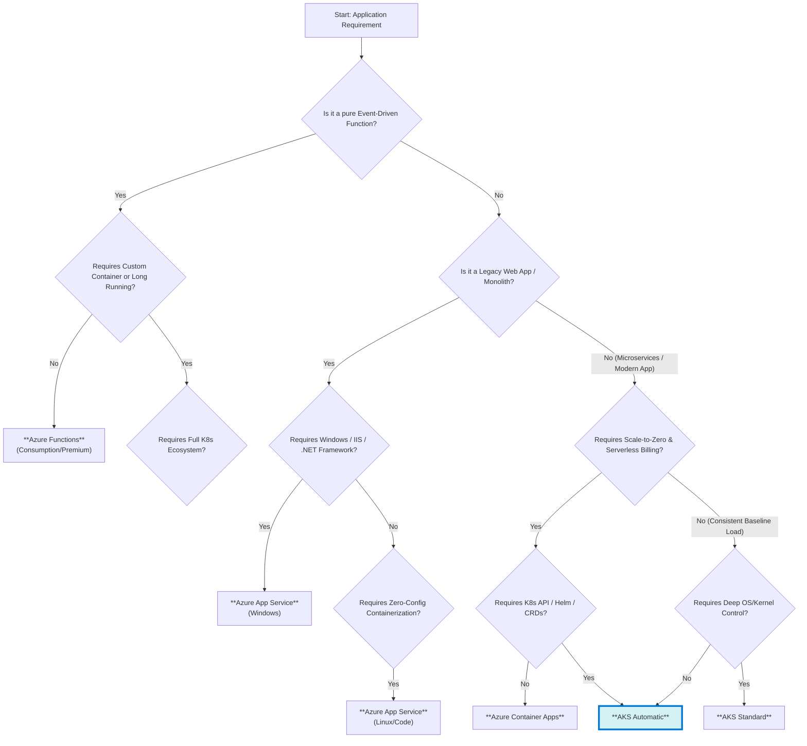

# Architecture & Design Guidance: Adopting AKS Automatic

**Target Audience:** Application Engineering Teams, Platform Architects, and Technical Decision Makers.
**Objective:** To provide a pragmatic framework for evaluating and adopting Azure Kubernetes Service (AKS) Automatic, focusing on the "People, Process, Technology" impact and clear decision criteria.

---

## 1. Executive Summary

In the evolution of cloud-native computing, Kubernetes has established itself as the operating system of the cloud. However, its complexity often imposes a significant "tax" on engineering teams—requiring deep expertise in cluster operations, security hardening, and infrastructure management.

**AKS Automatic** represents a paradigm shift: it is "Kubernetes without the tax." It offers a fully managed, production-ready Kubernetes experience that automates the heavy lifting of cluster management while preserving access to the full Kubernetes API. This paper outlines why and how application teams should adopt AKS Automatic to accelerate delivery, improve security posture, and reduce operational toil.

---

## 2. Architecture & Design Guidance

When designing for AKS Automatic, the focus shifts from *managing infrastructure* to *defining application requirements*.

### 2.1 Core Architectural Principles

*   **Microservices & Stateless Design**: Build applications as independent, stateless microservices. This aligns perfectly with AKS Automatic's dynamic scaling capabilities. State should be externalized to managed services like Azure SQL, Cosmos DB, or Azure Storage.
*   **Event-Driven Scaling**: Leverage the built-in **KEDA (Kubernetes Event-Driven Autoscaling)** add-on. Design your applications to scale based on business metrics (queue depth, HTTP requests) rather than just CPU/Memory.
    *   *Guidance*: Define `ScaledObjects` alongside your deployments to automate scaling from zero to peak load.
*   **Immutable Infrastructure**: Treat containers as immutable. Configuration should be injected via Kubernetes Secrets or ConfigMaps, and no manual changes should be made to running pods.

### 2.2 Security by Design

AKS Automatic enforces a "secure-by-default" posture that application teams must align with:

*   **Identity**:
    *   **Workload Identity**: Eliminate long-lived credentials (like connection strings) in your code. Use **Microsoft Entra Workload ID** to authenticate with Azure resources (Key Vault, SQL, Service Bus) using the pod's identity.
    *   **RBAC**: Access to the cluster is governed strictly by Microsoft Entra ID. Local accounts are disabled.
*   **Network Security**:
    *   **Azure CNI Overlay & Cilium**: The cluster uses Azure CNI Overlay for efficient networking and Cilium for high-performance data plane and network policies.
    *   *Guidance*: Define `NetworkPolicies` to restrict east-west traffic between microservices. Adopt a "deny-all" default and explicitly allow required traffic.
*   **Policy Enforcement**: Azure Policy is enabled by default. It prevents non-compliant deployments (e.g., privileged containers) before they reach the cluster.

### 2.3 Reliability & Observability

*   **Zone Redundancy**: AKS Automatic clusters are zone-redundant by default. Ensure your deployments specify `topologySpreadConstraints` to distribute pods across availability zones for high availability.
*   **Automated Operations**: Node repair, upgrades, and patching are handled automatically by Azure. Application teams do not need to schedule maintenance windows for infrastructure updates.
*   **Observability**:
    *   **Azure Monitor & Container Insights**: Enabled by default.
    *   *Guidance*: Instrument applications with OpenTelemetry. Ensure logs are written to `stdout`/`stderr` for automatic collection. Use Prometheus metrics for application-level monitoring.

---

### 3. Decision Framework: The "Nth Level" Deep Dive

Choosing the right compute service requires looking beyond the marketing fluff. This section provides a granular, technical comparison to drive the decision.

#### 3.1 Decision Workflow

The following decision tree provides a logical path to the optimal compute service.

#### 3.2 Detailed Service Comparison

| Feature Category | **AKS Automatic** | **AKS Standard** | **Azure Container Apps (ACA)** | **Azure App Service** | **Azure Functions** |
| :--- | :--- | :--- | :--- | :--- | :--- |
| **Primary Use Case** | Production-grade K8s without ops. Standard microservices. | Specialized K8s workloads (GPU, Windows, Custom CNI). | Serverless microservices, HTTP APIs, Event-driven apps. | Traditional Web Apps, Monoliths, simple APIs. | Pure event-driven code snippets, glue logic. |
| **Control Plane** | **Managed & Opaque**. API access only. No flag tuning. | **Managed & Configurable**. Can tune API server flags (in preview/tiers). | **Abstracted**. No K8s API access. | **Abstracted**. IIS/Middleware managed. | **Abstracted**. Runtime managed. |
| **Compute / Nodes** | **Invisible**. Nodes are provisioned/patched automatically. | **Visible**. You manage Node Pools, SKUs, OS images. | **Invisible**. Serverless containers. | **Plan-based**. Dedicated VMs (App Service Plan). | **Serverless**. Consumption or Premium Plan. |
| **Scaling Metric** | CPU, Memory, Custom (KEDA). | CPU, Memory, Custom (KEDA). | HTTP Requests, Events (KEDA), CPU/Mem. | CPU, Memory, Time-of-day. | Event triggers (Queue depth, Blob, etc.). |
| **Scale Limits** | High (5000+ nodes). | High (5000+ nodes). | Moderate (Revision limits). | Low/Medium (Plan limits, e.g., 30 instances). | Very High (Consumption). |
| **Networking** | Full VNET, CNI Overlay, Network Policies, Ingress Controllers. | Full VNET, Custom CNI (Cilium/Flannel), Network Policies. | VNET Integration, Envoy Ingress (Managed). | VNET Integration (Outbound), Private Endpoint (Inbound). | VNET Integration (Premium), Private Endpoint. |
| **State Management** | PVCs (Azure Disk/File/Blob). StatefulSets supported. | PVCs (All types). StatefulSets supported. | Azure Files (Limited). Best for stateless. | Local storage (ephemeral) + Azure Files. | Stateless (State stored in external backing services). |
| **"Nth Level" Constraints** | • No privileged containers (default). • No custom host config. • Linux only (initially). | • Full root access to nodes. • Supports Windows Containers. • Supports GPU nodes. | • No DaemonSets. • No privileged containers. • Limited sidecar patterns. | • "Sticky sessions" by default. • Slow scale-out (minutes vs seconds). • No "Mesh". | • Timeout limits (e.g., 10 mins). • Cold starts (Consumption). • Language runtime version lock-in. |

#### 3.3 When to Choose "The Others" (Not AKS)

*   **Choose Azure App Service when:**
    *   You are migrating a legacy .NET Framework or Java Tomcat application "as-is" (Lift & Shift).
    *   You need built-in features like "Authentication/Authorization" (Easy Auth) without writing code.
    *   You have a single monolithic application and don't need service discovery or mesh.
*   **Choose Azure Functions when:**
    *   Your workload is purely event-driven (e.g., "Process this file when it lands in Blob Storage").
    *   The code runs for seconds, not minutes.
    *   You want the absolute lowest cost for sporadic tasks (pay-per-execution).

### 3.3 Capability & Value Analysis

The following table breaks down what the Engineering Team and the Business gain from each option:

| Option | **Engineering Team Capabilities** | **Business Value & Outcomes** |
| :--- | :--- | :--- |
| **AKS Automatic** | • **Zero-Touch Ops**: No node patching, upgrades, or scaling configuration required. • **Full K8s Power**: Access to Helm, CRDs, and the entire ecosystem. • **Secure Defaults**: "Secure-by-design" configuration reduces security review toil. • **Focus on Code**: Time spent on infrastructure shrinks to near zero. | • **Faster Time-to-Market**: Teams ship features, not clusters. • **Reduced Risk**: Automated patching and security baselines minimize vulnerability windows. • **Lower TCO**: Reduced need for dedicated "Kubernetes Ops" headcount. • **Reliability**: SLA-backed uptime with automated self-healing. |
| **AKS Standard** | • **Granular Control**: Ability to tune kernel parameters, OS settings, and daemonsets. • **Customization**: Support for custom CNI plugins, Windows node pools, and specialized hardware. • **Legacy Support**: Run older or non-standard workloads that require specific host configurations. | • **Flexibility**: Can support complex, legacy, or highly regulated workloads that require specific OS tuning. • **Compliance**: Meet strict regulatory requirements that mandate full control over the entire stack. • **Hybrid Parity**: Match on-premise Kubernetes configurations exactly. |
| **Azure Container Apps** | • **Serverless Simplicity**: No cluster concepts to manage. Just "Source to URL". • **Scale-to-Zero**: Built-in KEDA scaling to zero for idle workloads. • **Dapr Integration**: Native support for distributed application runtime patterns. | • **Cost Efficiency**: Pay only for active execution time (ideal for sporadic traffic). • **Simplicity**: Lowest barrier to entry for new applications. • **Focus**: Absolute maximum focus on business logic, zero infrastructure distractions. |

---

## 4. The "People, Process, Technology" Impact

Adopting AKS Automatic is not just a technology swap; it transforms how your team operates.

### 4.1 People: Shifting Cognitive Load

*   **From Cluster Admins to Platform Engineers**:
    *   *Traditional*: A dedicated team spends 50% of their time patching nodes, upgrading K8s versions, and fixing CNI issues.
    *   *With AKS Automatic*: This team shifts focus to building "Golden Paths"—internal developer platforms, templates, and governance. They become enablers rather than gatekeepers.
*   **Empowered Application Teams**:
    *   Developers no longer need to be "Kubernetes Experts" to deploy safely. The platform handles the complexity of node scaling and reliability.
    *   Reduced "On-Call" Fatigue: Infrastructure-related alerts (node down, disk full) are handled by Azure, reducing the noise for application teams.

### 4.2 Process: Streamlined & Secure

*   **Simplified Day 2 Operations**:
    *   *Old Way*: "We need to schedule a maintenance window next Saturday to upgrade the cluster."
    *   *New Way*: "Azure upgraded the control plane and nodes last night. No downtime observed."
*   **Shift-Left Security**:
    *   Security is no longer a checklist item at the end. With built-in Azure Policy and secure defaults, non-compliant code is blocked at the PR/Deployment stage.
*   **GitOps Native**:
    *   AKS Automatic is designed for GitOps (Flux/ArgoCD). Since the infrastructure manages itself, the Git repository becomes the single source of truth for the *application* state, without being cluttered by infrastructure maintenance scripts.

### 4.3 Technology: Standardization

*   **Golden Standards**: AKS Automatic enforces Microsoft's "Well-Architected" standards by default. You don't need to read 100 pages of documentation to configure a secure cluster; it comes that way.
*   **Ecosystem Integration**: Deep integration with the Azure ecosystem (Managed Prometheus, Managed Grafana, Key Vault) reduces the need to maintain self-hosted operational tools.

---

## 5. Pragmatic Reasons for Adoption

1.  **Cost Efficiency via Bin-Packing**: AKS Automatic dynamically provisions nodes based on exact pod requirements. It eliminates the "fragmentation" waste common in standard clusters where you pay for empty space on large VMs.
2.  **Velocity for New Projects**: A new team can go from "zero" to "deployed app with HTTPS and WAF" in minutes, not days. The setup time for a production-grade cluster is drastically reduced.
3.  **Risk Reduction**: Misconfiguration is the #1 cause of Kubernetes security incidents. By removing the ability to misconfigure the control plane and nodes, you significantly lower your attack surface.

---

## 6. Conclusion

For most application engineering teams, **AKS Automatic is the default choice**. It provides the perfect balance: the industry-standard power of the Kubernetes API without the operational burden of managing the underlying infrastructure.

**Recommendation:**
*   **Start with AKS Automatic** for all new projects.
*   **Evaluate AKS Standard** only if you hit a specific "hard block" limitation (custom kernel, unsupported CNI).
*   **Use Azure Container Apps** only for simple, isolated workloads that do not require the broader Kubernetes ecosystem.

By adopting AKS Automatic, you allow your people to focus on business value, streamline your delivery processes, and leverage technology that manages itself.
