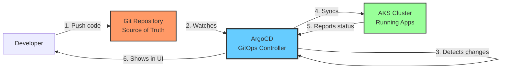
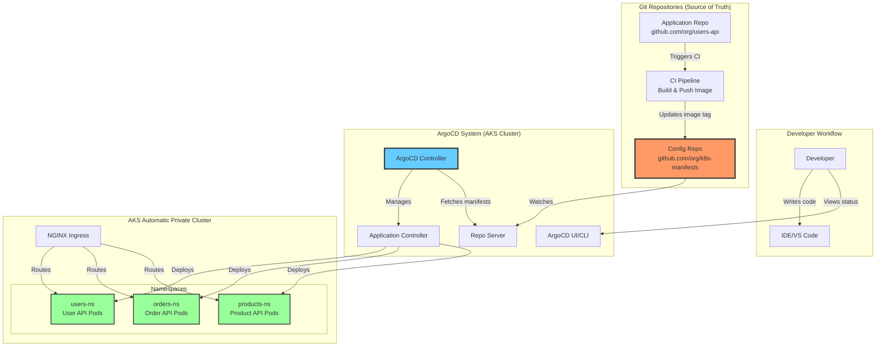
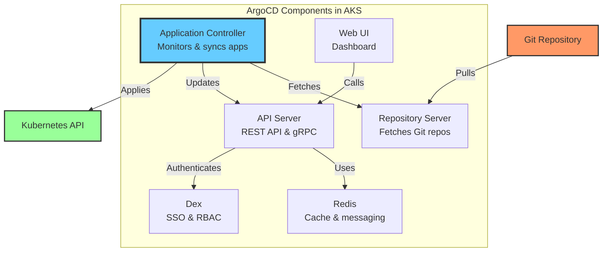
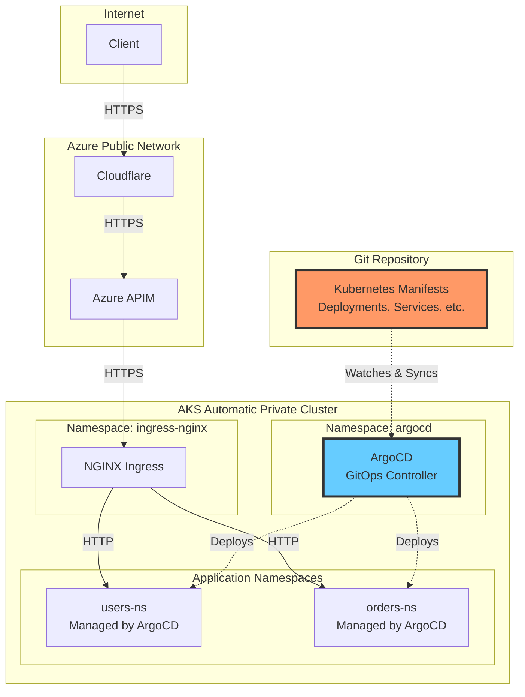
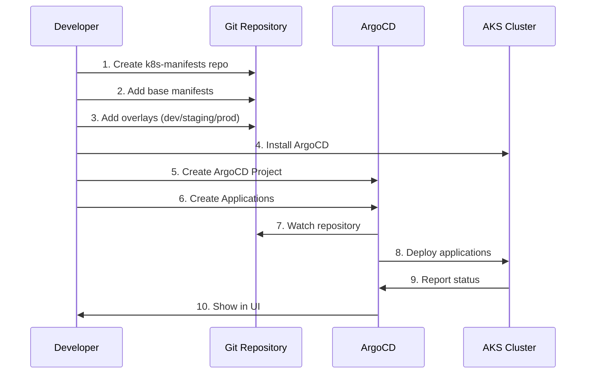

# ArgoCD for AKS Microservices: Complete Architecture & Engineering Guide

## Table of Contents
1. [Introduction: What is ArgoCD?](#introduction-what-is-argocd)
2. [Why GitOps for AKS Microservices?](#why-gitops-for-aks-microservices)
3. [Architecture Overview](#architecture-overview)
4. [Design Principles](#design-principles)
5. [Repository Structure](#repository-structure)
6. [Installation & Setup](#installation--setup)
7. [Reusable Code Templates](#reusable-code-templates)
8. [Deployment Workflows](#deployment-workflows)
9. [Operational Guide](#operational-guide)
10. [Troubleshooting](#troubleshooting)

---

## Introduction: What is ArgoCD?

### Layman Explanation

**Imagine you have a recipe book (Git repository) and a kitchen (Kubernetes cluster).**

- **Traditional approach**: You manually cook each dish by reading the recipe and following steps
- **ArgoCD approach**: You have a robot chef that:
  - Constantly watches your recipe book
  - Automatically cooks dishes when recipes change
  - Ensures the kitchen always matches what's in the recipe book
  - Alerts you if someone tries to cook something not in the book

**In technical terms:**
- **Recipe book** = Git repository with Kubernetes manifests
- **Kitchen** = Your AKS cluster
- **Robot chef** = ArgoCD
- **Dishes** = Your microservices (pods, services, deployments)

### What ArgoCD Does



**Key Capabilities:**
1. **Declarative**: You declare what you want (in Git), ArgoCD makes it happen
2. **Automated**: Changes in Git automatically deploy to Kubernetes
3. **Auditable**: Every change is tracked in Git history
4. **Rollback**: Easy to revert to previous versions
5. **Multi-cluster**: Manage multiple AKS clusters from one ArgoCD instance

---

## Why GitOps for AKS Microservices?

### Traditional Deployment (Manual)

```
Developer → kubectl apply → AKS Cluster
           ↓
    ❌ No audit trail
    ❌ No version control
    ❌ Manual process
    ❌ Hard to rollback
    ❌ Drift from desired state
```

### GitOps with ArgoCD (Automated)

```
Developer → Git Push → ArgoCD → AKS Cluster
           ↓
    ✅ Full audit trail (Git history)
    ✅ Version controlled
    ✅ Automated deployment
    ✅ Easy rollback (git revert)
    ✅ Self-healing (auto-sync)
```

### Benefits for Your AKS Microservices

| Challenge | Without ArgoCD | With ArgoCD |
|-----------|----------------|-------------|
| **Deployment consistency** | Manual kubectl commands, prone to errors | Automated, consistent deployments from Git |
| **Environment parity** | Dev/staging/prod may drift | All environments defined in Git, guaranteed parity |
| **Rollback** | Manual, error-prone | Git revert + auto-sync |
| **Audit trail** | Limited, scattered logs | Complete Git history |
| **Disaster recovery** | Manual cluster rebuild | Git repo = cluster state, easy rebuild |
| **Multi-cluster** | Manage each cluster separately | Single pane of glass for all clusters |
| **Security** | Direct kubectl access needed | Git-based RBAC, no direct cluster access |

---

## Architecture Overview

### High-Level Architecture



### ArgoCD Components



### Integration with Your AKS Architecture



---

## Design Principles

### 1. Repository Structure Strategy

**App of Apps Pattern** (Recommended for microservices)

```
k8s-manifests/                    # Single config repository
├── argocd/                       # ArgoCD configuration
│   ├── projects/                 # ArgoCD Projects
│   │   ├── microservices.yaml
│   │   └── infrastructure.yaml
│   ├── applications/             # ArgoCD Applications
│   │   ├── app-of-apps.yaml     # Root application
│   │   ├── users-api-dev.yaml
│   │   ├── users-api-staging.yaml
│   │   ├── users-api-prod.yaml
│   │   ├── orders-api-dev.yaml
│   │   └── ...
│   └── applicationsets/          # ApplicationSets for automation
│       └── microservices.yaml
├── base/                         # Base Kustomize configs
│   ├── users-api/
│   │   ├── kustomization.yaml
│   │   ├── deployment.yaml
│   │   ├── service.yaml
│   │   ├── ingress.yaml
│   │   └── secretproviderclass.yaml
│   ├── orders-api/
│   └── products-api/
└── overlays/                     # Environment-specific overlays
    ├── dev/
    │   ├── users-api/
    │   │   ├── kustomization.yaml
    │   │   └── patches/
    │   ├── orders-api/
    │   └── ...
    ├── staging/
    └── prod/
```

### 2. Application Patterns

**Pattern 1: One App Per Microservice Per Environment**
```
users-api-dev    → deploys to dev namespace
users-api-staging → deploys to staging namespace
users-api-prod   → deploys to prod namespace
```

**Pattern 2: ApplicationSet for Automation**
```
microservices-appset → generates apps for all microservices × all environments
```

### 3. Sync Strategies

| Strategy | Description | Use Case |
|----------|-------------|----------|
| **Manual Sync** | Requires manual approval to deploy | Production environments |
| **Auto Sync** | Automatically deploys on Git changes | Dev/staging environments |
| **Self-Heal** | Reverts manual kubectl changes | All environments (recommended) |
| **Prune** | Deletes resources removed from Git | All environments (be careful!) |

---

## Repository Structure

### Complete Directory Layout

```bash
k8s-manifests/
├── README.md
├── argocd/
│   ├── install/
│   │   ├── argocd-namespace.yaml
│   │   ├── argocd-install.yaml
│   │   └── argocd-ingress.yaml
│   ├── projects/
│   │   ├── microservices-project.yaml
│   │   └── infrastructure-project.yaml
│   ├── applications/
│   │   ├── root-app.yaml                    # App of Apps
│   │   ├── users-api-dev.yaml
│   │   ├── users-api-staging.yaml
│   │   ├── users-api-prod.yaml
│   │   ├── orders-api-dev.yaml
│   │   ├── orders-api-staging.yaml
│   │   └── orders-api-prod.yaml
│   └── applicationsets/
│       └── microservices-appset.yaml
├── base/
│   ├── users-api/
│   │   ├── kustomization.yaml
│   │   ├── namespace.yaml
│   │   ├── serviceaccount.yaml
│   │   ├── deployment.yaml
│   │   ├── service.yaml
│   │   ├── ingress.yaml
│   │   ├── secretproviderclass.yaml
│   │   ├── configmap.yaml
│   │   └── hpa.yaml
│   ├── orders-api/
│   │   └── ... (same structure)
│   └── products-api/
│       └── ... (same structure)
├── overlays/
│   ├── dev/
│   │   ├── users-api/
│   │   │   ├── kustomization.yaml
│   │   │   ├── deployment-patch.yaml
│   │   │   ├── configmap-patch.yaml
│   │   │   └── ingress-patch.yaml
│   │   ├── orders-api/
│   │   └── products-api/
│   ├── staging/
│   │   └── ... (same structure as dev)
│   └── prod/
│       └── ... (same structure as dev)
└── scripts/
    ├── install-argocd.sh
    ├── create-app.sh
    └── sync-app.sh
```

---

## Installation & Setup

### Prerequisites

```bash
# 1. AKS cluster (automatic private cluster)
# 2. kubectl configured
# 3. Helm 3 installed
# 4. Git repository for manifests
```

### Step 1: Install ArgoCD

**Option A: Using Official Manifests (Recommended)**

```bash
#!/bin/bash
# scripts/install-argocd.sh

set -e

echo "Installing ArgoCD..."

# Create namespace
kubectl create namespace argocd

# Install ArgoCD
kubectl apply -n argocd -f https://raw.githubusercontent.com/argoproj/argo-cd/stable/manifests/install.yaml

# Wait for ArgoCD to be ready
echo "Waiting for ArgoCD to be ready..."
kubectl wait --for=condition=available --timeout=300s \
  deployment/argocd-server -n argocd

# Get initial admin password
ARGOCD_PASSWORD=$(kubectl -n argocd get secret argocd-initial-admin-secret \
  -o jsonpath="{.data.password}" | base64 -d)

echo "ArgoCD installed successfully!"
echo "Admin password: $ARGOCD_PASSWORD"
echo ""
echo "To access ArgoCD UI:"
echo "kubectl port-forward svc/argocd-server -n argocd 8080:443"
echo "Then visit: https://localhost:8080"
echo "Username: admin"
echo "Password: $ARGOCD_PASSWORD"
```

**Option B: Using Helm**

```bash
#!/bin/bash
# scripts/install-argocd-helm.sh

set -e

# Add ArgoCD Helm repository
helm repo add argo https://argoproj.github.io/argo-helm
helm repo update

# Install ArgoCD with custom values
helm install argocd argo/argo-cd \
  --namespace argocd \
  --create-namespace \
  --values - <<EOF
server:
  replicas: 2
  ingress:
    enabled: true
    ingressClassName: nginx
    hosts:
      - argocd.apps.internal.local
    tls:
      - secretName: argocd-tls
        hosts:
          - argocd.apps.internal.local
  config:
    url: https://argocd.apps.internal.local
    
controller:
  replicas: 1
  
repoServer:
  replicas: 2
  
redis:
  enabled: true
  
configs:
  secret:
    argocdServerAdminPassword: \$2a\$10\$... # bcrypt hash of your password
EOF

echo "ArgoCD installed via Helm!"
```

### Step 2: Configure ArgoCD for AKS

**Create ArgoCD ConfigMap:**

```yaml
# argocd/install/argocd-cm.yaml
apiVersion: v1
kind: ConfigMap
metadata:
  name: argocd-cm
  namespace: argocd
data:
  # Enable anonymous read-only access (optional)
  users.anonymous.enabled: "false"
  
  # Timeout settings
  timeout.reconciliation: "180s"
  timeout.hard.reconciliation: "0"
  
  # Resource tracking method
  application.resourceTrackingMethod: "annotation"
  
  # Diff customization
  resource.customizations: |
    admissionregistration.k8s.io/MutatingWebhookConfiguration:
      ignoreDifferences: |
        jsonPointers:
        - /webhooks/0/clientConfig/caBundle
```

**Configure RBAC:**

```yaml
# argocd/install/argocd-rbac-cm.yaml
apiVersion: v1
kind: ConfigMap
metadata:
  name: argocd-rbac-cm
  namespace: argocd
data:
  policy.default: role:readonly
  policy.csv: |
    # Developers can view and sync apps
    p, role:developer, applications, get, */*, allow
    p, role:developer, applications, sync, */*, allow
    p, role:developer, logs, get, */*, allow
    p, role:developer, exec, create, */*, deny
    
    # DevOps can do everything
    p, role:devops, applications, *, */*, allow
    p, role:devops, clusters, *, *, allow
    p, role:devops, repositories, *, *, allow
    p, role:devops, projects, *, *, allow
    
    # Map Azure AD groups to roles
    g, devops-team@example.com, role:devops
    g, developers@example.com, role:developer
```

### Step 3: Expose ArgoCD UI

**Create Ingress for ArgoCD:**

```yaml
# argocd/install/argocd-ingress.yaml
apiVersion: networking.k8s.io/v1
kind: Ingress
metadata:
  name: argocd-server-ingress
  namespace: argocd
  annotations:
    kubernetes.io/ingress.class: nginx
    cert-manager.io/cluster-issuer: letsencrypt-prod
    nginx.ingress.kubernetes.io/ssl-passthrough: "true"
    nginx.ingress.kubernetes.io/backend-protocol: "HTTPS"
spec:
  tls:
  - hosts:
    - argocd.apps.internal.local
    secretName: argocd-tls
  rules:
  - host: argocd.apps.internal.local
    http:
      paths:
      - path: /
        pathType: Prefix
        backend:
          service:
            name: argocd-server
            port:
              number: 443
```

**Apply the configuration:**

```bash
kubectl apply -f argocd/install/argocd-cm.yaml
kubectl apply -f argocd/install/argocd-rbac-cm.yaml
kubectl apply -f argocd/install/argocd-ingress.yaml
```

---

## Reusable Code Templates

### Template 1: ArgoCD Project

```yaml
# argocd/projects/microservices-project.yaml
apiVersion: argoproj.io/v1alpha1
kind: AppProject
metadata:
  name: microservices
  namespace: argocd
spec:
  description: Microservices applications
  
  # Source repositories
  sourceRepos:
  - 'https://github.com/your-org/k8s-manifests.git'
  - 'https://github.com/your-org/*'  # Allow all org repos
  
  # Destination clusters and namespaces
  destinations:
  - namespace: 'users-ns'
    server: https://kubernetes.default.svc
  - namespace: 'orders-ns'
    server: https://kubernetes.default.svc
  - namespace: 'products-ns'
    server: https://kubernetes.default.svc
  - namespace: '*-dev'
    server: https://kubernetes.default.svc
  - namespace: '*-staging'
    server: https://kubernetes.default.svc
  - namespace: '*-prod'
    server: https://kubernetes.default.svc
  
  # Cluster resource allow list
  clusterResourceWhitelist:
  - group: ''
    kind: Namespace
  - group: 'rbac.authorization.k8s.io'
    kind: ClusterRole
  - group: 'rbac.authorization.k8s.io'
    kind: ClusterRoleBinding
  
  # Namespace resource allow list
  namespaceResourceWhitelist:
  - group: '*'
    kind: '*'
  
  # Sync windows (optional - prevent syncs during maintenance)
  syncWindows:
  - kind: deny
    schedule: '0 22 * * *'  # No syncs at 10 PM
    duration: 2h
    applications:
    - '*-prod'
    manualSync: true
```

### Template 2: Base Kustomization for Microservice

```yaml
# base/users-api/kustomization.yaml
apiVersion: kustomize.config.k8s.io/v1beta1
kind: Kustomization

namespace: users-ns

resources:
- namespace.yaml
- serviceaccount.yaml
- deployment.yaml
- service.yaml
- ingress.yaml
- secretproviderclass.yaml
- configmap.yaml
- hpa.yaml

commonLabels:
  app: users-api
  managed-by: argocd

commonAnnotations:
  team: platform
  contact: platform-team@example.com
```

```yaml
# base/users-api/namespace.yaml
apiVersion: v1
kind: Namespace
metadata:
  name: users-ns
  labels:
    name: users-ns
    istio-injection: enabled  # If using Istio
```

```yaml
# base/users-api/serviceaccount.yaml
apiVersion: v1
kind: ServiceAccount
metadata:
  name: users-api-sa
  namespace: users-ns
  annotations:
    azure.workload.identity/client-id: "${WORKLOAD_IDENTITY_CLIENT_ID}"
    azure.workload.identity/tenant-id: "${AZURE_TENANT_ID}"
```

```yaml
# base/users-api/deployment.yaml
apiVersion: apps/v1
kind: Deployment
metadata:
  name: users-api
  namespace: users-ns
spec:
  replicas: 3
  selector:
    matchLabels:
      app: users-api
  template:
    metadata:
      labels:
        app: users-api
        version: v1
        azure.workload.identity/use: "true"
    spec:
      serviceAccountName: users-api-sa
      containers:
      - name: users-api
        image: myregistry.azurecr.io/users-api:latest  # Will be overridden by Kustomize
        ports:
        - containerPort: 8080
          name: http
        - containerPort: 9090
          name: metrics
        
        envFrom:
        - configMapRef:
            name: users-api-config
        
        env:
        - name: Database__ConnectionString
          valueFrom:
            secretKeyRef:
              name: users-api-kv-secrets
              key: database-connection
        - name: POD_NAME
          valueFrom:
            fieldRef:
              fieldPath: metadata.name
        - name: POD_NAMESPACE
          valueFrom:
            fieldRef:
              fieldPath: metadata.namespace
        
        resources:
          requests:
            memory: "256Mi"
            cpu: "250m"
          limits:
            memory: "512Mi"
            cpu: "500m"
        
        livenessProbe:
          httpGet:
            path: /health/live
            port: 8080
          initialDelaySeconds: 10
          periodSeconds: 10
        
        readinessProbe:
          httpGet:
            path: /health/ready
            port: 8080
          initialDelaySeconds: 5
          periodSeconds: 5
        
        volumeMounts:
        - name: secrets-store
          mountPath: "/mnt/secrets-store"
          readOnly: true
      
      volumes:
      - name: secrets-store
        csi:
          driver: secrets-store.csi.k8s.io
          readOnly: true
          volumeAttributes:
            secretProviderClass: "users-api-secrets"
```

```yaml
# base/users-api/service.yaml
apiVersion: v1
kind: Service
metadata:
  name: users-api-service
  namespace: users-ns
spec:
  type: ClusterIP
  selector:
    app: users-api
  ports:
  - name: http
    port: 8080
    targetPort: 8080
  - name: metrics
    port: 9090
    targetPort: 9090
```

```yaml
# base/users-api/ingress.yaml
apiVersion: networking.k8s.io/v1
kind: Ingress
metadata:
  name: users-api-ingress
  namespace: users-ns
  annotations:
    kubernetes.io/ingress.class: nginx
    cert-manager.io/cluster-issuer: letsencrypt-prod
    nginx.ingress.kubernetes.io/ssl-redirect: "true"
spec:
  tls:
  - hosts:
    - users-api.apps.internal.local
    secretName: users-api-tls
  rules:
  - host: users-api.apps.internal.local
    http:
      paths:
      - path: /
        pathType: Prefix
        backend:
          service:
            name: users-api-service
            port:
              number: 8080
```

```yaml
# base/users-api/secretproviderclass.yaml
apiVersion: secrets-store.csi.x-k8s.io/v1
kind: SecretProviderClass
metadata:
  name: users-api-secrets
  namespace: users-ns
spec:
  provider: azure
  parameters:
    usePodIdentity: "false"
    useVMManagedIdentity: "false"
    clientID: "${WORKLOAD_IDENTITY_CLIENT_ID}"
    keyvaultName: "kv-aks-prod-secrets"
    cloudName: "AzurePublicCloud"
    objects: |
      array:
        - |
          objectName: users-api-db-connection
          objectType: secret
          objectVersion: ""
    tenantId: "${AZURE_TENANT_ID}"
  secretObjects:
  - secretName: users-api-kv-secrets
    type: Opaque
    data:
    - objectName: users-api-db-connection
      key: database-connection
```

```yaml
# base/users-api/configmap.yaml
apiVersion: v1
kind: ConfigMap
metadata:
  name: users-api-config
  namespace: users-ns
data:
  ASPNETCORE_ENVIRONMENT: "Production"
  App__Name: "UsersAPIService"
  App__Version: "1.0.0"
  Logging__LogLevel__Default: "Information"
  Services__OrdersAPI__BaseUrl: "http://orders-api-service.orders-ns.svc.cluster.local:8080"
```

```yaml
# base/users-api/hpa.yaml
apiVersion: autoscaling/v2
kind: HorizontalPodAutoscaler
metadata:
  name: users-api-hpa
  namespace: users-ns
spec:
  scaleTargetRef:
    apiVersion: apps/v1
    kind: Deployment
    name: users-api
  minReplicas: 3
  maxReplicas: 10
  metrics:
  - type: Resource
    resource:
      name: cpu
      target:
        type: Utilization
        averageUtilization: 70
  - type: Resource
    resource:
      name: memory
      target:
        type: Utilization
        averageUtilization: 80
```

### Template 3: Environment Overlays

```yaml
# overlays/dev/users-api/kustomization.yaml
apiVersion: kustomize.config.k8s.io/v1beta1
kind: Kustomization

namespace: users-ns-dev

bases:
- ../../../base/users-api

nameSuffix: -dev

images:
- name: myregistry.azurecr.io/users-api
  newTag: dev-latest

replicas:
- name: users-api
  count: 1

patches:
- path: deployment-patch.yaml
- path: configmap-patch.yaml
- path: ingress-patch.yaml
```

```yaml
# overlays/dev/users-api/deployment-patch.yaml
apiVersion: apps/v1
kind: Deployment
metadata:
  name: users-api
spec:
  template:
    spec:
      containers:
      - name: users-api
        resources:
          requests:
            memory: "128Mi"
            cpu: "100m"
          limits:
            memory: "256Mi"
            cpu: "200m"
```

```yaml
# overlays/dev/users-api/configmap-patch.yaml
apiVersion: v1
kind: ConfigMap
metadata:
  name: users-api-config
data:
  ASPNETCORE_ENVIRONMENT: "Development"
  Logging__LogLevel__Default: "Debug"
```

```yaml
# overlays/dev/users-api/ingress-patch.yaml
apiVersion: networking.k8s.io/v1
kind: Ingress
metadata:
  name: users-api-ingress
spec:
  rules:
  - host: users-api-dev.apps.internal.local
```

```yaml
# overlays/prod/users-api/kustomization.yaml
apiVersion: kustomize.config.k8s.io/v1beta1
kind: Kustomization

namespace: users-ns-prod

bases:
- ../../../base/users-api

nameSuffix: -prod

images:
- name: myregistry.azurecr.io/users-api
  newTag: v1.2.3  # Specific version tag for prod

replicas:
- name: users-api
  count: 5

patches:
- path: deployment-patch.yaml
- path: configmap-patch.yaml
- path: ingress-patch.yaml
- path: hpa-patch.yaml
```

```yaml
# overlays/prod/users-api/hpa-patch.yaml
apiVersion: autoscaling/v2
kind: HorizontalPodAutoscaler
metadata:
  name: users-api-hpa
spec:
  minReplicas: 5
  maxReplicas: 20
```

### Template 4: ArgoCD Application

```yaml
# argocd/applications/users-api-dev.yaml
apiVersion: argoproj.io/v1alpha1
kind: Application
metadata:
  name: users-api-dev
  namespace: argocd
  finalizers:
  - resources-finalizer.argocd.argoproj.io
spec:
  project: microservices
  
  source:
    repoURL: https://github.com/your-org/k8s-manifests.git
    targetRevision: main
    path: overlays/dev/users-api
  
  destination:
    server: https://kubernetes.default.svc
    namespace: users-ns-dev
  
  syncPolicy:
    automated:
      prune: true
      selfHeal: true
      allowEmpty: false
    syncOptions:
    - CreateNamespace=true
    - PrunePropagationPolicy=foreground
    - PruneLast=true
    retry:
      limit: 5
      backoff:
        duration: 5s
        factor: 2
        maxDuration: 3m
  
  ignoreDifferences:
  - group: apps
    kind: Deployment
    jsonPointers:
    - /spec/replicas  # Ignore if HPA is managing replicas
```

```yaml
# argocd/applications/users-api-prod.yaml
apiVersion: argoproj.io/v1alpha1
kind: Application
metadata:
  name: users-api-prod
  namespace: argocd
  finalizers:
  - resources-finalizer.argocd.argoproj.io
  annotations:
    notifications.argoproj.io/subscribe.on-sync-succeeded.slack: platform-team
    notifications.argoproj.io/subscribe.on-sync-failed.slack: platform-team
spec:
  project: microservices
  
  source:
    repoURL: https://github.com/your-org/k8s-manifests.git
    targetRevision: main
    path: overlays/prod/users-api
  
  destination:
    server: https://kubernetes.default.svc
    namespace: users-ns-prod
  
  syncPolicy:
    automated:
      prune: false  # Manual approval for prod
      selfHeal: true
    syncOptions:
    - CreateNamespace=true
    - PrunePropagationPolicy=foreground
    retry:
      limit: 3
      backoff:
        duration: 10s
        factor: 2
        maxDuration: 5m
  
  ignoreDifferences:
  - group: apps
    kind: Deployment
    jsonPointers:
    - /spec/replicas
```

### Template 5: App of Apps (Root Application)

```yaml
# argocd/applications/root-app.yaml
apiVersion: argoproj.io/v1alpha1
kind: Application
metadata:
  name: root-app
  namespace: argocd
  finalizers:
  - resources-finalizer.argocd.argoproj.io
spec:
  project: default
  
  source:
    repoURL: https://github.com/your-org/k8s-manifests.git
    targetRevision: main
    path: argocd/applications
  
  destination:
    server: https://kubernetes.default.svc
    namespace: argocd
  
  syncPolicy:
    automated:
      prune: true
      selfHeal: true
```

### Template 6: ApplicationSet (Advanced Automation)

```yaml
# argocd/applicationsets/microservices-appset.yaml
apiVersion: argoproj.io/v1alpha1
kind: ApplicationSet
metadata:
  name: microservices
  namespace: argocd
spec:
  generators:
  # Matrix generator: microservices × environments
  - matrix:
      generators:
      # List of microservices
      - list:
          elements:
          - service: users-api
            namespace: users-ns
          - service: orders-api
            namespace: orders-ns
          - service: products-api
            namespace: products-ns
      
      # List of environments
      - list:
          elements:
          - env: dev
            autoSync: "true"
            prune: "true"
          - env: staging
            autoSync: "true"
            prune: "true"
          - env: prod
            autoSync: "false"
            prune: "false"
  
  template:
    metadata:
      name: '{{service}}-{{env}}'
      namespace: argocd
      finalizers:
      - resources-finalizer.argocd.argoproj.io
    spec:
      project: microservices
      
      source:
        repoURL: https://github.com/your-org/k8s-manifests.git
        targetRevision: main
        path: 'overlays/{{env}}/{{service}}'
      
      destination:
        server: https://kubernetes.default.svc
        namespace: '{{namespace}}-{{env}}'
      
      syncPolicy:
        automated:
          prune: '{{prune}}'
          selfHeal: true
        syncOptions:
        - CreateNamespace=true
```

---

## Deployment Workflows

### Workflow 1: Initial Setup



**Step-by-step commands:**

```bash
# 1. Create and initialize repository
git clone https://github.com/your-org/k8s-manifests.git
cd k8s-manifests

# 2. Create directory structure
mkdir -p argocd/{install,projects,applications,applicationsets}
mkdir -p base/{users-api,orders-api,products-api}
mkdir -p overlays/{dev,staging,prod}/{users-api,orders-api,products-api}
mkdir -p scripts

# 3. Install ArgoCD
./scripts/install-argocd.sh

# 4. Apply ArgoCD project
kubectl apply -f argocd/projects/microservices-project.yaml

# 5. Apply root application (App of Apps)
kubectl apply -f argocd/applications/root-app.yaml

# 6. Verify deployment
argocd app list
argocd app get users-api-dev
```

### Workflow 2: Deploying a New Microservice

```bash
#!/bin/bash
# scripts/create-new-microservice.sh

SERVICE_NAME=$1
NAMESPACE=$2

if [ -z "$SERVICE_NAME" ] || [ -z "$NAMESPACE" ]; then
  echo "Usage: $0 <service-name> <namespace>"
  exit 1
fi

echo "Creating manifests for $SERVICE_NAME..."

# Create base directory
mkdir -p base/$SERVICE_NAME

# Copy template files
cp base/users-api/* base/$SERVICE_NAME/

# Replace placeholders
sed -i "s/users-api/$SERVICE_NAME/g" base/$SERVICE_NAME/*
sed -i "s/users-ns/$NAMESPACE/g" base/$SERVICE_NAME/*

# Create overlays
for ENV in dev staging prod; do
  mkdir -p overlays/$ENV/$SERVICE_NAME
  cp overlays/dev/users-api/* overlays/$ENV/$SERVICE_NAME/
  sed -i "s/users-api/$SERVICE_NAME/g" overlays/$ENV/$SERVICE_NAME/*
done

echo "Manifests created! Now:"
echo "1. Review and customize base/$SERVICE_NAME/"
echo "2. Update overlays for each environment"
echo "3. Commit and push to Git"
echo "4. ArgoCD will automatically deploy (if auto-sync enabled)"
```

### Workflow 3: Promoting to Production

```mermaid
graph LR
    Dev[Developer] -->|1. Test in dev| DevEnv[Dev Environment]
    DevEnv -->|2. Promote to staging| StagingEnv[Staging Environment]
    StagingEnv -->|3. QA approval| QA[QA Team]
    QA -->|4. Update prod overlay| Git[Git Repository]
    Git -->|5. Manual sync| ArgoCD
    ArgoCD -->|6. Deploy| ProdEnv[Production]
    
    style DevEnv fill:#ccffcc,stroke:#333,stroke-width:2px
    style StagingEnv fill:#ffffcc,stroke:#333,stroke-width:2px
    style ProdEnv fill:#ffcccc,stroke:#333,stroke-width:2px
```



**Promotion script:**

```bash
#!/bin/bash
# scripts/promote-to-prod.sh

SERVICE=$1
VERSION=$2

if [ -z "$SERVICE" ] || [ -z "$VERSION" ]; then
  echo "Usage: $0 <service-name> <version>"
  exit 1
fi

echo "Promoting $SERVICE to production with version $VERSION..."

# Update production overlay
cd overlays/prod/$SERVICE

# Update image tag in kustomization.yaml
sed -i "s/newTag: .*/newTag: $VERSION/" kustomization.yaml

# Commit changes
git add kustomization.yaml
git commit -m "Promote $SERVICE to production: $VERSION"
git push origin main

echo "Promotion committed to Git!"
echo "To deploy, run:"
echo "argocd app sync $SERVICE-prod"
```

---

## Operational Guide

### Monitoring ArgoCD

**Check Application Health:**

```bash
# List all applications
argocd app list

# Get detailed app status
argocd app get users-api-prod

# View sync history
argocd app history users-api-prod

# View application logs
argocd app logs users-api-prod
```

**ArgoCD Metrics (Prometheus):**

```yaml
# ServiceMonitor for ArgoCD metrics
apiVersion: monitoring.coreos.com/v1
kind: ServiceMonitor
metadata:
  name: argocd-metrics
  namespace: argocd
spec:
  selector:
    matchLabels:
      app.kubernetes.io/name: argocd-metrics
  endpoints:
  - port: metrics
```

**Key Metrics to Monitor:**
- `argocd_app_sync_total` - Total number of syncs
- `argocd_app_health_status` - Application health status
- `argocd_app_sync_status` - Sync status (synced/out-of-sync)
- `argocd_app_reconcile_duration_seconds` - Reconciliation duration

### Notifications

**Configure Slack notifications:**

```yaml
# argocd-notifications-cm.yaml
apiVersion: v1
kind: ConfigMap
metadata:
  name: argocd-notifications-cm
  namespace: argocd
data:
  service.slack: |
    token: $slack-token
  
  template.app-deployed: |
    message: |
      Application {{.app.metadata.name}} is now running new version.
      Sync Status: {{.app.status.sync.status}}
    slack:
      attachments: |
        [{
          "title": "{{ .app.metadata.name}}",
          "title_link":"{{.context.argocdUrl}}/applications/{{.app.metadata.name}}",
          "color": "#18be52",
          "fields": [
          {
            "title": "Sync Status",
            "value": "{{.app.status.sync.status}}",
            "short": true
          },
          {
            "title": "Repository",
            "value": "{{.app.spec.source.repoURL}}",
            "short": true
          }
          ]
        }]
  
  trigger.on-deployed: |
    - when: app.status.operationState.phase in ['Succeeded']
      send: [app-deployed]
```

### Backup and Disaster Recovery

**Backup ArgoCD configuration:**

```bash
#!/bin/bash
# scripts/backup-argocd.sh

BACKUP_DIR="argocd-backup-$(date +%Y%m%d-%H%M%S)"
mkdir -p $BACKUP_DIR

# Backup ArgoCD applications
kubectl get applications -n argocd -o yaml > $BACKUP_DIR/applications.yaml

# Backup ArgoCD projects
kubectl get appprojects -n argocd -o yaml > $BACKUP_DIR/projects.yaml

# Backup ArgoCD secrets
kubectl get secrets -n argocd -o yaml > $BACKUP_DIR/secrets.yaml

# Backup ArgoCD configmaps
kubectl get configmaps -n argocd -o yaml > $BACKUP_DIR/configmaps.yaml

tar -czf $BACKUP_DIR.tar.gz $BACKUP_DIR
echo "Backup created: $BACKUP_DIR.tar.gz"
```

**Disaster Recovery:**

```bash
# 1. Reinstall ArgoCD
./scripts/install-argocd.sh

# 2. Restore from backup
tar -xzf argocd-backup-*.tar.gz
kubectl apply -f argocd-backup-*/projects.yaml
kubectl apply -f argocd-backup-*/applications.yaml

# 3. ArgoCD will automatically sync from Git
# All applications will be restored to their desired state
```

---

## Troubleshooting

### Common Issues

#### Issue 1: Application Stuck in "Progressing"

**Symptoms:**
```
argocd app get users-api-dev
# Shows: Health Status: Progressing
```

**Diagnosis:**
```bash
# Check application events
argocd app get users-api-dev --show-operation

# Check pod status
kubectl get pods -n users-ns-dev

# Check pod logs
kubectl logs -n users-ns-dev deployment/users-api
```

**Solutions:**
1. Check if pods are failing to start (image pull errors, crash loops)
2. Verify resource quotas aren't exceeded
3. Check if health check probes are failing

#### Issue 2: Sync Fails with "Permission Denied"

**Symptoms:**
```
argocd app sync users-api-dev
# Error: permission denied
```

**Solution:**
```bash
# Check ArgoCD RBAC
kubectl get configmap argocd-rbac-cm -n argocd -o yaml

# Verify your user/group has correct permissions
# Update RBAC if needed
```

#### Issue 3: Application Out of Sync

**Symptoms:**
```
argocd app get users-api-prod
# Shows: Sync Status: OutOfSync
```

**Diagnosis:**
```bash
# View differences
argocd app diff users-api-prod

# Check if someone made manual changes
kubectl get deployment users-api -n users-ns-prod -o yaml
```

**Solutions:**
1. If auto-sync is disabled, manually sync: `argocd app sync users-api-prod`
2. If self-heal is disabled, ArgoCD won't revert manual changes
3. Enable self-heal to prevent drift: `syncPolicy.automated.selfHeal: true`

### Best Practices

1. **Use App of Apps Pattern**
   - Easier to manage multiple applications
   - Single source of truth for all apps

2. **Enable Self-Heal for All Environments**
   - Prevents configuration drift
   - Ensures Git is always the source of truth

3. **Use Manual Sync for Production**
   - Requires explicit approval for prod deployments
   - Prevents accidental deployments

4. **Implement Sync Windows**
   - Prevent deployments during business hours
   - Schedule maintenance windows

5. **Use ApplicationSets for Scale**
   - Automatically generate applications
   - Reduce manual configuration

6. **Monitor ArgoCD Health**
   - Set up Prometheus metrics
   - Configure Slack/email notifications

7. **Regular Backups**
   - Backup ArgoCD configuration daily
   - Test disaster recovery procedures

---

## Summary

### What You've Learned

1. **ArgoCD Basics**: GitOps controller that keeps AKS in sync with Git
2. **Architecture**: How ArgoCD integrates with your AKS cluster
3. **Repository Structure**: Organized layout for managing microservices
4. **Reusable Templates**: 100% reusable code for projects, applications, and manifests
5. **Workflows**: How to deploy, promote, and manage applications
6. **Operations**: Monitoring, backup, and troubleshooting

### Quick Start Checklist

- [ ] Install ArgoCD in AKS cluster
- [ ] Create Git repository with manifests
- [ ] Create ArgoCD project for microservices
- [ ] Create base manifests for your first microservice
- [ ] Create environment overlays (dev/staging/prod)
- [ ] Create ArgoCD applications
- [ ] Configure auto-sync for dev/staging
- [ ] Set up manual sync for production
- [ ] Configure notifications
- [ ] Set up monitoring and backups

### Next Steps

1. **Start Small**: Deploy one microservice to dev environment
2. **Test Workflows**: Practice promotion from dev → staging → prod
3. **Add More Services**: Use templates to onboard additional microservices
4. **Implement ApplicationSets**: Automate application creation
5. **Set Up CI/CD**: Integrate with your CI pipeline to update image tags
6. **Monitor and Optimize**: Track metrics and improve sync performance

**Your GitOps journey with ArgoCD starts now!** 🚀

