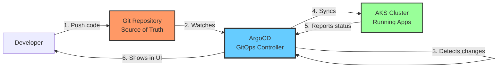
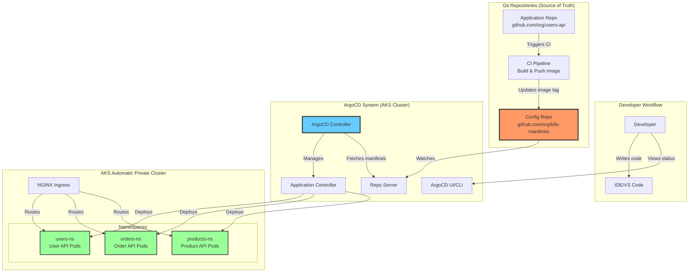
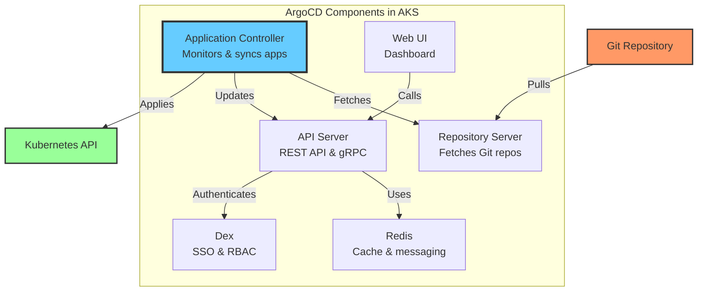
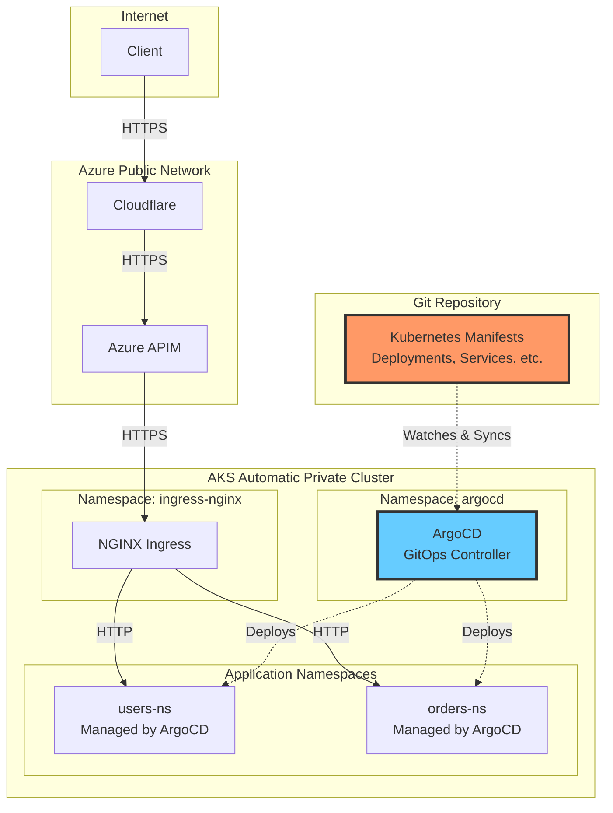

# ArgoCD for AKS Microservices: Complete Architecture & Engineering Guide

## Table of Contents
1. [Introduction: What is ArgoCD?](#introduction-what-is-argocd)
2. [Why GitOps for AKS Microservices?](#why-gitops-for-aks-microservices)
3. [Architecture Overview](#architecture-overview)
4. [Design Principles](#design-principles)
5. [Repository Structure](#repository-structure)
6. [Installation & Setup](#installation--setup)
7. [Reusable Code Templates](#reusable-code-templates)
8. [Deployment Workflows](#deployment-workflows)
9. [Operational Guide](#operational-guide)
10. [Troubleshooting](#troubleshooting)
11. [Deep Dive: Access & State Mechanics](#deep-dive-access--state-mechanics)

---

## Introduction: What is ArgoCD?

### Layman Explanation

**Imagine you have a recipe book (Git repository) and a kitchen (Kubernetes cluster).**

- **Traditional approach**: You manually cook each dish by reading the recipe and following steps
- **ArgoCD approach**: You have a robot chef that:
  - Constantly watches your recipe book
  - Automatically cooks dishes when recipes change
  - Ensures the kitchen always matches what's in the recipe book
  - Alerts you if someone tries to cook something not in the book

**In technical terms:**
- **Recipe book** = Git repository with Kubernetes manifests
- **Kitchen** = Your AKS cluster
- **Robot chef** = ArgoCD
- **Dishes** = Your microservices (pods, services, deployments)

### What ArgoCD Does



**Key Capabilities:**
1. **Declarative**: You declare what you want (in Git), ArgoCD makes it happen
2. **Automated**: Changes in Git automatically deploy to Kubernetes
3. **Auditable**: Every change is tracked in Git history
4. **Rollback**: Easy to revert to previous versions
5. **Multi-cluster**: Manage multiple AKS clusters from one ArgoCD instance

---

## Why GitOps for AKS Microservices?

### Traditional Deployment (Manual)

```
Developer → kubectl apply → AKS Cluster
           ↓
    ❌ No audit trail
    ❌ No version control
    ❌ Manual process
    ❌ Hard to rollback
    ❌ Drift from desired state
```

### GitOps with ArgoCD (Automated)

```
Developer → Git Push → ArgoCD → AKS Cluster
           ↓
    ✅ Full audit trail (Git history)
    ✅ Version controlled
    ✅ Automated deployment
    ✅ Easy rollback (git revert)
    ✅ Self-healing (auto-sync)
```

### Benefits for Your AKS Microservices

| Challenge | Without ArgoCD | With ArgoCD |
|-----------|----------------|-------------|
| **Deployment consistency** | Manual kubectl commands, prone to errors | Automated, consistent deployments from Git |
| **Environment parity** | Dev/staging/prod may drift | All environments defined in Git, guaranteed parity |
| **Rollback** | Manual, error-prone | Git revert + auto-sync |
| **Audit trail** | Limited, scattered logs | Complete Git history |
| **Disaster recovery** | Manual cluster rebuild | Git repo = cluster state, easy rebuild |
| **Multi-cluster** | Manage each cluster separately | Single pane of glass for all clusters |
| **Security** | Direct kubectl access needed | Git-based RBAC, no direct cluster access |

---

## Architecture Overview

### High-Level Architecture



### ArgoCD Components



### Integration with Your AKS Architecture



---

## Design Principles

### 1. Repository Structure Strategy

**App of Apps Pattern** (Recommended for microservices)

```
k8s-manifests/                    # Single config repository
├── argocd/                       # ArgoCD configuration
│   ├── projects/                 # ArgoCD Projects
│   │   ├── microservices.yaml
│   │   └── infrastructure.yaml
│   ├── applications/             # ArgoCD Applications
│   │   ├── app-of-apps.yaml     # Root application
│   │   ├── users-api-dev.yaml
│   │   ├── users-api-staging.yaml
│   │   ├── users-api-prod.yaml
│   │   ├── orders-api-dev.yaml
│   │   └── ...
│   └── applicationsets/          # ApplicationSets for automation
│       └── microservices.yaml
├── base/                         # Base Kustomize configs
│   ├── users-api/
│   │   ├── kustomization.yaml
│   │   ├── deployment.yaml
│   │   ├── service.yaml
│   │   ├── ingress.yaml
│   │   └── secretproviderclass.yaml
│   ├── orders-api/
│   └── products-api/
└── overlays/                     # Environment-specific overlays
    ├── dev/
    │   ├── users-api/
    │   │   ├── kustomization.yaml
    │   │   └── patches/
    │   ├── orders-api/
    │   └── ...
    ├── staging/
    └── prod/
```

### 2. Application Patterns

**Pattern 1: One App Per Microservice Per Environment**
```
users-api-dev    → deploys to dev namespace
users-api-staging → deploys to staging namespace
users-api-prod   → deploys to prod namespace
```

**Pattern 2: ApplicationSet for Automation**
```
microservices-appset → generates apps for all microservices × all environments
```

### 3. Sync Strategies

| Strategy | Description | Use Case |
|----------|-------------|----------|
| **Manual Sync** | Requires manual approval to deploy | Production environments |
| **Auto Sync** | Automatically deploys on Git changes | Dev/staging environments |
| **Self-Heal** | Reverts manual kubectl changes | All environments (recommended) |
| **Prune** | Deletes resources removed from Git | All environments (be careful!) |

---

## Repository Structure

### Complete Directory Layout

```bash
k8s-manifests/
├── README.md
├── argocd/
│   ├── install/
│   │   ├── argocd-namespace.yaml
│   │   ├── argocd-install.yaml
│   │   └── argocd-ingress.yaml
│   ├── projects/
│   │   ├── microservices-project.yaml
│   │   └── infrastructure-project.yaml
│   ├── applications/
│   │   ├── root-app.yaml                    # App of Apps
│   │   ├── users-api-dev.yaml
│   │   ├── users-api-staging.yaml
│   │   ├── users-api-prod.yaml
│   │   ├── orders-api-dev.yaml
│   │   ├── orders-api-staging.yaml
│   │   └── orders-api-prod.yaml
│   └── applicationsets/
│       └── microservices-appset.yaml
├── base/
│   ├── users-api/
│   │   ├── kustomization.yaml
│   │   ├── namespace.yaml
│   │   ├── serviceaccount.yaml
│   │   ├── deployment.yaml
│   │   ├── service.yaml
│   │   ├── ingress.yaml
│   │   ├── secretproviderclass.yaml
│   │   ├── configmap.yaml
│   │   └── hpa.yaml
│   ├── orders-api/
│   │   └── ... (same structure)
│   └── products-api/
│       └── ... (same structure)
├── overlays/
│   ├── dev/
│   │   ├── users-api/
│   │   │   ├── kustomization.yaml
│   │   │   ├── deployment-patch.yaml
│   │   │   ├── configmap-patch.yaml
│   │   │   └── ingress-patch.yaml
│   │   ├── orders-api/
│   │   └── products-api/
│   ├── staging/
│   │   └── ... (same structure as dev)
│   └── prod/
│       └── ... (same structure as dev)
└── scripts/
    ├── install-argocd.sh
    ├── create-app.sh
    └── sync-app.sh
```

---

## Installation & Setup

### Prerequisites

```bash
# 1. AKS cluster (automatic private cluster)
# 2. kubectl configured
# 3. Helm 3 installed
# 4. Git repository for manifests
```

### Step 1: Install ArgoCD

**Option A: Using Official Manifests (Recommended)**

```bash
#!/bin/bash
# scripts/install-argocd.sh

set -e

echo "Installing ArgoCD..."

# Create namespace
kubectl create namespace argocd

# Install ArgoCD
kubectl apply -n argocd -f https://raw.githubusercontent.com/argoproj/argo-cd/stable/manifests/install.yaml

# Wait for ArgoCD to be ready
echo "Waiting for ArgoCD to be ready..."
kubectl wait --for=condition=available --timeout=300s \
  deployment/argocd-server -n argocd

# Get initial admin password
ARGOCD_PASSWORD=$(kubectl -n argocd get secret argocd-initial-admin-secret \
  -o jsonpath="{.data.password}" | base64 -d)

echo "ArgoCD installed successfully!"
echo "Admin password: $ARGOCD_PASSWORD"
echo ""
echo "To access ArgoCD UI:"
echo "kubectl port-forward svc/argocd-server -n argocd 8080:443"
echo "Then visit: https://localhost:8080"
echo "Username: admin"
echo "Password: $ARGOCD_PASSWORD"
```

**Option B: Using Helm**

```bash
#!/bin/bash
# scripts/install-argocd-helm.sh

set -e

# Add ArgoCD Helm repository
helm repo add argo https://argoproj.github.io/argo-helm
helm repo update

# Install ArgoCD with custom values
helm install argocd argo/argo-cd \
  --namespace argocd \
  --create-namespace \
  --values - <<EOF
server:
  replicas: 2
  ingress:
    enabled: true
    ingressClassName: nginx
    hosts:
      - argocd.apps.internal.local
    tls:
      - secretName: argocd-tls
        hosts:
          - argocd.apps.internal.local
  config:
    url: https://argocd.apps.internal.local
    
controller:
  replicas: 1
  
repoServer:
  replicas: 2
  
redis:
  enabled: true
  
configs:
  secret:
    argocdServerAdminPassword: \$2a\$10\$... # bcrypt hash of your password
EOF

echo "ArgoCD installed via Helm!"
```

### Step 2: Configure ArgoCD for AKS

**Create ArgoCD ConfigMap:**

```yaml
# argocd/install/argocd-cm.yaml
apiVersion: v1
kind: ConfigMap
metadata:
  name: argocd-cm
  namespace: argocd
data:
  # Enable anonymous read-only access (optional)
  users.anonymous.enabled: "false"
  
  # Timeout settings
  timeout.reconciliation: "180s"
  timeout.hard.reconciliation: "0"
  
  # Resource tracking method
  application.resourceTrackingMethod: "annotation"
  
  # Diff customization
  resource.customizations: |
    admissionregistration.k8s.io/MutatingWebhookConfiguration:
      ignoreDifferences: |
        jsonPointers:
        - /webhooks/0/clientConfig/caBundle
```

**Configure RBAC:**

```yaml
# argocd/install/argocd-rbac-cm.yaml
apiVersion: v1
kind: ConfigMap
metadata:
  name: argocd-rbac-cm
  namespace: argocd
data:
  policy.default: role:readonly
  policy.csv: |
    # Developers can view and sync apps
    p, role:developer, applications, get, */*, allow
    p, role:developer, applications, sync, */*, allow
    p, role:developer, logs, get, */*, allow
    p, role:developer, exec, create, */*, deny
    
    # DevOps can do everything
    p, role:devops, applications, *, */*, allow
    p, role:devops, clusters, *, *, allow
    p, role:devops, repositories, *, *, allow
    p, role:devops, projects, *, *, allow
    
    # Map Azure AD groups to roles
    g, devops-team@example.com, role:devops
    g, developers@example.com, role:developer
```

### Step 3: Expose ArgoCD UI

**Create Ingress for ArgoCD:**

```yaml
# argocd/install/argocd-ingress.yaml
apiVersion: networking.k8s.io/v1
kind: Ingress
metadata:
  name: argocd-server-ingress
  namespace: argocd
  annotations:
    kubernetes.io/ingress.class: nginx
    cert-manager.io/cluster-issuer: letsencrypt-prod
    nginx.ingress.kubernetes.io/ssl-passthrough: "true"
    nginx.ingress.kubernetes.io/backend-protocol: "HTTPS"
spec:
  tls:
  - hosts:
    - argocd.apps.internal.local
    secretName: argocd-tls
  rules:
  - host: argocd.apps.internal.local
    http:
      paths:
      - path: /
        pathType: Prefix
        backend:
          service:
            name: argocd-server
            port:
              number: 443
```

**Apply the configuration:**

```bash
kubectl apply -f argocd/install/argocd-cm.yaml
kubectl apply -f argocd/install/argocd-rbac-cm.yaml
kubectl apply -f argocd/install/argocd-ingress.yaml
```

---

## Reusable Code Templates

### Template 1: ArgoCD Project

```yaml
# argocd/projects/microservices-project.yaml
apiVersion: argoproj.io/v1alpha1
kind: AppProject
metadata:
  name: microservices
  namespace: argocd
spec:
  description: Microservices applications
  
  # Source repositories
  sourceRepos:
  - 'https://github.com/your-org/k8s-manifests.git'
  - 'https://github.com/your-org/*'  # Allow all org repos
  
  # Destination clusters and namespaces
  destinations:
  - namespace: 'users-ns'
    server: https://kubernetes.default.svc
  - namespace: 'orders-ns'
    server: https://kubernetes.default.svc
  - namespace: 'products-ns'
    server: https://kubernetes.default.svc
  - namespace: '*-dev'
    server: https://kubernetes.default.svc
  - namespace: '*-staging'
    server: https://kubernetes.default.svc
  - namespace: '*-prod'
    server: https://kubernetes.default.svc
  
  # Cluster resource allow list
  clusterResourceWhitelist:
  - group: ''
    kind: Namespace
  - group: 'rbac.authorization.k8s.io'
    kind: ClusterRole
  - group: 'rbac.authorization.k8s.io'
    kind: ClusterRoleBinding
  
  # Namespace resource allow list
  namespaceResourceWhitelist:
  - group: '*'
    kind: '*'
  
  # Sync windows (optional - prevent syncs during maintenance)
  syncWindows:
  - kind: deny
    schedule: '0 22 * * *'  # No syncs at 10 PM
    duration: 2h
    applications:
    - '*-prod'
    manualSync: true
```

### Template 2: Base Kustomization for Microservice

```yaml
# base/users-api/kustomization.yaml
apiVersion: kustomize.config.k8s.io/v1beta1
kind: Kustomization

namespace: users-ns

resources:
- namespace.yaml
- serviceaccount.yaml
- deployment.yaml
- service.yaml
- ingress.yaml
- secretproviderclass.yaml
- configmap.yaml
- hpa.yaml

commonLabels:
  app: users-api
  managed-by: argocd

commonAnnotations:
  team: platform
  contact: platform-team@example.com
```

```yaml
# base/users-api/namespace.yaml
apiVersion: v1
kind: Namespace
metadata:
  name: users-ns
  labels:
    name: users-ns
    istio-injection: enabled  # If using Istio
```

```yaml
# base/users-api/serviceaccount.yaml
apiVersion: v1
kind: ServiceAccount
metadata:
  name: users-api-sa
  namespace: users-ns
  annotations:
    azure.workload.identity/client-id: "${WORKLOAD_IDENTITY_CLIENT_ID}"
    azure.workload.identity/tenant-id: "${AZURE_TENANT_ID}"
```

```yaml
# base/users-api/deployment.yaml
apiVersion: apps/v1
kind: Deployment
metadata:
  name: users-api
  namespace: users-ns
spec:
  replicas: 3
  selector:
    matchLabels:
      app: users-api
  template:
    metadata:
      labels:
        app: users-api
        version: v1
        azure.workload.identity/use: "true"
    spec:
      serviceAccountName: users-api-sa
      containers:
      - name: users-api
        image: myregistry.azurecr.io/users-api:latest  # Will be overridden by Kustomize
        ports:
        - containerPort: 8080
          name: http
        - containerPort: 9090
          name: metrics
        
        envFrom:
        - configMapRef:
            name: users-api-config
        
        env:
        - name: Database__ConnectionString
          valueFrom:
            secretKeyRef:
              name: users-api-kv-secrets
              key: database-connection
        - name: POD_NAME
          valueFrom:
            fieldRef:
              fieldPath: metadata.name
        - name: POD_NAMESPACE
          valueFrom:
            fieldRef:
              fieldPath: metadata.namespace
        
        resources:
          requests:
            memory: "256Mi"
            cpu: "250m"
          limits:
            memory: "512Mi"
            cpu: "500m"
        
        livenessProbe:
          httpGet:
            path: /health/live
            port: 8080
          initialDelaySeconds: 10
          periodSeconds: 10
        
        readinessProbe:
          httpGet:
            path: /health/ready
            port: 8080
          initialDelaySeconds: 5
          periodSeconds: 5
        
        volumeMounts:
        - name: secrets-store
          mountPath: "/mnt/secrets-store"
          readOnly: true
      
      volumes:
      - name: secrets-store
        csi:
          driver: secrets-store.csi.k8s.io
          readOnly: true
          volumeAttributes:
            secretProviderClass: "users-api-secrets"
```

```yaml
# base/users-api/service.yaml
apiVersion: v1
kind: Service
metadata:
  name: users-api-service
  namespace: users-ns
spec:
  type: ClusterIP
  selector:
    app: users-api
  ports:
  - name: http
    port: 8080
    targetPort: 8080
  - name: metrics
    port: 9090
    targetPort: 9090
```

```yaml
# base/users-api/ingress.yaml
apiVersion: networking.k8s.io/v1
kind: Ingress
metadata:
  name: users-api-ingress
  namespace: users-ns
  annotations:
    kubernetes.io/ingress.class: nginx
    cert-manager.io/cluster-issuer: letsencrypt-prod
    nginx.ingress.kubernetes.io/ssl-redirect: "true"
spec:
  tls:
  - hosts:
    - users-api.apps.internal.local
    secretName: users-api-tls
  rules:
  - host: users-api.apps.internal.local
    http:
      paths:
      - path: /
        pathType: Prefix
        backend:
          service:
            name: users-api-service
            port:
              number: 8080
```

```yaml
# base/users-api/secretproviderclass.yaml
apiVersion: secrets-store.csi.x-k8s.io/v1
kind: SecretProviderClass
metadata:
  name: users-api-secrets
  namespace: users-ns
spec:
  provider: azure
  parameters:
    usePodIdentity: "false"
    useVMManagedIdentity: "false"
    clientID: "${WORKLOAD_IDENTITY_CLIENT_ID}"
    keyvaultName: "kv-aks-prod-secrets"
    cloudName: "AzurePublicCloud"
    objects: |
      array:
        - |
          objectName: users-api-db-connection
          objectType: secret
    tenantId: "${AZURE_TENANT_ID}"
  secretObjects:
  - secretName: users-api-kv-secrets
    type: Opaque
    data:
    - objectName: users-api-db-connection
      key: database-connection
```

### Template 3: ApplicationSet (Automation)

```yaml
# argocd/applicationsets/microservices-appset.yaml
apiVersion: argoproj.io/v1alpha1
kind: ApplicationSet
metadata:
  name: microservices
  namespace: argocd
spec:
  generators:
  - list:
      elements:
      - cluster: dev
        url: https://kubernetes.default.svc
        env: dev
      - cluster: staging
        url: https://kubernetes.default.svc
        env: staging
      - cluster: prod
        url: https://kubernetes.default.svc
        env: prod
  template:
    metadata:
      name: '{{name}}-{{env}}'
    spec:
      project: microservices
      source:
        repoURL: https://github.com/your-org/k8s-manifests.git
        targetRevision: main
        path: 'overlays/{{env}}/{{name}}'
      destination:
        server: '{{url}}'
        namespace: '{{name}}-{{env}}'
      syncPolicy:
        automated:
          prune: true
          selfHeal: true
```

---

## Deployment Workflows

### 1. New Feature Deployment (Dev)

1. Developer pushes code to `feature/new-login` branch in Application Repo.
2. CI pipeline builds image `users-api:feature-new-login-123`.
3. CI pipeline updates `overlays/dev/users-api/kustomization.yaml` in Config Repo:
   ```yaml
   images:
   - name: myregistry.azurecr.io/users-api
     newTag: feature-new-login-123
   ```
4. ArgoCD detects change in Config Repo.
5. ArgoCD syncs `users-api-dev` application.
6. New version deployed to `users-ns-dev`.

### 2. Promotion to Staging

1. Developer creates PR in Config Repo to merge changes from `dev` overlay to `staging` overlay.
2. PR approved and merged.
3. ArgoCD detects change.
4. ArgoCD syncs `users-api-staging` application.

### 3. Promotion to Production

1. Release manager creates PR to update `overlays/prod/users-api/kustomization.yaml`.
2. PR approved and merged.
3. ArgoCD detects change.
4. **Manual Step**: If sync policy is manual, click "Sync" in ArgoCD UI.
5. Production updated.

---

## Operational Guide

### Monitoring ArgoCD

**Key Metrics to Watch:**
- `argocd_app_sync_status`: Is the app synced?
- `argocd_app_health_status`: Is the app healthy?
- `workqueue_depth`: Is the controller overwhelmed?

### Disaster Recovery

**Backing up ArgoCD:**
ArgoCD state is stored in Kubernetes resources (ConfigMaps, Secrets, Applications).

```bash
# Backup script
argocd admin export -n argocd > argocd-backup.yaml
```

**Restoring ArgoCD:**
```bash
# Restore script
argocd admin import -n argocd < argocd-backup.yaml
```

---

## Troubleshooting

### Common Issues

**1. Application OutOfSync**
- **Cause**: Someone manually changed a resource (kubectl edit).
- **Fix**: Click "Sync" (or enable self-healing).

**2. Application Degraded**
- **Cause**: Pods are crashing or failing readiness probes.
- **Fix**: Check pod logs (`kubectl logs`).

**3. Sync Failed**
- **Cause**: Invalid manifest or admission webhook rejection.
- **Fix**: Check ArgoCD UI error message.

**4. Repo Server Connection Refused**
- **Cause**: Repo server pod is down or overloaded.
- **Fix**: Check repo-server logs, scale up if needed.

---

## Deep Dive: Access & State Mechanics

### 1. Azure DevOps Access Mechanics

ArgoCD requires access to your Azure DevOps Git repositories to fetch manifests.

**Access Level Required:**
- **Read-Only**: ArgoCD only needs **Read** access to the repository. It does *not* need Write access (unless you are using the Image Updater component to write back to Git).
- **Scope**: For Azure DevOps Personal Access Tokens (PAT), the `Code (Read)` scope is sufficient.

**Authentication Methods:**
1.  **HTTPS with PAT (Recommended)**:
    -   Uses a Personal Access Token as the password.
    -   Simple to set up and rotate.
2.  **SSH**:
    -   Uses an SSH private key.
    -   Requires adding the public key to Azure DevOps.
3.  **Workload Identity**:
    -   Advanced setup where the ArgoCD Repo Server pod uses a managed identity to authenticate.
    -   Requires Azure DevOps Service Connection configuration.

**Credential Storage:**
-   Credentials are stored as **Kubernetes Secrets** in the `argocd` namespace.
-   They must be labeled with `argocd.argoproj.io/secret-type: repository`.
-   ArgoCD mounts these secrets to the **Repo Server** component to perform `git clone/fetch` operations.

### 2. State Maintenance Mechanics (Nth Level)

ArgoCD maintains the synchronization between the **Desired State** (Git) and the **Live State** (Cluster).

**The "State" Concept:**
-   **Desired State**: The manifests defined in your Git repository.
-   **Live State**: The actual resources running in the Kubernetes cluster (stored in etcd).

**Component Interaction & State Flow:**

1.  **Repo Server (The Manifest Generator)**:
    -   **Role**: Stateless component that clones Git repos and generates manifests.
    -   **Process**: It runs tools like `kustomize build` or `helm template` on the cloned repo.
    -   **Caching**: To improve performance, it caches the *generated manifests* in **Redis**. The cache key is a hash of the commit SHA + application parameters. This prevents re-running Kustomize/Helm for every reconciliation loop if the commit hasn't changed.

2.  **Application Controller (The State Manager)**:
    -   **Role**: The brain of ArgoCD.
    -   **Reconciliation Loop**: Runs continuously (default every 3 minutes).
    -   **Process**:
        1.  **Fetch Desired**: Requests the manifest tree from the Repo Server (or Redis cache).
        2.  **Fetch Live**: Queries the Kubernetes API Server for the current state of resources.
        3.  **Diffing**: Compares Desired vs. Live using a specialized diffing engine that understands K8s semantics (e.g., ignoring `status` fields, default values).
        4.  **Status Update**: Updates the `Application` CRD status field with `SyncStatus` (Synced/OutOfSync) and `HealthStatus` (Healthy/Degraded). This status is stored in the cluster's **etcd**.

3.  **Redis (The Performance Layer)**:
    -   **Role**: Acts as a critical cache to prevent overloading the K8s API and Repo Server.
    -   **Stores**:
        -   Generated manifests (from Repo Server).
        -   Cluster state cache (resource tree).

4.  **AKS (The Target)**:
    -   **Role**: The destination for deployments.
    -   **Interaction**: ArgoCD communicates with AKS via the **Kubernetes API Server**.
    -   **Permissions**: It uses a `ServiceAccount` (usually `argocd-application-controller`) bound to a `ClusterRole` to read/write resources.
    -   **Ultimate Truth**: The actual state of resources is stored in AKS's **etcd**. ArgoCD just *observes* and *mutates* it based on the Git source.
