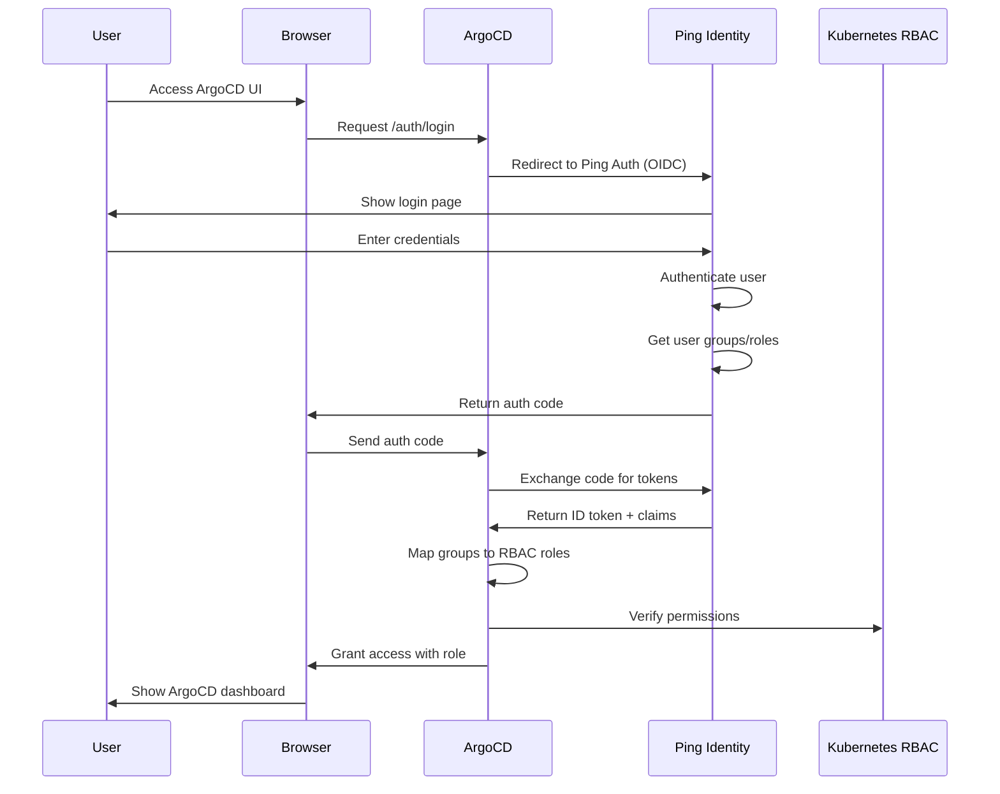
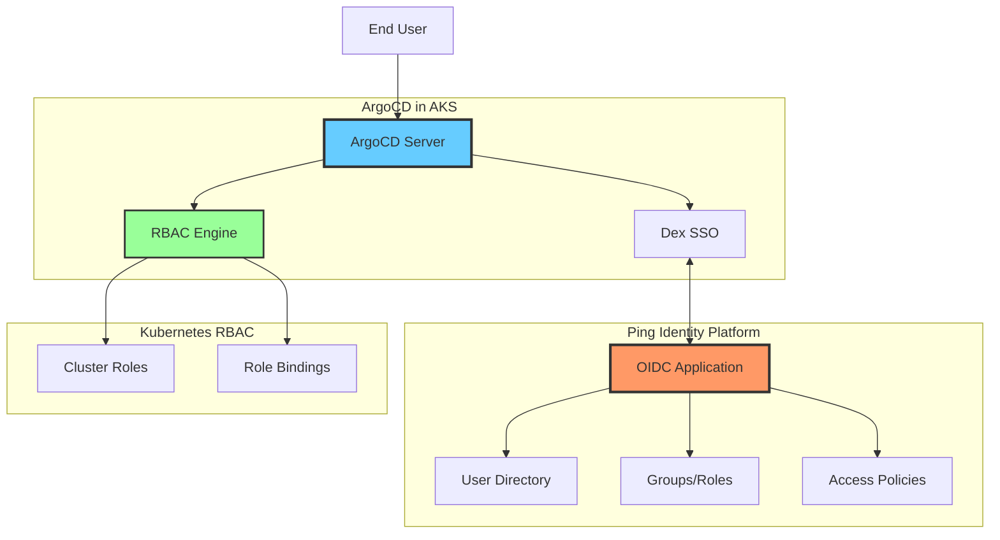

# ArgoCD Ping Identity Integration - Implementation Plan

## Overview

This document outlines the complete approach for integrating ArgoCD with Ping Identity for user authentication and authorization using OpenID Connect (OIDC). This integration will enable centralized identity management, SSO capabilities, and fine-grained RBAC for ArgoCD users.

## Architecture Overview

### High-Level Authentication Flow



### Component Architecture



## Design Decisions

### 1. Authentication Method: OIDC vs SAML

**Selected: OpenID Connect (OIDC)**

| Criteria | OIDC | SAML |
|----------|------|------|
| Modern standard | ✅ Yes | ❌ Legacy |
| Mobile-friendly | ✅ Yes | ❌ Limited |
| API integration | ✅ Native | ❌ Complex |
| Token format | JWT | XML |
| ArgoCD support | ✅ Native | ⚠️ Via Dex |
| Complexity | Low | High |

### 2. Authorization Model: RBAC

We'll implement a three-tier RBAC model:

1. **Admin** - Full access to all ArgoCD resources
2. **Developer** - Can view and sync applications
3. **ReadOnly** - Can only view applications and logs

### 3. Group Mapping Strategy

Ping Identity groups will be mapped to ArgoCD roles using OIDC claims:

```
Ping Group              → ArgoCD Role
-----------------------------------------
argocd-admins          → role:admin
argocd-developers      → role:developer
argocd-viewers         → role:readonly
```

## Proposed Changes

### Component 1: Ping Identity Configuration

#### [NEW] OIDC Application in Ping Identity

**Configuration Steps:**

1. **Application Creation**
   - Application Type: OIDC Web App
   - Application Name: `ArgoCD-Production`
   - Grant Types: Authorization Code, Refresh Token
   - Response Types: Code
   - Token Endpoint Auth Method: Client Secret Post

2. **Redirect URIs**
   ```
   https://argocd.yourdomain.com/auth/callback
   https://argocd.yourdomain.com/api/dex/callback
   ```

3. **Scopes Configuration**
   - `openid` (required)
   - `profile` (user information)
   - `email` (user email)
   - `groups` (group membership)

4. **Claims Mapping**
   ```json
   {
     "sub": "user.id",
     "email": "user.email",
     "name": "user.displayName",
     "groups": "user.memberOfGroupNames",
     "preferred_username": "user.username"
   }
   ```

---

#### [NEW] Groups/Roles in Ping Identity

**Groups to Create:**

1. **argocd-admins**
   - Description: Full administrative access to ArgoCD
   - Members: DevOps team, Platform engineers

2. **argocd-developers**
   - Description: Can deploy and sync applications
   - Members: Development teams

3. **argocd-viewers**
   - Description: Read-only access for monitoring
   - Members: QA team, Stakeholders

**Group Attributes:**
```json
{
  "name": "argocd-admins",
  "description": "ArgoCD Administrators",
  "membershipAttribute": "memberOfGroupNames"
}
```

---

#### [NEW] Access Policies

**Policy 1: ArgoCD Access Policy**
```json
{
  "name": "ArgoCD Access Policy",
  "description": "Controls access to ArgoCD application",
  "conditions": {
    "userGroups": [
      "argocd-admins",
      "argocd-developers",
      "argocd-viewers"
    ]
  },
  "actions": {
    "allow": true
  }
}
```

---

### Component 2: ArgoCD Configuration

#### [MODIFY] argocd-cm ConfigMap

File: `argocd/install/argocd-cm.yaml`

**Changes:**
- Add OIDC configuration for Ping Identity
- Configure group claims
- Set up SSO redirect URLs

```yaml
apiVersion: v1
kind: ConfigMap
metadata:
  name: argocd-cm
  namespace: argocd
data:
  url: https://argocd.yourdomain.com
  
  # OIDC Configuration for Ping Identity
  oidc.config: |
    name: Ping Identity
    issuer: https://auth.pingone.com/YOUR_ENV_ID/as
    clientID: YOUR_CLIENT_ID
    clientSecret: $oidc.ping.clientSecret
    requestedScopes:
      - openid
      - profile
      - email
      - groups
    requestedIDTokenClaims:
      groups:
        essential: true
  
  # Admin users (fallback)
  admin.enabled: "true"
  
  # Dex configuration (if using Dex as OIDC proxy)
  dex.config: |
    connectors:
    - type: oidc
      id: ping
      name: Ping Identity
      config:
        issuer: https://auth.pingone.com/YOUR_ENV_ID/as
        clientID: YOUR_CLIENT_ID
        clientSecret: $dex.ping.clientSecret
        redirectURI: https://argocd.yourdomain.com/api/dex/callback
        scopes:
          - openid
          - profile
          - email
          - groups
        claimMapping:
          groups: groups
```

---

#### [MODIFY] argocd-rbac-cm ConfigMap

File: `argocd/install/argocd-rbac-cm.yaml`

**Changes:**
- Define RBAC policies for each role
- Map Ping Identity groups to ArgoCD roles
- Set default policy

```yaml
apiVersion: v1
kind: ConfigMap
metadata:
  name: argocd-rbac-cm
  namespace: argocd
data:
  # Default policy for authenticated users
  policy.default: role:readonly
  
  # CSV format RBAC policies
  policy.csv: |
    # Admin Role - Full Access
    p, role:admin, applications, *, */*, allow
    p, role:admin, clusters, *, *, allow
    p, role:admin, repositories, *, *, allow
    p, role:admin, projects, *, *, allow
    p, role:admin, accounts, *, *, allow
    p, role:admin, gpgkeys, *, *, allow
    p, role:admin, certificates, *, *, allow
    p, role:admin, logs, get, */*, allow
    p, role:admin, exec, create, */*, allow
    
    # Developer Role - Application Management
    p, role:developer, applications, get, */*, allow
    p, role:developer, applications, create, */*, allow
    p, role:developer, applications, update, */*, allow
    p, role:developer, applications, delete, */*, allow
    p, role:developer, applications, sync, */*, allow
    p, role:developer, applications, override, */*, allow
    p, role:developer, applications, action/*, */*, allow
    p, role:developer, repositories, get, *, allow
    p, role:developer, repositories, create, *, allow
    p, role:developer, projects, get, *, allow
    p, role:developer, logs, get, */*, allow
    p, role:developer, exec, create, */*, deny
    
    # Developer Role - Production Restrictions
    p, role:developer, applications, delete, */prod-*, deny
    p, role:developer, applications, sync, */prod-*, deny
    p, role:developer, applications, override, */prod-*, deny
    
    # ReadOnly Role - View Only
    p, role:readonly, applications, get, */*, allow
    p, role:readonly, repositories, get, *, allow
    p, role:readonly, projects, get, *, allow
    p, role:readonly, clusters, get, *, allow
    p, role:readonly, logs, get, */*, allow
    
    # Group Mappings - Map Ping Identity groups to ArgoCD roles
    g, argocd-admins, role:admin
    g, argocd-developers, role:developer
    g, argocd-viewers, role:readonly
    
    # Individual user overrides (optional)
    # g, john.doe@example.com, role:admin
  
  # Scopes for RBAC (optional - for fine-grained control)
  scopes: '[groups, email]'
```

---

#### [NEW] argocd-secret for OIDC

File: `argocd/install/argocd-oidc-secret.yaml`

**Purpose:** Store Ping Identity client secret securely

```yaml
apiVersion: v1
kind: Secret
metadata:
  name: argocd-secret
  namespace: argocd
type: Opaque
stringData:
  # OIDC client secret from Ping Identity
  oidc.ping.clientSecret: "YOUR_PING_CLIENT_SECRET"
  
  # Dex client secret (if using Dex)
  dex.ping.clientSecret: "YOUR_PING_CLIENT_SECRET"
  
  # Server signature key (auto-generated if not provided)
  server.secretkey: "RANDOM_SECRET_KEY"
```

**Best Practice:** Use Azure Key Vault with CSI driver:

```yaml
apiVersion: secrets-store.csi.x-k8s.io/v1
kind: SecretProviderClass
metadata:
  name: argocd-ping-secrets
  namespace: argocd
spec:
  provider: azure
  secretObjects:
  - secretName: argocd-secret
    type: Opaque
    data:
    - objectName: ping-client-secret
      key: oidc.ping.clientSecret
  parameters:
    usePodIdentity: "false"
    useVMManagedIdentity: "true"
    userAssignedIdentityID: "YOUR_MANAGED_IDENTITY_CLIENT_ID"
    keyvaultName: "your-keyvault-name"
    objects: |
      array:
        - |
          objectName: ping-client-secret
          objectType: secret
          objectVersion: ""
    tenantId: "YOUR_TENANT_ID"
```

---

### Component 3: Kubernetes RBAC (Optional Enhancement)

#### [NEW] ClusterRole for ArgoCD Application Management

File: `argocd/rbac/argocd-application-controller-clusterrole.yaml`

**Purpose:** Define Kubernetes-level permissions for ArgoCD

```yaml
apiVersion: rbac.authorization.k8s.io/v1
kind: ClusterRole
metadata:
  name: argocd-application-controller
rules:
# Applications
- apiGroups:
  - argoproj.io
  resources:
  - applications
  - applicationsets
  - appprojects
  verbs:
  - get
  - list
  - watch
  - create
  - update
  - patch
  - delete

# Core resources
- apiGroups:
  - ""
  resources:
  - pods
  - services
  - configmaps
  - secrets
  - namespaces
  verbs:
  - get
  - list
  - watch
  - create
  - update
  - patch
  - delete

# Apps resources
- apiGroups:
  - apps
  resources:
  - deployments
  - replicasets
  - statefulsets
  - daemonsets
  verbs:
  - get
  - list
  - watch
  - create
  - update
  - patch
  - delete
```

---

### Component 4: Deployment Scripts

#### [NEW] Installation Script

File: `argocd/scripts/install-argocd-with-ping.sh`

```bash
#!/bin/bash
set -e

# Configuration
NAMESPACE="argocd"
PING_ISSUER="https://auth.pingone.com/YOUR_ENV_ID/as"
PING_CLIENT_ID="YOUR_CLIENT_ID"
PING_CLIENT_SECRET="YOUR_CLIENT_SECRET"
ARGOCD_DOMAIN="argocd.yourdomain.com"

echo "=== Installing ArgoCD with Ping Identity Integration ==="

# Step 1: Create namespace
echo "Creating namespace..."
kubectl create namespace $NAMESPACE --dry-run=client -o yaml | kubectl apply -f -

# Step 2: Install ArgoCD
echo "Installing ArgoCD..."
kubectl apply -n $NAMESPACE -f https://raw.githubusercontent.com/argoproj/argo-cd/stable/manifests/install.yaml

# Step 3: Wait for ArgoCD to be ready
echo "Waiting for ArgoCD to be ready..."
kubectl wait --for=condition=available --timeout=300s \
  deployment/argocd-server -n $NAMESPACE

# Step 4: Create OIDC secret
echo "Creating OIDC secret..."
kubectl create secret generic argocd-secret \
  --from-literal=oidc.ping.clientSecret="$PING_CLIENT_SECRET" \
  --from-literal=dex.ping.clientSecret="$PING_CLIENT_SECRET" \
  --namespace=$NAMESPACE \
  --dry-run=client -o yaml | kubectl apply -f -

# Step 5: Configure ArgoCD CM
echo "Configuring ArgoCD..."
cat <<EOF | kubectl apply -f -
apiVersion: v1
kind: ConfigMap
metadata:
  name: argocd-cm
  namespace: $NAMESPACE
data:
  url: https://$ARGOCD_DOMAIN
  oidc.config: |
    name: Ping Identity
    issuer: $PING_ISSUER
    clientID: $PING_CLIENT_ID
    clientSecret: \$oidc.ping.clientSecret
    requestedScopes:
      - openid
      - profile
      - email
      - groups
    requestedIDTokenClaims:
      groups:
        essential: true
EOF

# Step 6: Configure RBAC
echo "Configuring RBAC..."
kubectl apply -f argocd/install/argocd-rbac-cm.yaml

# Step 7: Create Ingress
echo "Creating Ingress..."
kubectl apply -f argocd/install/argocd-ingress.yaml

# Step 8: Get initial admin password (for emergency access)
ADMIN_PASSWORD=$(kubectl -n $NAMESPACE get secret argocd-initial-admin-secret \
  -o jsonpath="{.data.password}" | base64 -d)

echo ""
echo "=== Installation Complete ==="
echo "ArgoCD URL: https://$ARGOCD_DOMAIN"
echo "Emergency Admin Password: $ADMIN_PASSWORD"
echo ""
echo "Login with Ping Identity: Click 'LOG IN VIA PING IDENTITY' button"
echo ""
```

---

#### [NEW] User Sync Script

File: `argocd/scripts/sync-ping-users.sh`

**Purpose:** Verify Ping Identity group mappings

```bash
#!/bin/bash
set -e

NAMESPACE="argocd"

echo "=== Verifying Ping Identity Integration ==="

# Get ArgoCD admin password
ADMIN_PASSWORD=$(kubectl -n $NAMESPACE get secret argocd-initial-admin-secret \
  -o jsonpath="{.data.password}" | base64 -d)

# Login to ArgoCD CLI
argocd login argocd.yourdomain.com \
  --username admin \
  --password "$ADMIN_PASSWORD" \
  --insecure

# List configured OIDC providers
echo "Configured OIDC providers:"
argocd account list

# Test RBAC policies
echo ""
echo "Testing RBAC policies:"
argocd account can-i sync applications '*' --as argocd-developers
argocd account can-i delete applications '*' --as argocd-developers
argocd account can-i get applications '*' --as argocd-viewers

echo ""
echo "=== Verification Complete ==="
```

---

### Component 5: Terraform/IaC Templates

#### [NEW] Terraform Module for Ping Identity

File: `terraform/ping-identity/main.tf`

```hcl
# Ping Identity OIDC Application Configuration
# Note: This requires Ping Identity Terraform provider

terraform {
  required_providers {
    pingone = {
      source  = "pingidentity/pingone"
      version = "~> 0.20"
    }
  }
}

provider "pingone" {
  client_id      = var.ping_client_id
  client_secret  = var.ping_client_secret
  environment_id = var.ping_environment_id
  region         = var.ping_region
}

# Create OIDC Application
resource "pingone_application" "argocd" {
  environment_id = var.ping_environment_id
  name           = "ArgoCD Production"
  description    = "ArgoCD GitOps Platform"
  enabled        = true

  oidc_options {
    type                        = "WEB_APP"
    grant_types                 = ["AUTHORIZATION_CODE", "REFRESH_TOKEN"]
    response_types              = ["CODE"]
    token_endpoint_auth_method  = "CLIENT_SECRET_POST"
    
    redirect_uris = [
      "https://argocd.yourdomain.com/auth/callback",
      "https://argocd.yourdomain.com/api/dex/callback"
    ]
    
    post_logout_redirect_uris = [
      "https://argocd.yourdomain.com"
    ]
  }
}

# Create Groups
resource "pingone_group" "argocd_admins" {
  environment_id = var.ping_environment_id
  name           = "argocd-admins"
  description    = "ArgoCD Administrators - Full Access"
}

resource "pingone_group" "argocd_developers" {
  environment_id = var.ping_environment_id
  name           = "argocd-developers"
  description    = "ArgoCD Developers - Application Management"
}

resource "pingone_group" "argocd_viewers" {
  environment_id = var.ping_environment_id
  name           = "argocd-viewers"
  description    = "ArgoCD Viewers - Read-Only Access"
}

# Application Resource Grant for Groups Scope
resource "pingone_application_resource_grant" "argocd_groups" {
  environment_id = var.ping_environment_id
  application_id = pingone_application.argocd.id
  
  resource_name = "openid"
  
  scopes = [
    "openid",
    "profile",
    "email"
  ]
}

# Custom Scope for Groups
resource "pingone_resource" "groups_scope" {
  environment_id = var.ping_environment_id
  name           = "groups"
  description    = "User group membership"
  
  audience = pingone_application.argocd.oidc_options[0].redirect_uris[0]
  
  attribute {
    name  = "groups"
    value = "$${user.memberOfGroupNames}"
  }
}

# Outputs
output "client_id" {
  value       = pingone_application.argocd.oidc_options[0].client_id
  description = "OIDC Client ID for ArgoCD"
}

output "client_secret" {
  value       = pingone_application.argocd.oidc_options[0].client_secret
  description = "OIDC Client Secret for ArgoCD"
  sensitive   = true
}

output "issuer_url" {
  value       = "https://auth.pingone.com/${var.ping_environment_id}/as"
  description = "OIDC Issuer URL"
}

output "group_ids" {
  value = {
    admins     = pingone_group.argocd_admins.id
    developers = pingone_group.argocd_developers.id
    viewers    = pingone_group.argocd_viewers.id
  }
  description = "Group IDs for user assignment"
}
```

File: `terraform/ping-identity/variables.tf`

```hcl
variable "ping_client_id" {
  description = "Ping Identity API Client ID"
  type        = string
  sensitive   = true
}

variable "ping_client_secret" {
  description = "Ping Identity API Client Secret"
  type        = string
  sensitive   = true
}

variable "ping_environment_id" {
  description = "Ping Identity Environment ID"
  type        = string
}

variable "ping_region" {
  description = "Ping Identity Region (NA, EU, ASIA)"
  type        = string
  default     = "NA"
}

variable "argocd_domain" {
  description = "ArgoCD domain name"
  type        = string
  default     = "argocd.yourdomain.com"
}
```

---

## Verification Plan

### Automated Tests

#### Test 1: OIDC Configuration Validation

```bash
#!/bin/bash
# tests/validate-oidc-config.sh

# Verify ArgoCD ConfigMap
kubectl get configmap argocd-cm -n argocd -o yaml | grep -q "oidc.config"
if [ $? -eq 0 ]; then
  echo "✅ OIDC configuration found"
else
  echo "❌ OIDC configuration missing"
  exit 1
fi

# Verify OIDC secret
kubectl get secret argocd-secret -n argocd -o jsonpath='{.data.oidc\.ping\.clientSecret}' | base64 -d > /dev/null
if [ $? -eq 0 ]; then
  echo "✅ OIDC client secret configured"
else
  echo "❌ OIDC client secret missing"
  exit 1
fi
```

#### Test 2: RBAC Policy Validation

```bash
#!/bin/bash
# tests/validate-rbac.sh

# Test admin permissions
argocd account can-i sync applications '*' --as argocd-admins
if [ $? -eq 0 ]; then
  echo "✅ Admin role has sync permissions"
else
  echo "❌ Admin role missing sync permissions"
fi

# Test developer restrictions on prod
argocd account can-i delete applications 'prod-*' --as argocd-developers
if [ $? -ne 0 ]; then
  echo "✅ Developer role correctly restricted on prod"
else
  echo "❌ Developer role has excessive permissions on prod"
fi

# Test readonly permissions
argocd account can-i get applications '*' --as argocd-viewers
if [ $? -eq 0 ]; then
  echo "✅ Readonly role has view permissions"
else
  echo "❌ Readonly role missing view permissions"
fi
```

#### Test 3: End-to-End Authentication Flow

```bash
#!/bin/bash
# tests/e2e-auth-test.sh

# Simulate OIDC login flow
curl -I https://argocd.yourdomain.com/auth/login | grep -q "Location.*pingone"
if [ $? -eq 0 ]; then
  echo "✅ OIDC redirect to Ping Identity working"
else
  echo "❌ OIDC redirect not configured"
  exit 1
fi
```

### Manual Verification

#### Step 1: Test User Login

1. Navigate to `https://argocd.yourdomain.com`
2. Click "LOG IN VIA PING IDENTITY"
3. Enter Ping Identity credentials
4. Verify successful redirect to ArgoCD dashboard
5. Check user role in top-right corner

#### Step 2: Test RBAC Permissions

**As Admin User:**
- ✅ Can create applications
- ✅ Can sync applications
- ✅ Can delete applications
- ✅ Can access settings

**As Developer User:**
- ✅ Can create applications
- ✅ Can sync dev/staging applications
- ❌ Cannot sync prod applications
- ❌ Cannot delete prod applications
- ❌ Cannot access settings

**As Viewer User:**
- ✅ Can view applications
- ✅ Can view logs
- ❌ Cannot sync applications
- ❌ Cannot create applications
- ❌ Cannot access settings

#### Step 3: Test Group Membership Changes

1. Add user to `argocd-developers` group in Ping Identity
2. User logs out and logs back in to ArgoCD
3. Verify user now has developer permissions
4. Remove user from group
5. Verify permissions are revoked after re-login

## Security Considerations

### 1. Client Secret Management

> [!CAUTION]
> Never commit client secrets to Git repositories. Use Azure Key Vault with CSI driver or Kubernetes secrets with encryption at rest.

**Recommended Approach:**
```bash
# Store in Azure Key Vault
az keyvault secret set \
  --vault-name your-keyvault \
  --name ping-client-secret \
  --value "YOUR_SECRET"

# Reference in SecretProviderClass
# See argocd-oidc-secret.yaml above
```

### 2. Token Expiration

> [!IMPORTANT]
> Configure appropriate token lifetimes in Ping Identity:
> - Access Token: 1 hour
> - Refresh Token: 24 hours
> - ID Token: 1 hour

### 3. Network Security

> [!WARNING]
> Ensure ArgoCD and Ping Identity communicate over HTTPS only. Configure proper TLS certificates.

**Required:**
- TLS 1.2 or higher
- Valid SSL certificates (Let's Encrypt or enterprise CA)
- HSTS headers enabled

### 4. Audit Logging

Enable audit logging in both ArgoCD and Ping Identity:

**ArgoCD Audit:**
```yaml
# In argocd-cm ConfigMap
data:
  server.rbac.log.enforce.enable: "true"
```

**Ping Identity Audit:**
- Enable audit logs in Ping Identity console
- Forward logs to SIEM (Azure Sentinel, Splunk)

### 5. Session Management

**Configure session timeout:**
```yaml
# In argocd-cm ConfigMap
data:
  timeout.reconciliation: "180s"
  users.session.duration: "24h"
```

## Implementation Timeline

| Phase | Duration | Tasks |
|-------|----------|-------|
| **Phase 1: Planning** | 1 week | Architecture design, stakeholder approval |
| **Phase 2: Ping Setup** | 1 week | Create OIDC app, configure groups, test auth |
| **Phase 3: ArgoCD Config** | 1 week | Configure OIDC, RBAC policies, secrets |
| **Phase 4: Testing** | 1 week | E2E testing, RBAC validation, security audit |
| **Phase 5: Deployment** | 1 week | Production deployment, monitoring setup |
| **Total** | **5 weeks** | |

## Rollback Plan

If issues occur during deployment:

1. **Disable OIDC:**
   ```bash
   kubectl patch configmap argocd-cm -n argocd \
     --type json -p='[{"op": "remove", "path": "/data/oidc.config"}]'
   ```

2. **Revert to admin login:**
   ```bash
   kubectl patch configmap argocd-cm -n argocd \
     --type merge -p='{"data":{"admin.enabled":"true"}}'
   ```

3. **Restore RBAC to default:**
   ```bash
   kubectl patch configmap argocd-rbac-cm -n argocd \
     --type merge -p='{"data":{"policy.default":"role:admin"}}'
   ```

## Next Steps

After reviewing this plan:

1. ✅ Approve architecture and design
2. ✅ Provide Ping Identity environment details
3. ✅ Confirm ArgoCD domain name
4. ✅ Review RBAC role definitions
5. ✅ Proceed with implementation

## References

- [ArgoCD OIDC Documentation](https://argo-cd.readthedocs.io/en/stable/operator-manual/user-management/#oidc)
- [Ping Identity OIDC Guide](https://docs.pingidentity.com/bundle/pingone/page/xsh1564020480660-1.html)
- [ArgoCD RBAC Documentation](https://argo-cd.readthedocs.io/en/stable/operator-manual/rbac/)
