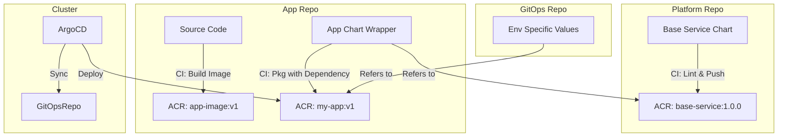

# Architecture & Design: Helm on AKS Automatic

## Overview
This document outlines the architectural approach for deploying microservices and platform components to AKS Automatic using Helm, Azure DevOps, and Argo CD.

## Core Principles
1.  **GitOps First**: All cluster state is defined in Git. Argo CD is the source of truth enforcer.
2.  **Immutable Artifacts**: Helm charts and Container images are versioned and stored in OCI-compliant Azure Container Registry (ACR).
3.  **DRY (Don't Repeat Yourself)**: Use a "Library Chart" pattern to centralize common Kubernetes manifests (Deployment, HPA, Service, Ingress).
4.  **Separation of Concerns**:
    -   **App Repo**: Source code + Helm Chart definition.
    -   **GitOps Repo**: Environment-specific configuration (Helm values).

## High-Level Architecture

```mermaid
graph TD
    subgraph "CI - Azure DevOps"
        Dev[Developer] -->|Push Code| AppRepo[App Repository]
        AppRepo -->|Trigger| PL_Build[Pipeline: Build & Publish]
        PL_Build -->|Push Image| ACR_Img[ACR: Container Images]
        PL_Build -->|Push Chart| ACR_Chart[ACR: Helm Charts (OCI)]
    end

    subgraph "CD - GitOps"
        PL_Build -->|Update Version| GitOpsRepo[GitOps Repository]
        GitOpsRepo -->|Manifests| EnvCfg[Environment Config]
    end

    subgraph "Cluster - AKS Automatic"
        ArgoCD[Argo CD Controller] -->|Watch| GitOpsRepo
        ArgoCD -->|Pull Chart| ACR_Chart
        ArgoCD -->|Pull Image| ACR_Img
        ArgoCD -->|Sync| K8s[Kubernetes Resources]
    end
```

## Helm Strategy

### 1. The "Base" Library Chart
Instead of repeating `deployment.yaml` and `service.yaml` in every microservice, we create a centralized `base-service` chart.
-   **Contains**: Standard templates for Deployments, Services, Ingress, PodDisruptionBudgets, ServiceAccounts, etc.
-   **Benefits**: Standardized security contexts, labels, and hygiene across all apps.

### 2. Application Charts
Each microservice has a thin Helm chart that depends on `base-service`.
-   **Start**: `helm create my-app` (using a starter template).
-   **Content**: Mostly `values.yaml` and maybe a specific ConfigMap.

### 3. Platform Charts
For 3rd party tools (e.g., Redis, KEDA), we use:
-   **Vendor Charts**: Referenced directly in Argo CD Application manifests.
-   **Wrapper Charts**: If we need to enforce specific corporate configurations on top of vendor charts.

## CI/CD Workflow

### CI (Azure DevOps)
1.  **Lint**: `helm lint`
2.  **Test**: `helm unittest` (optional plugin)
3.  **Package**: `helm package`
4.  **Publish**: `helm push` to ACR (OCI Artifact)
5.  **Tag**: Git tag the repo.

### CD (Argo CD)
1.  **App of Apps Pattern**: A root Application manages other Applications.
2.  **ApplicationSet**: Automate creation of Applications based on folder structure in GitOps repo.
3.  **Sync**: Argo CD detects changes in GitOps repo (e.g., `image.tag` update) and syncs.

## Repository Strategy: Platform vs. Applications

To satisfy the separation of concerns, we divide responsibilities across three repository types (simulated as folders in this POC):

### 1. Platform Repository (`platform-repo`)
*   **Owner**: Platform Engineering Team.
*   **Content**:
    *   `base-service` Chart: The standard "contract" for deploying services.
    *   `platform-infra` Charts: Redis, Ingress Controllers, Observability.
*   **Output**: Pushes immutable Chart versions to ACR (e.g., `oci://myacr.azurecr.io/helm/base-service:1.0.0`).

### 2. Application Repository (`app-repo`)
*   **Owner**: Application Development Team.
*   **Content**:
    *   Source Code (`src/`)
    *   Local Helm Chart (`charts/my-app/`)
*   **Mechanism**:
    *   The App Chart is a "Wrapper Chart" or "Consumer Chart".
    *   `Chart.yaml` declares a dependency on `oci://myacr.azurecr.io/helm/base-service`.
    *   `values.yaml` contains ONLY the overrides (image tag, replica count, env vars).
*   **Output**: Pushes a versioned Application Chart to ACR (e.g., `oci://myacr.azurecr.io/helm/my-app:2.5.0`).

### 3. GitOps Repository (`gitops-repo`)
*   **Owner**: Shared / Operations.
*   **Content**: Argo CD Applications pointing to specific versions of Application Charts.
*   **Mechanism**:
    *   Argo CD monitors this repo.
    *   `env/dev/values.yaml`: Overrides for Dev (e.g., `replicaCount: 1`).
    *   `env/prod/values.yaml`: Overrides for Prod (e.g., `replicaCount: 3`).

## Workflow Diagram



## Details on 'Base Service' Chart
The base chart abstracts complex K8s logic.
-   **Inputs**: Simple values (e.g., `enableExternalAccess: true`, `port: 8080`).
-   **Outputs**: `Deployment`, `Service`, `Ingress`, `ServiceMonitor`, `HPA`.
-   **Versioning**: Semantic versioning. App teams upgrade major versions deliberately to avoid breaking changes.

## CI Pipelines

### Platform Pipeline (`azure-pipelines-platform.yaml`)
1.  Changes detected in `charts/base-service`.
2.  `helm lint`.
3.  `helm push` to `oci://<acr>/helm/base-service`.

### Application Pipeline (`azure-pipelines-app.yaml`)
1.  App Code Build -> Docker Push.
2.  `helm dependency update` (pulls base-service from ACR).
3.  `helm package` (bundles app values with base chart ref).
4.  `helm push` to `oci://<acr>/helm/my-app`.
5.  **Trigger**: Updates GitOps Repo `image.tag` (automatic) or creates Pull Request.

