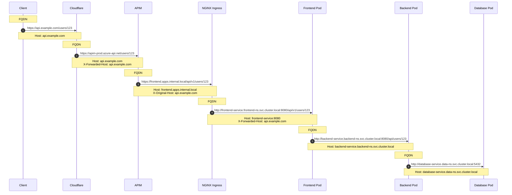
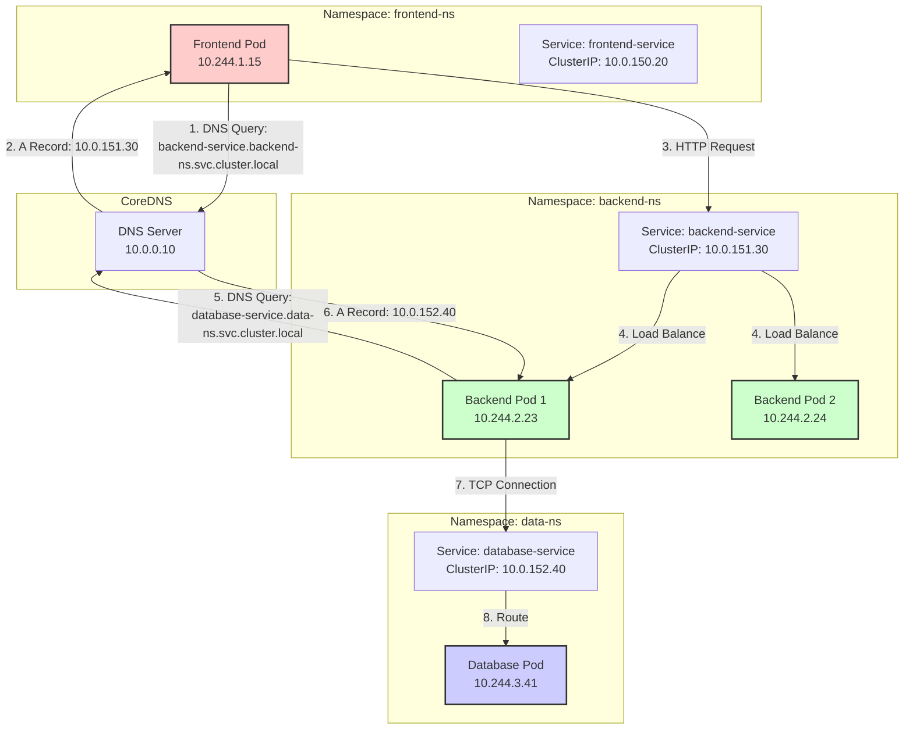
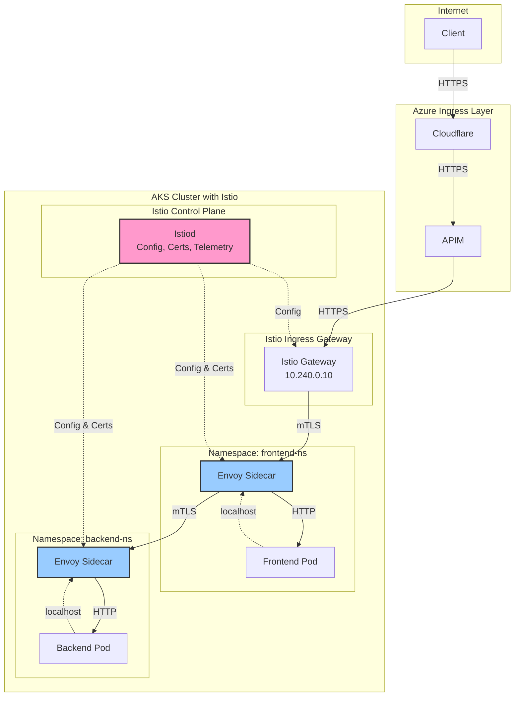
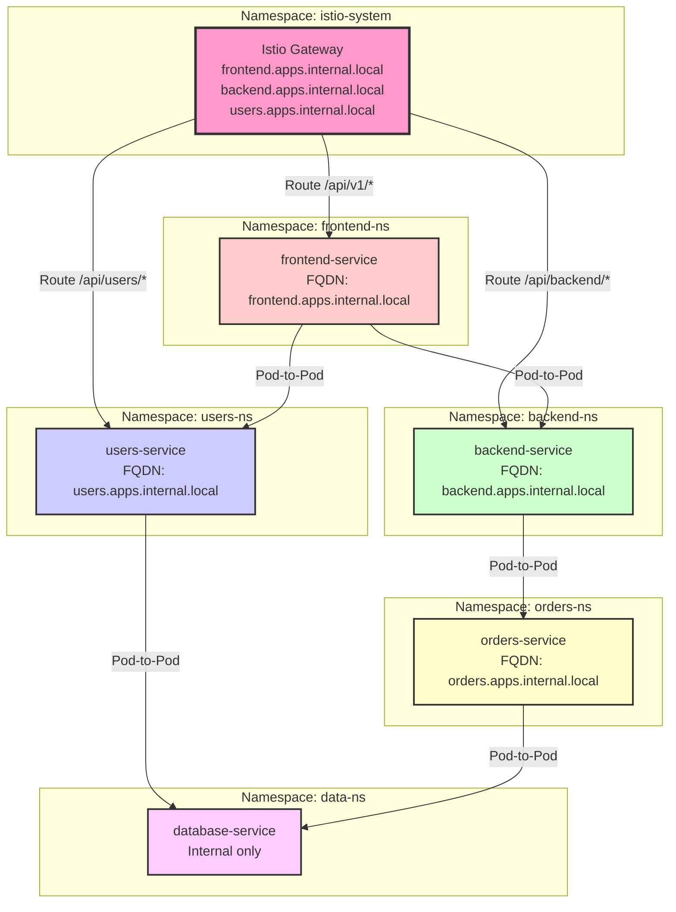

# AKS FQDN Transformation & Service Mesh Architecture

## Overview

This document explains how FQDNs change throughout the request flow, how microservices handle these transformations, pod-to-pod communication patterns, service mesh integration, and multi-namespace architecture with different FQDN endpoints.

---

## Table of Contents
1. [FQDN Transformation Flow](#fqdn-transformation-flow)
2. [Microservice Behavior with FQDN Changes](#microservice-behavior-with-fqdn-changes)
3. [Pod-to-Pod Communication](#pod-to-pod-communication)
4. [Service Mesh Integration](#service-mesh-integration)
5. [Multi-Namespace Architecture](#multi-namespace-architecture)
6. [Complete Implementation Example](#complete-implementation-example)

---

## FQDN Transformation Flow

### End-to-End FQDN Changes



### FQDN Transformation Table

| Hop | FQDN | DNS Zone | Resolved IP | Protocol | Purpose |
|-----|------|----------|-------------|----------|---------|
| 1 | api.example.com | Public DNS (Cloudflare) | 20.123.45.67 | HTTPS | Client-facing endpoint |
| 2 | apim-prod.azure-api.net | Azure DNS | 10.100.2.20 | HTTPS | APIM gateway endpoint |
| 3 | frontend.apps.internal.local | Azure Private DNS | 10.240.0.10 | HTTPS | NGINX Ingress endpoint |
| 4 | frontend-service.frontend-ns.svc.cluster.local | CoreDNS (K8s) | 10.0.150.20 | HTTP | Kubernetes Service (ClusterIP) |
| 5 | backend-service.backend-ns.svc.cluster.local | CoreDNS (K8s) | 10.0.151.30 | HTTP | Backend service (pod-to-pod) |
| 6 | database-service.data-ns.svc.cluster.local | CoreDNS (K8s) | 10.0.152.40 | TCP | Database service |

---

## Microservice Behavior with FQDN Changes

### Understanding the Host Header Transformation

**Key Principle**: Microservices should be **FQDN-agnostic** for their own endpoint but **FQDN-aware** for generating links and calling other services.

### 1. Extracting Original FQDN

```csharp
public class FqdnAwareController : ControllerBase
{
    private readonly ILogger<FqdnAwareController> _logger;

    [HttpGet("users/{id}")]
    public async Task<IActionResult> GetUser(int id)
    {
        // Extract all FQDN-related headers
        var currentHost = HttpContext.Request.Host.ToString(); // frontend-service:8080
        var originalHost = HttpContext.Request.Headers["X-Forwarded-Host"].FirstOrDefault(); // api.example.com
        var forwardedProto = HttpContext.Request.Headers["X-Forwarded-Proto"].FirstOrDefault(); // https
        var originalUri = HttpContext.Request.Headers["X-Original-URI"].FirstOrDefault(); // /users/123
        
        _logger.LogInformation(
            "Request received - Current Host: {CurrentHost}, Original Host: {OriginalHost}, " +
            "Original URI: {OriginalUri}, Proto: {Proto}",
            currentHost, originalHost, originalUri, forwardedProto);

        // Build the original URL if needed (e.g., for HATEOAS links)
        var originalUrl = $"{forwardedProto}://{originalHost}{originalUri}";
        
        var user = await _userService.GetUserByIdAsync(id);
        
        // Return response with HATEOAS links using original FQDN
        return Ok(new
        {
            id = user.Id,
            name = user.Name,
            _links = new
            {
                self = $"{forwardedProto}://{originalHost}/users/{user.Id}",
                orders = $"{forwardedProto}://{originalHost}/users/{user.Id}/orders",
                profile = $"{forwardedProto}://{originalHost}/users/{user.Id}/profile"
            }
        });
    }
}
```

### 2. FQDN Context Service

```csharp
public interface IRequestContext
{
    string OriginalHost { get; }
    string OriginalScheme { get; }
    string CurrentHost { get; }
    string BuildOriginalUrl(string path);
}

public class RequestContext : IRequestContext
{
    private readonly IHttpContextAccessor _httpContextAccessor;

    public RequestContext(IHttpContextAccessor httpContextAccessor)
    {
        _httpContextAccessor = httpContextAccessor;
    }

    public string OriginalHost => 
        _httpContextAccessor.HttpContext?.Request.Headers["X-Forwarded-Host"].FirstOrDefault() 
        ?? _httpContextAccessor.HttpContext?.Request.Host.ToString();

    public string OriginalScheme => 
        _httpContextAccessor.HttpContext?.Request.Headers["X-Forwarded-Proto"].FirstOrDefault() 
        ?? "https";

    public string CurrentHost => 
        _httpContextAccessor.HttpContext?.Request.Host.ToString();

    public string BuildOriginalUrl(string path)
    {
        if (!path.StartsWith("/"))
            path = "/" + path;
        
        return $"{OriginalScheme}://{OriginalHost}{path}";
    }
}

// Usage in service
public class UserService
{
    private readonly IRequestContext _requestContext;

    public UserDto GetUser(int id)
    {
        var user = _repository.GetById(id);
        
        return new UserDto
        {
            Id = user.Id,
            Name = user.Name,
            ProfileUrl = _requestContext.BuildOriginalUrl($"/users/{user.Id}/profile")
        };
    }
}
```

### 3. Header Tracking Middleware

```csharp
public class FqdnTrackingMiddleware
{
    private readonly RequestDelegate _next;
    private readonly ILogger<FqdnTrackingMiddleware> _logger;

    public FqdnTrackingMiddleware(RequestDelegate next, ILogger<FqdnTrackingMiddleware> logger)
    {
        _next = next;
        _logger = logger;
    }

    public async Task InvokeAsync(HttpContext context)
    {
        // Log all FQDN transformations
        var fqdnContext = new
        {
            CurrentHost = context.Request.Host.ToString(),
            OriginalHost = context.Request.Headers["X-Forwarded-Host"].FirstOrDefault(),
            ForwardedProto = context.Request.Headers["X-Forwarded-Proto"].FirstOrDefault(),
            OriginalUri = context.Request.Headers["X-Original-URI"].FirstOrDefault(),
            RealIp = context.Request.Headers["X-Real-IP"].FirstOrDefault(),
            ForwardedFor = context.Request.Headers["X-Forwarded-For"].FirstOrDefault(),
            RequestPath = context.Request.Path.ToString(),
            RequestId = context.Request.Headers["X-Request-ID"].FirstOrDefault()
        };

        _logger.LogDebug("FQDN Context: {@FqdnContext}", fqdnContext);

        // Store in HttpContext for easy access
        context.Items["FqdnContext"] = fqdnContext;

        await _next(context);
    }
}
```

---

## Pod-to-Pod Communication

### Kubernetes DNS Resolution



### Kubernetes Service DNS Naming Convention

**Format**: `<service-name>.<namespace>.svc.cluster.local`

**Examples**:
- Same namespace: `backend-service` or `backend-service.backend-ns.svc.cluster.local`
- Different namespace: `backend-service.backend-ns.svc.cluster.local` (full FQDN required)
- Short form (same namespace): `backend-service`

### Pod-to-Pod Communication Implementation

**Frontend Service calling Backend Service:**

```csharp
// appsettings.json
{
  "Services": {
    "Backend": {
      "BaseUrl": "http://backend-service.backend-ns.svc.cluster.local:8080",
      "Timeout": 30
    },
    "UserService": {
      "BaseUrl": "http://user-service.users-ns.svc.cluster.local:8080",
      "Timeout": 30
    },
    "OrderService": {
      "BaseUrl": "http://order-service.orders-ns.svc.cluster.local:8080",
      "Timeout": 30
    }
  }
}
```

```csharp
// Service configuration
public class ServiceSettings
{
    public Dictionary<string, ServiceEndpoint> Services { get; set; }
}

public class ServiceEndpoint
{
    public string BaseUrl { get; set; }
    public int Timeout { get; set; }
}

// Program.cs
builder.Services.Configure<ServiceSettings>(builder.Configuration);

builder.Services.AddHttpClient("BackendService", (serviceProvider, client) =>
{
    var settings = serviceProvider.GetRequiredService<IOptions<ServiceSettings>>().Value;
    var backendConfig = settings.Services["Backend"];
    
    client.BaseAddress = new Uri(backendConfig.BaseUrl);
    client.Timeout = TimeSpan.FromSeconds(backendConfig.Timeout);
    
    // Add default headers for pod-to-pod communication
    client.DefaultRequestHeaders.Add("X-Service-Name", "frontend-service");
    client.DefaultRequestHeaders.Add("X-Service-Version", "1.2.3");
})
.AddPolicyHandler(GetRetryPolicy())
.AddPolicyHandler(GetCircuitBreakerPolicy());

// Frontend service calling backend
public class FrontendService
{
    private readonly IHttpClientFactory _httpClientFactory;
    private readonly ILogger<FrontendService> _logger;
    private readonly IRequestContext _requestContext;

    public FrontendService(
        IHttpClientFactory httpClientFactory, 
        ILogger<FrontendService> logger,
        IRequestContext requestContext)
    {
        _httpClientFactory = httpClientFactory;
        _logger = logger;
        _requestContext = requestContext;
    }

    public async Task<UserDetailsDto> GetUserDetailsAsync(int userId)
    {
        var client = _httpClientFactory.CreateClient("BackendService");
        
        // Propagate correlation headers to backend
        var request = new HttpRequestMessage(HttpMethod.Get, $"/api/users/{userId}");
        request.Headers.Add("X-Request-ID", Activity.Current?.Id ?? Guid.NewGuid().ToString());
        request.Headers.Add("X-Correlation-ID", Activity.Current?.RootId);
        
        // Propagate original host information (optional)
        request.Headers.Add("X-Original-Host", _requestContext.OriginalHost);
        request.Headers.Add("X-Original-Scheme", _requestContext.OriginalScheme);

        _logger.LogInformation(
            "Calling backend service at {BackendUrl} for user {UserId}",
            client.BaseAddress, userId);

        var response = await client.SendAsync(request);
        
        if (!response.IsSuccessStatusCode)
        {
            _logger.LogError(
                "Backend service returned {StatusCode} for user {UserId}",
                response.StatusCode, userId);
            throw new HttpRequestException($"Backend service error: {response.StatusCode}");
        }

        var content = await response.Content.ReadAsStringAsync();
        return JsonSerializer.Deserialize<UserDetailsDto>(content);
    }
}
```

### ConfigMap for Service Discovery

```yaml
apiVersion: v1
kind: ConfigMap
metadata:
  name: frontend-service-config
  namespace: frontend-ns
data:
  appsettings.json: |
    {
      "Services": {
        "Backend": {
          "BaseUrl": "http://backend-service.backend-ns.svc.cluster.local:8080",
          "Timeout": 30
        },
        "UserService": {
          "BaseUrl": "http://user-service.users-ns.svc.cluster.local:8080",
          "Timeout": 30
        },
        "OrderService": {
          "BaseUrl": "http://order-service.orders-ns.svc.cluster.local:8080",
          "Timeout": 30
        }
      }
    }
---
apiVersion: apps/v1
kind: Deployment
metadata:
  name: frontend-service
  namespace: frontend-ns
spec:
  template:
    spec:
      containers:
      - name: frontend
        volumeMounts:
        - name: config
          mountPath: /app/config
      volumes:
      - name: config
        configMap:
          name: frontend-service-config
```

---

## Service Mesh Integration

### Why Service Mesh?

**Problems Service Mesh Solves:**
1. **mTLS**: Automatic encryption for pod-to-pod communication
2. **Traffic Management**: Advanced routing, retries, timeouts
3. **Observability**: Automatic distributed tracing, metrics
4. **Security**: Fine-grained access control between services
5. **Resilience**: Circuit breaking, fault injection

### Architecture with Istio Service Mesh



### Istio Installation and Configuration

**1. Install Istio:**
```bash
# Install Istio CLI
curl -L https://istio.io/downloadIstio | sh -
cd istio-1.20.0
export PATH=$PWD/bin:$PATH

# Install Istio on AKS with custom profile
istioctl install --set profile=production \
  --set values.gateways.istio-ingressgateway.type=LoadBalancer \
  --set values.global.proxy.resources.requests.cpu=100m \
  --set values.global.proxy.resources.requests.memory=128Mi

# Verify installation
kubectl get pods -n istio-system
```

**2. Enable Automatic Sidecar Injection:**
```bash
# Label namespaces for automatic sidecar injection
kubectl label namespace frontend-ns istio-injection=enabled
kubectl label namespace backend-ns istio-injection=enabled
kubectl label namespace users-ns istio-injection=enabled
kubectl label namespace orders-ns istio-injection=enabled

# Verify labels
kubectl get namespace -L istio-injection
```

**3. Istio Gateway Configuration:**
```yaml
apiVersion: networking.istio.io/v1beta1
kind: Gateway
metadata:
  name: aks-gateway
  namespace: istio-system
spec:
  selector:
    istio: ingressgateway
  servers:
  # Frontend application
  - port:
      number: 443
      name: https-frontend
      protocol: HTTPS
    tls:
      mode: SIMPLE
      credentialName: frontend-tls-cert  # Kubernetes secret with cert
    hosts:
    - "frontend.apps.internal.local"
  
  # Backend API
  - port:
      number: 443
      name: https-backend
      protocol: HTTPS
    tls:
      mode: SIMPLE
      credentialName: backend-tls-cert
    hosts:
    - "backend.apps.internal.local"
  
  # User Service
  - port:
      number: 443
      name: https-users
      protocol: HTTPS
    tls:
      mode: SIMPLE
      credentialName: users-tls-cert
    hosts:
    - "users.apps.internal.local"
```

**4. Virtual Service for Routing:**
```yaml
apiVersion: networking.istio.io/v1beta1
kind: VirtualService
metadata:
  name: frontend-vs
  namespace: frontend-ns
spec:
  hosts:
  - "frontend.apps.internal.local"
  gateways:
  - istio-system/aks-gateway
  http:
  - match:
    - uri:
        prefix: "/api/v1"
    route:
    - destination:
        host: frontend-service.frontend-ns.svc.cluster.local
        port:
          number: 8080
    timeout: 30s
    retries:
      attempts: 3
      perTryTimeout: 10s
      retryOn: 5xx,reset,connect-failure,refused-stream
---
apiVersion: networking.istio.io/v1beta1
kind: VirtualService
metadata:
  name: backend-vs
  namespace: backend-ns
spec:
  hosts:
  - "backend.apps.internal.local"
  gateways:
  - istio-system/aks-gateway
  http:
  - match:
    - uri:
        prefix: "/api"
    route:
    - destination:
        host: backend-service.backend-ns.svc.cluster.local
        port:
          number: 8080
        subset: v1
      weight: 90
    - destination:
        host: backend-service.backend-ns.svc.cluster.local
        port:
          number: 8080
        subset: v2
      weight: 10  # Canary deployment: 10% traffic to v2
```

**5. Destination Rules (Traffic Policies):**
```yaml
apiVersion: networking.istio.io/v1beta1
kind: DestinationRule
metadata:
  name: backend-dr
  namespace: backend-ns
spec:
  host: backend-service.backend-ns.svc.cluster.local
  trafficPolicy:
    connectionPool:
      tcp:
        maxConnections: 100
      http:
        http1MaxPendingRequests: 50
        http2MaxRequests: 100
        maxRequestsPerConnection: 2
    loadBalancer:
      simple: LEAST_REQUEST
    outlierDetection:
      consecutiveErrors: 5
      interval: 30s
      baseEjectionTime: 30s
      maxEjectionPercent: 50
  subsets:
  - name: v1
    labels:
      version: v1
  - name: v2
    labels:
      version: v2
```

**6. Peer Authentication (mTLS):**
```yaml
# Enforce mTLS for entire mesh
apiVersion: security.istio.io/v1beta1
kind: PeerAuthentication
metadata:
  name: default
  namespace: istio-system
spec:
  mtls:
    mode: STRICT  # Enforce mTLS for all pod-to-pod communication
---
# Namespace-specific mTLS policy
apiVersion: security.istio.io/v1beta1
kind: PeerAuthentication
metadata:
  name: backend-mtls
  namespace: backend-ns
spec:
  mtls:
    mode: STRICT
```

**7. Authorization Policies:**
```yaml
# Allow frontend to call backend
apiVersion: security.istio.io/v1beta1
kind: AuthorizationPolicy
metadata:
  name: backend-authz
  namespace: backend-ns
spec:
  selector:
    matchLabels:
      app: backend-service
  action: ALLOW
  rules:
  - from:
    - source:
        namespaces: ["frontend-ns"]
        principals: ["cluster.local/ns/frontend-ns/sa/frontend-sa"]
    to:
    - operation:
        methods: ["GET", "POST"]
        paths: ["/api/*"]
---
# Deny all by default, then allow specific services
apiVersion: security.istio.io/v1beta1
kind: AuthorizationPolicy
metadata:
  name: deny-all
  namespace: backend-ns
spec:
  {}  # Empty spec = deny all
---
apiVersion: security.istio.io/v1beta1
kind: AuthorizationPolicy
metadata:
  name: allow-frontend
  namespace: backend-ns
spec:
  selector:
    matchLabels:
      app: backend-service
  action: ALLOW
  rules:
  - from:
    - source:
        namespaces: ["frontend-ns"]
```

### Microservice Behavior with Service Mesh

**Key Changes:**
1. **No code changes required** - Envoy sidecar handles mTLS, retries, timeouts
2. **Use standard Kubernetes Service FQDNs** - Istio intercepts and manages traffic
3. **Automatic distributed tracing** - Propagate trace headers

```csharp
// With Istio, your code stays simple - no retry logic needed!
public class FrontendService
{
    private readonly IHttpClientFactory _httpClientFactory;

    public async Task<UserDto> GetUserAsync(int userId)
    {
        var client = _httpClientFactory.CreateClient("BackendService");
        
        // Propagate trace headers (Istio uses these for distributed tracing)
        var request = new HttpRequestMessage(HttpMethod.Get, $"/api/users/{userId}");
        
        // Istio automatically adds these if not present, but explicit is better
        request.Headers.Add("x-request-id", Activity.Current?.Id ?? Guid.NewGuid().ToString());
        request.Headers.Add("x-b3-traceid", Activity.Current?.TraceId.ToString());
        request.Headers.Add("x-b3-spanid", Activity.Current?.SpanId.ToString());
        
        // Istio handles:
        // - mTLS encryption
        // - Retries (configured in VirtualService)
        // - Circuit breaking (configured in DestinationRule)
        // - Load balancing
        // - Timeout enforcement
        var response = await client.SendAsync(request);
        response.EnsureSuccessStatusCode();
        
        return await response.Content.ReadFromJsonAsync<UserDto>();
    }
}
```

---

## Multi-Namespace Architecture

### Namespace Strategy



### Complete Multi-Namespace Implementation

**1. Namespace Creation:**
```bash
# Create namespaces
kubectl create namespace frontend-ns
kubectl create namespace backend-ns
kubectl create namespace users-ns
kubectl create namespace orders-ns
kubectl create namespace data-ns

# Enable Istio injection
kubectl label namespace frontend-ns istio-injection=enabled
kubectl label namespace backend-ns istio-injection=enabled
kubectl label namespace users-ns istio-injection=enabled
kubectl label namespace orders-ns istio-injection=enabled
kubectl label namespace data-ns istio-injection=enabled
```

**2. Gateway with Multiple FQDNs:**
```yaml
apiVersion: networking.istio.io/v1beta1
kind: Gateway
metadata:
  name: multi-fqdn-gateway
  namespace: istio-system
spec:
  selector:
    istio: ingressgateway
  servers:
  - port:
      number: 443
      name: https-frontend
      protocol: HTTPS
    tls:
      mode: SIMPLE
      credentialName: wildcard-apps-internal-tls
    hosts:
    - "frontend.apps.internal.local"
    - "www.apps.internal.local"
  
  - port:
      number: 443
      name: https-api
      protocol: HTTPS
    tls:
      mode: SIMPLE
      credentialName: wildcard-apps-internal-tls
    hosts:
    - "api.apps.internal.local"
    - "backend.apps.internal.local"
    - "users.apps.internal.local"
    - "orders.apps.internal.local"
```

**3. Virtual Services for Each Namespace:**
```yaml
# Frontend Virtual Service
apiVersion: networking.istio.io/v1beta1
kind: VirtualService
metadata:
  name: frontend-vs
  namespace: frontend-ns
spec:
  hosts:
  - "frontend.apps.internal.local"
  - "www.apps.internal.local"
  gateways:
  - istio-system/multi-fqdn-gateway
  http:
  - match:
    - uri:
        prefix: "/"
    route:
    - destination:
        host: frontend-service.frontend-ns.svc.cluster.local
        port:
          number: 8080
---
# Backend Virtual Service
apiVersion: networking.istio.io/v1beta1
kind: VirtualService
metadata:
  name: backend-vs
  namespace: backend-ns
spec:
  hosts:
  - "backend.apps.internal.local"
  - "api.apps.internal.local"
  gateways:
  - istio-system/multi-fqdn-gateway
  http:
  - match:
    - uri:
        prefix: "/api/backend"
    rewrite:
      uri: "/api"
    route:
    - destination:
        host: backend-service.backend-ns.svc.cluster.local
        port:
          number: 8080
---
# Users Virtual Service
apiVersion: networking.istio.io/v1beta1
kind: VirtualService
metadata:
  name: users-vs
  namespace: users-ns
spec:
  hosts:
  - "users.apps.internal.local"
  - "api.apps.internal.local"
  gateways:
  - istio-system/multi-fqdn-gateway
  http:
  - match:
    - uri:
        prefix: "/api/users"
    route:
    - destination:
        host: users-service.users-ns.svc.cluster.local
        port:
          number: 8080
---
# Orders Virtual Service
apiVersion: networking.istio.io/v1beta1
kind: VirtualService
metadata:
  name: orders-vs
  namespace: orders-ns
spec:
  hosts:
  - "orders.apps.internal.local"
  - "api.apps.internal.local"
  gateways:
  - istio-system/multi-fqdn-gateway
  http:
  - match:
    - uri:
        prefix: "/api/orders"
    route:
    - destination:
        host: orders-service.orders-ns.svc.cluster.local
        port:
          number: 8080
```

**4. APIM Backend Configuration for Multiple FQDNs:**
```xml
<!-- APIM Policy for routing to different FQDNs based on path -->
<policies>
    <inbound>
        <base />
        <choose>
            <!-- Route /users/* to users service -->
            <when condition="@(context.Request.Url.Path.StartsWith("/users"))">
                <set-backend-service base-url="https://users.apps.internal.local" />
                <rewrite-uri template="@("/api" + context.Request.Url.Path)" />
            </when>
            
            <!-- Route /orders/* to orders service -->
            <when condition="@(context.Request.Url.Path.StartsWith("/orders"))">
                <set-backend-service base-url="https://orders.apps.internal.local" />
                <rewrite-uri template="@("/api" + context.Request.Url.Path)" />
            </when>
            
            <!-- Route /backend/* to backend service -->
            <when condition="@(context.Request.Url.Path.StartsWith("/backend"))">
                <set-backend-service base-url="https://backend.apps.internal.local" />
                <rewrite-uri template="@("/api/backend" + context.Request.Url.Path.Substring(8))" />
            </when>
            
            <!-- Default to frontend -->
            <otherwise>
                <set-backend-service base-url="https://frontend.apps.internal.local" />
            </otherwise>
        </choose>
        
        <!-- Preserve original host information -->
        <set-header name="X-Original-Host" exists-action="override">
            <value>@(context.Request.OriginalUrl.Host)</value>
        </set-header>
        <set-header name="X-Original-Path" exists-action="override">
            <value>@(context.Request.Url.Path)</value>
        </set-header>
    </inbound>
</policies>
```

**5. Private DNS Zone Configuration:**
```bash
# Create A records for each FQDN pointing to Istio Gateway IP
az network private-dns record-set a add-record \
  --resource-group rg-aks-prod \
  --zone-name internal.local \
  --record-set-name "frontend.apps" \
  --ipv4-address 10.240.0.10

az network private-dns record-set a add-record \
  --resource-group rg-aks-prod \
  --zone-name internal.local \
  --record-set-name "backend.apps" \
  --ipv4-address 10.240.0.10

az network private-dns record-set a add-record \
  --resource-group rg-aks-prod \
  --zone-name internal.local \
  --record-set-name "users.apps" \
  --ipv4-address 10.240.0.10

az network private-dns record-set a add-record \
  --resource-group rg-aks-prod \
  --zone-name internal.local \
  --record-set-name "orders.apps" \
  --ipv4-address 10.240.0.10

# Or use wildcard
az network private-dns record-set a add-record \
  --resource-group rg-aks-prod \
  --zone-name internal.local \
  --record-set-name "*.apps" \
  --ipv4-address 10.240.0.10
```

---

## Complete Implementation Example

### Scenario: E-Commerce Platform

**Architecture:**
- **Frontend**: React SPA (frontend-ns) → `frontend.apps.internal.local`
- **API Gateway**: BFF pattern (api-ns) → `api.apps.internal.local`
- **Users Service**: User management (users-ns) → `users.apps.internal.local`
- **Orders Service**: Order processing (orders-ns) → `orders.apps.internal.local`
- **Products Service**: Product catalog (products-ns) → `products.apps.internal.local`
- **Payments Service**: Payment processing (payments-ns) → `payments.apps.internal.local`

### Request Flow Example

```
Client Request: https://api.example.com/orders/123

1. Cloudflare → APIM
   FQDN: api.example.com
   
2. APIM → Istio Gateway
   FQDN: api.apps.internal.local
   Path: /orders/123
   
3. Istio Gateway → API Gateway Service (BFF)
   FQDN: api-gateway-service.api-ns.svc.cluster.local
   Headers: X-Original-Host: api.example.com
   
4. API Gateway → Orders Service (pod-to-pod)
   FQDN: orders-service.orders-ns.svc.cluster.local
   Path: /api/orders/123
   mTLS: Enabled by Istio
   
5. Orders Service → Users Service (pod-to-pod)
   FQDN: users-service.users-ns.svc.cluster.local
   Path: /api/users/456
   mTLS: Enabled by Istio
   
6. Orders Service → Payments Service (pod-to-pod)
   FQDN: payments-service.payments-ns.svc.cluster.local
   Path: /api/payments/validate
   mTLS: Enabled by Istio
```

### Complete Deployment

```yaml
# API Gateway Service (BFF Pattern)
apiVersion: v1
kind: Namespace
metadata:
  name: api-ns
  labels:
    istio-injection: enabled
---
apiVersion: v1
kind: ServiceAccount
metadata:
  name: api-gateway-sa
  namespace: api-ns
---
apiVersion: apps/v1
kind: Deployment
metadata:
  name: api-gateway
  namespace: api-ns
spec:
  replicas: 3
  selector:
    matchLabels:
      app: api-gateway
  template:
    metadata:
      labels:
        app: api-gateway
        version: v1
    spec:
      serviceAccountName: api-gateway-sa
      containers:
      - name: api-gateway
        image: myregistry.azurecr.io/api-gateway:1.0.0
        ports:
        - containerPort: 8080
        env:
        - name: ASPNETCORE_URLS
          value: "http://+:8080"
        - name: Services__Users__BaseUrl
          value: "http://users-service.users-ns.svc.cluster.local:8080"
        - name: Services__Orders__BaseUrl
          value: "http://orders-service.orders-ns.svc.cluster.local:8080"
        - name: Services__Products__BaseUrl
          value: "http://products-service.products-ns.svc.cluster.local:8080"
        - name: Services__Payments__BaseUrl
          value: "http://payments-service.payments-ns.svc.cluster.local:8080"
---
apiVersion: v1
kind: Service
metadata:
  name: api-gateway-service
  namespace: api-ns
spec:
  selector:
    app: api-gateway
  ports:
  - port: 8080
    targetPort: 8080
---
# Istio Virtual Service
apiVersion: networking.istio.io/v1beta1
kind: VirtualService
metadata:
  name: api-gateway-vs
  namespace: api-ns
spec:
  hosts:
  - "api.apps.internal.local"
  gateways:
  - istio-system/multi-fqdn-gateway
  http:
  - match:
    - uri:
        prefix: "/"
    route:
    - destination:
        host: api-gateway-service.api-ns.svc.cluster.local
        port:
          number: 8080
    timeout: 60s
    retries:
      attempts: 3
      perTryTimeout: 20s
---
# Authorization Policy - Allow APIM to call API Gateway
apiVersion: security.istio.io/v1beta1
kind: AuthorizationPolicy
metadata:
  name: allow-apim
  namespace: api-ns
spec:
  selector:
    matchLabels:
      app: api-gateway
  action: ALLOW
  rules:
  - from:
    - source:
        # APIM IP range
        ipBlocks: ["10.100.2.0/24"]
```

### Summary

**Key Takeaways:**

1. **FQDN Transformations**: Microservices receive multiple FQDNs through headers; use `X-Forwarded-Host` to track original FQDN

2. **Pod-to-Pod Communication**: Use Kubernetes Service FQDNs (`service.namespace.svc.cluster.local`)

3. **Service Mesh Benefits**:
   - Automatic mTLS for pod-to-pod
   - Traffic management (retries, timeouts, circuit breaking)
   - Observability (tracing, metrics)
   - Fine-grained authorization

4. **Multi-Namespace Strategy**:
   - One namespace per microservice/domain
   - Istio Gateway handles multiple FQDNs
   - Virtual Services route based on host/path
   - Authorization Policies control cross-namespace access

5. **Microservice Behavior**:
   - Extract original FQDN from headers for HATEOAS links
   - Use Kubernetes Service DNS for pod-to-pod calls
   - Propagate correlation/trace headers
   - Let service mesh handle resilience patterns

