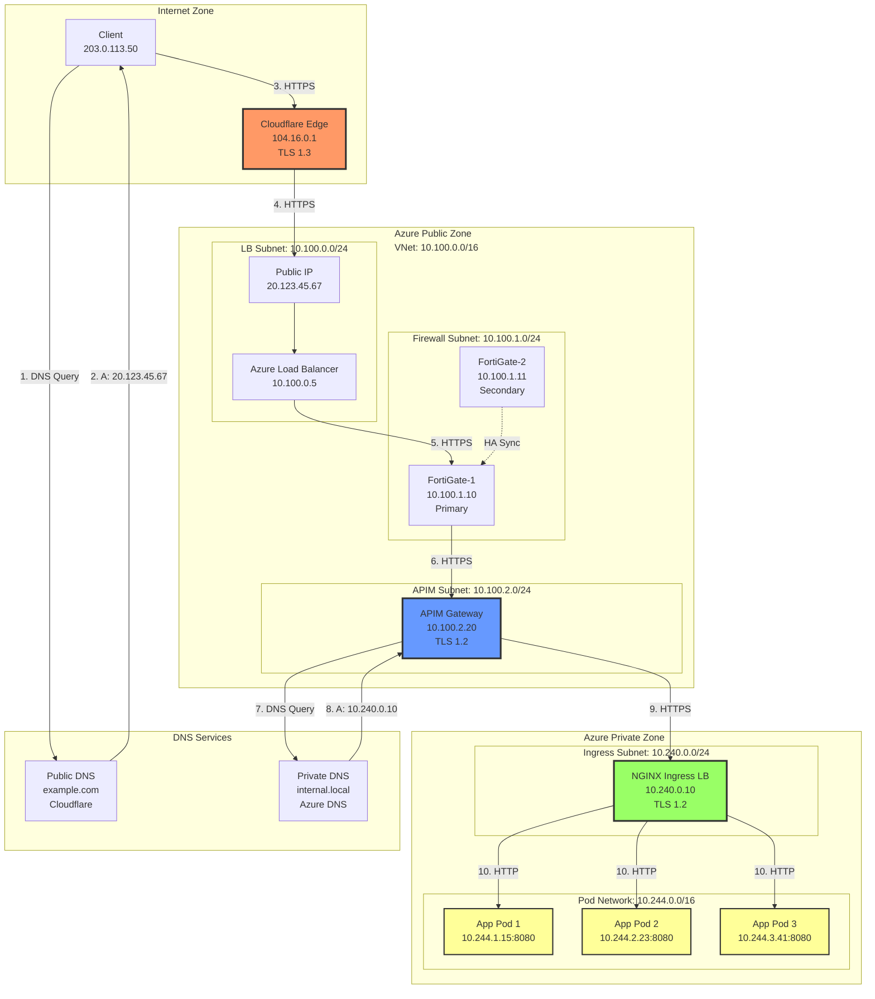
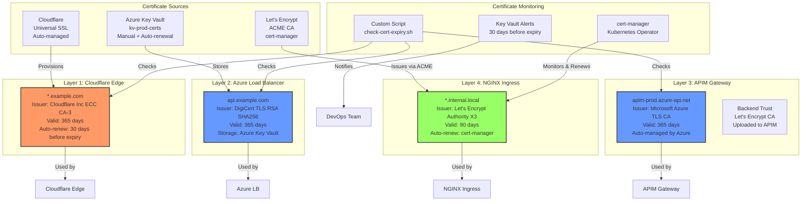
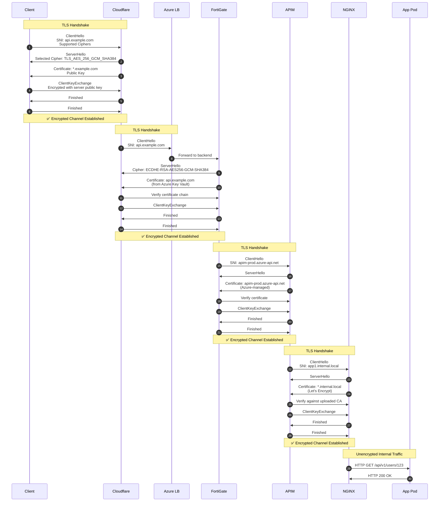
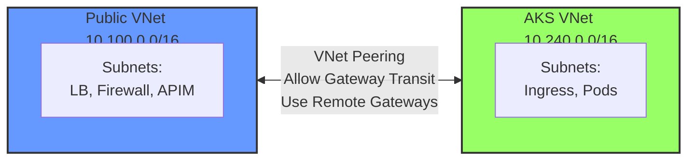

# AKS Ingress Network Topology & Certificate Management

## Network Topology Diagram



## Certificate Management Architecture



## TLS Handshake Flow



## IP Address Allocation

### Public IP Addresses
| Resource | IP Address | DNS Name | Purpose |
|----------|------------|----------|---------|
| Azure Load Balancer | 20.123.45.67 | api.example.com | Public entry point |
| Cloudflare Edge (example) | 104.16.0.1 | - | CDN edge node |

### Private IP Addresses - Public VNet (10.100.0.0/16)
| Subnet | Resource | IP Address | Purpose |
|--------|----------|------------|---------|
| 10.100.0.0/24 | Azure LB Internal | 10.100.0.5 | Load balancer frontend |
| 10.100.1.0/24 | FortiGate-1 | 10.100.1.10 | Primary firewall |
| 10.100.1.0/24 | FortiGate-2 | 10.100.1.11 | Secondary firewall (HA) |
| 10.100.2.0/24 | APIM Gateway | 10.100.2.20 | API Management instance |

### Private IP Addresses - AKS VNet (10.240.0.0/16)
| Subnet | Resource | IP Address | Purpose |
|--------|----------|------------|---------|
| 10.240.0.0/24 | NGINX Ingress LB | 10.240.0.10 | Ingress controller service |
| 10.244.1.0/24 | App Pod 1 | 10.244.1.15 | Application pod (node 1) |
| 10.244.2.0/24 | App Pod 2 | 10.244.2.23 | Application pod (node 2) |
| 10.244.3.0/24 | App Pod 3 | 10.244.3.41 | Application pod (node 3) |

## Port Mapping

| Layer | Source Port | Destination Port | Protocol | Notes |
|-------|-------------|------------------|----------|-------|
| Client → Cloudflare | Random (>1024) | 443 | HTTPS/TLS 1.3 | Client ephemeral port |
| Cloudflare → Azure LB | Random | 443 | HTTPS/TLS 1.2 | Cloudflare source port |
| Azure LB → FortiGate | Random | 443 | HTTPS/TLS 1.2 | Load balancer NAT |
| FortiGate → APIM | Random | 443 | HTTPS/TLS 1.2 | Firewall NAT |
| APIM → NGINX | Random | 443 | HTTPS/TLS 1.2 | APIM source port |
| NGINX → Pod | Random | 8080 | HTTP | Unencrypted cluster traffic |

## FQDN to IP Resolution Matrix

| FQDN | DNS Zone | Record Type | IP Address | Resolver | Accessible From |
|------|----------|-------------|------------|----------|-----------------|
| api.example.com | example.com (Public) | A | 20.123.45.67 | Cloudflare DNS | Internet |
| www.example.com | example.com (Public) | CNAME → A | 20.123.45.67 | Cloudflare DNS | Internet |
| apim-prod.azure-api.net | azure-api.net (Azure) | A | 10.100.2.20 | Azure DNS | Azure VNets |
| app1.internal.local | internal.local (Private) | A | 10.240.0.10 | Azure Private DNS | Linked VNets only |
| *.apps.internal.local | internal.local (Private) | A | 10.240.0.10 | Azure Private DNS | Linked VNets only |
| app1-service.default.svc.cluster.local | cluster.local (K8s) | A | 10.0.150.20 | CoreDNS | AKS cluster only |

## Certificate Chain Validation

### Cloudflare Certificate Chain
```
Root CA: Baltimore CyberTrust Root
  ├─ Intermediate CA: Cloudflare Inc ECC CA-3
  │   └─ End Entity: *.example.com
  │       ├─ Subject: CN=*.example.com
  │       ├─ Issuer: CN=Cloudflare Inc ECC CA-3
  │       ├─ Serial: 0a:1b:2c:3d:4e:5f:6a:7b:8c:9d
  │       ├─ Valid: 2024-01-15 to 2025-01-14
  │       └─ Key: ECDSA P-256
```

### Azure Load Balancer Certificate Chain
```
Root CA: DigiCert Global Root CA
  ├─ Intermediate CA: DigiCert TLS RSA SHA256 2020 CA1
  │   └─ End Entity: api.example.com
  │       ├─ Subject: CN=api.example.com
  │       ├─ Issuer: CN=DigiCert TLS RSA SHA256 2020 CA1
  │       ├─ Serial: 0f:1e:2d:3c:4b:5a:69:78:87:96
  │       ├─ Valid: 2024-06-01 to 2025-06-01
  │       └─ Key: RSA 2048
```

### NGINX Ingress Certificate Chain
```
Root CA: ISRG Root X1 (Let's Encrypt)
  ├─ Intermediate CA: Let's Encrypt Authority X3
  │   └─ End Entity: *.internal.local
  │       ├─ Subject: CN=*.internal.local
  │       ├─ Issuer: CN=Let's Encrypt Authority X3
  │       ├─ Serial: 03:a1:b2:c3:d4:e5:f6:07:08:09
  │       ├─ Valid: 2024-11-01 to 2025-02-01 (90 days)
  │       └─ Key: RSA 2048
```

## Network Security Groups (NSG) Rules

### LB Subnet NSG (10.100.0.0/24)
| Priority | Name | Direction | Source | Destination | Port | Protocol | Action |
|----------|------|-----------|--------|-------------|------|----------|--------|
| 100 | Allow-Internet-HTTPS | Inbound | Internet | 20.123.45.67 | 443 | TCP | Allow |
| 110 | Allow-HealthProbe | Inbound | AzureLoadBalancer | * | * | * | Allow |
| 200 | Allow-To-Firewall | Outbound | 10.100.0.0/24 | 10.100.1.0/24 | 443 | TCP | Allow |
| 65000 | Deny-All-Inbound | Inbound | * | * | * | * | Deny |

### Firewall Subnet NSG (10.100.1.0/24)
| Priority | Name | Direction | Source | Destination | Port | Protocol | Action |
|----------|------|-----------|--------|-------------|------|----------|--------|
| 100 | Allow-From-LB | Inbound | 10.100.0.0/24 | 10.100.1.0/24 | 443 | TCP | Allow |
| 110 | Allow-HA-Sync | Inbound | 10.100.1.0/24 | 10.100.1.0/24 | * | * | Allow |
| 200 | Allow-To-APIM | Outbound | 10.100.1.0/24 | 10.100.2.0/24 | 443 | TCP | Allow |
| 65000 | Deny-All-Inbound | Inbound | * | * | * | * | Deny |

### APIM Subnet NSG (10.100.2.0/24)
| Priority | Name | Direction | Source | Destination | Port | Protocol | Action |
|----------|------|-----------|--------|-------------|------|----------|--------|
| 100 | Allow-From-Firewall | Inbound | 10.100.1.0/24 | 10.100.2.0/24 | 443 | TCP | Allow |
| 110 | Allow-APIM-Management | Inbound | ApiManagement | * | 3443 | TCP | Allow |
| 200 | Allow-To-AKS | Outbound | 10.100.2.0/24 | 10.240.0.0/24 | 443 | TCP | Allow |
| 210 | Allow-Azure-DNS | Outbound | * | 168.63.129.16 | 53 | UDP | Allow |
| 65000 | Deny-All-Inbound | Inbound | * | * | * | * | Deny |

### AKS Ingress Subnet NSG (10.240.0.0/24)
| Priority | Name | Direction | Source | Destination | Port | Protocol | Action |
|----------|------|-----------|--------|-------------|------|----------|--------|
| 100 | Allow-From-APIM | Inbound | 10.100.2.0/24 | 10.240.0.0/24 | 443 | TCP | Allow |
| 200 | Allow-To-Pods | Outbound | 10.240.0.0/24 | 10.244.0.0/16 | * | TCP | Allow |
| 65000 | Deny-All-Inbound | Inbound | * | * | * | * | Deny |

## VNet Peering Configuration



**Peering Configuration:**
```bash
# Create VNet peering from Public to AKS
az network vnet peering create \
  --name public-to-aks \
  --resource-group rg-aks-prod \
  --vnet-name vnet-public \
  --remote-vnet vnet-aks \
  --allow-vnet-access \
  --allow-forwarded-traffic

# Create VNet peering from AKS to Public
az network vnet peering create \
  --name aks-to-public \
  --resource-group rg-aks-prod \
  --vnet-name vnet-aks \
  --remote-vnet vnet-public \
  --allow-vnet-access \
  --allow-forwarded-traffic
```

## Request Headers at Each Layer

### Layer 1: Client → Cloudflare
```http
GET /users/123 HTTP/2
Host: api.example.com
User-Agent: Mozilla/5.0 (Windows NT 10.0; Win64; x64)
Accept: application/json
Accept-Encoding: gzip, deflate, br
Connection: keep-alive
```

### Layer 2: Cloudflare → Azure LB
```http
GET /users/123 HTTP/1.1
Host: api.example.com
User-Agent: Mozilla/5.0 (Windows NT 10.0; Win64; x64)
Accept: application/json
X-Forwarded-For: 203.0.113.50
X-Forwarded-Proto: https
CF-Connecting-IP: 203.0.113.50
CF-Ray: 8a1b2c3d4e5f6g7h
CF-Visitor: {"scheme":"https"}
```

### Layer 3: FortiGate → APIM
```http
GET /users/123 HTTP/1.1
Host: api.example.com
User-Agent: Mozilla/5.0 (Windows NT 10.0; Win64; x64)
Accept: application/json
X-Forwarded-For: 203.0.113.50
X-Forwarded-Proto: https
CF-Connecting-IP: 203.0.113.50
CF-Ray: 8a1b2c3d4e5f6g7h
X-Fortigate-Client-IP: 203.0.113.50
```

### Layer 4: APIM → NGINX
```http
GET /api/v1/users/123 HTTP/1.1
Host: app1.internal.local
User-Agent: APIM/1.0
Accept: application/json
X-Forwarded-For: 203.0.113.50
X-Forwarded-Proto: https
Ocp-Apim-Subscription-Key: a1b2c3d4e5f6g7h8i9j0
X-APIM-Request-Id: 12345678-1234-1234-1234-123456789abc
X-Original-Host: api.example.com
```

### Layer 5: NGINX → Pod
```http
GET /api/v1/users/123 HTTP/1.1
Host: app1-service:8080
User-Agent: APIM/1.0
Accept: application/json
X-Real-IP: 10.100.2.20
X-Forwarded-For: 203.0.113.50
X-Forwarded-Proto: https
X-Scheme: https
X-Original-URI: /users/123
Ocp-Apim-Subscription-Key: a1b2c3d4e5f6g7h8i9j0
X-APIM-Request-Id: 12345678-1234-1234-1234-123456789abc
X-Request-ID: nginx-req-11223
```

