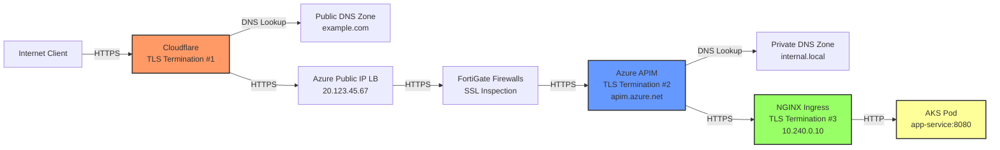
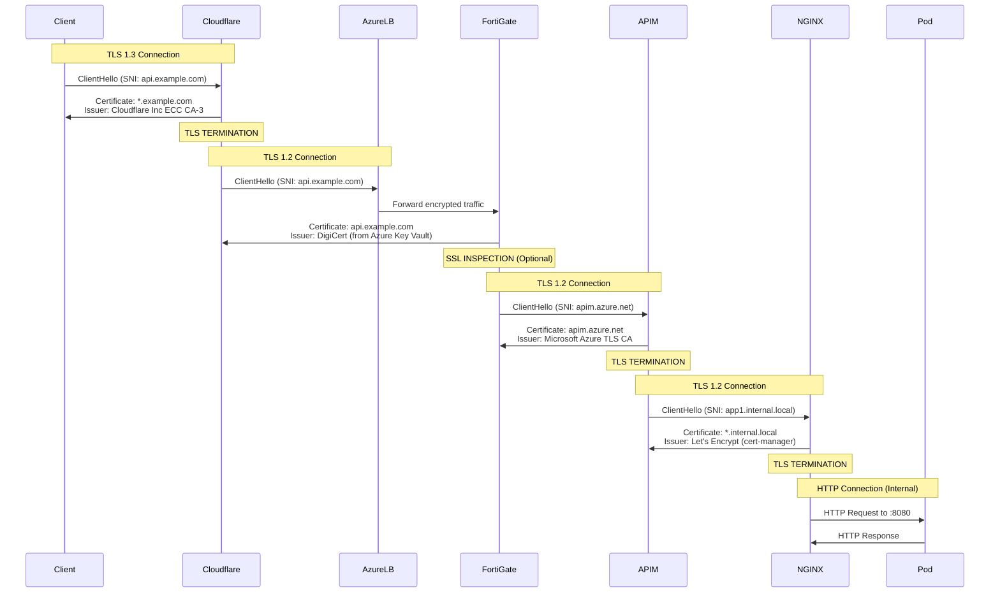
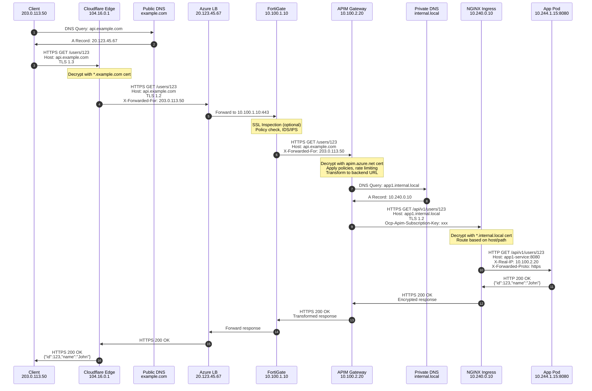
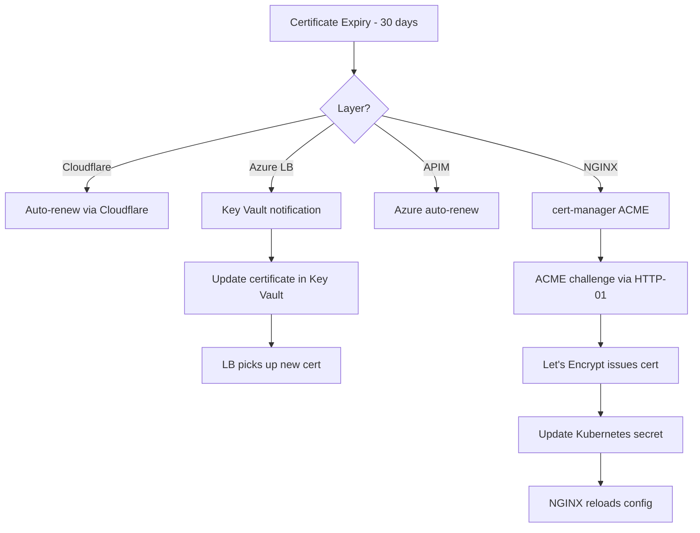

# AKS Ingress Traffic Engineering Documentation

## Executive Summary

This document provides comprehensive engineering documentation for the AKS ingress traffic flow in a hybrid cloud environment, covering the complete data path from internet clients through Cloudflare, Azure infrastructure, FortiGate firewalls, APIM, to the AKS private cluster with NGINX ingress controller.

**Key Components:**
- **Edge Layer**: Cloudflare (Internet-facing)
- **Azure Public Layer**: Azure Public IP Load Balancer
- **Security Layer**: FortiGate Internal Firewalls (HA)
- **API Gateway Layer**: Azure API Management (APIM)
- **Container Layer**: AKS Private Cluster with NGINX Ingress Controller

---

## Architecture Overview



---

## DNS Configuration

### Public DNS Zone (example.com)

**Zone**: `example.com` (Managed in Cloudflare)

| Record Type | Name | Value | TTL | Purpose |
|-------------|------|-------|-----|---------|
| A | api.example.com | 20.123.45.67 | 300 | Points to Azure Public IP Load Balancer |
| CNAME | www.example.com | api.example.com | 300 | Alias for main API endpoint |
| TXT | _acme-challenge.api | validation-token | 120 | SSL certificate validation |

**Configuration Example:**
```bash
# Cloudflare DNS Records
api.example.com.     300  IN  A      20.123.45.67
www.example.com.     300  IN  CNAME  api.example.com
*.api.example.com.   300  IN  A      20.123.45.67
```

### Private DNS Zone (internal.local)

**Zone**: `internal.local` (Azure Private DNS Zone)

| Record Type | Name | Value | TTL | Purpose |
|-------------|------|-------|-----|---------|
| A | *.apps.internal.local | 10.240.0.10 | 300 | Wildcard for all AKS apps |
| A | nginx-ingress.internal.local | 10.240.0.10 | 300 | NGINX Ingress Controller |
| A | app1.internal.local | 10.240.0.10 | 300 | Specific application endpoint |

**Azure CLI Configuration:**
```bash
# Create Private DNS Zone
az network private-dns zone create \
  --resource-group rg-aks-prod \
  --name internal.local

# Link to AKS VNet
az network private-dns link vnet create \
  --resource-group rg-aks-prod \
  --zone-name internal.local \
  --name aks-vnet-link \
  --virtual-network aks-vnet \
  --registration-enabled false

# Create A Record for NGINX Ingress
az network private-dns record-set a add-record \
  --resource-group rg-aks-prod \
  --zone-name internal.local \
  --record-set-name "*.apps" \
  --ipv4-address 10.240.0.10
```

---

## SSL/TLS Certificate Management

### Certificate Chain Overview



### Certificate Details by Layer

#### Layer 1: Cloudflare Edge Certificate

**Certificate**: `*.example.com`
```yaml
Subject: CN=*.example.com
Issuer: CN=Cloudflare Inc ECC CA-3, O=Cloudflare, Inc., C=US
Valid From: 2024-01-15
Valid To: 2025-01-14
Key Type: ECDSA P-256
SANs:
  - *.example.com
  - example.com
  - api.example.com
```

**Cloudflare SSL/TLS Mode**: Full (Strict)
- Encrypts traffic between client and Cloudflare
- Encrypts traffic between Cloudflare and origin (Azure LB)
- Validates origin certificate

**Configuration:**
```bash
# Cloudflare SSL/TLS Settings (via API or Dashboard)
# Mode: Full (strict)
# Minimum TLS Version: 1.2
# TLS 1.3: Enabled
# Automatic HTTPS Rewrites: Enabled
# Always Use HTTPS: Enabled
```

#### Layer 2: Azure Load Balancer Certificate

**Certificate**: `api.example.com`
```yaml
Subject: CN=api.example.com
Issuer: CN=DigiCert TLS RSA SHA256 2020 CA1
Valid From: 2024-06-01
Valid To: 2025-06-01
Key Type: RSA 2048
Storage: Azure Key Vault (kv-prod-certs)
SANs:
  - api.example.com
  - www.example.com
```

**Azure Key Vault Configuration:**
```bash
# Create Key Vault
az keyvault create \
  --name kv-prod-certs \
  --resource-group rg-aks-prod \
  --location eastus \
  --enable-rbac-authorization true

# Import Certificate
az keyvault certificate import \
  --vault-name kv-prod-certs \
  --name api-example-com \
  --file api.example.com.pfx \
  --password "cert-password"

# Grant Load Balancer access
az keyvault set-policy \
  --name kv-prod-certs \
  --object-id <lb-managed-identity-id> \
  --certificate-permissions get list
```

**Load Balancer SSL Configuration:**
```bash
# Configure Application Gateway (if using) or Front Door
az network application-gateway ssl-cert create \
  --gateway-name appgw-prod \
  --resource-group rg-aks-prod \
  --name api-example-com-cert \
  --key-vault-secret-id "https://kv-prod-certs.vault.azure.net/secrets/api-example-com"
```

#### Layer 3: APIM Gateway Certificate

**Certificate**: `apim.azure.net` (Azure-managed)
```yaml
Subject: CN=apim-prod.azure-api.net
Issuer: CN=Microsoft Azure TLS Issuing CA 01
Valid From: 2024-03-01
Valid To: 2025-03-01
Key Type: RSA 2048
Management: Automatic (Azure-managed)
SANs:
  - apim-prod.azure-api.net
  - apim-prod.management.azure-api.net
```

**APIM Backend Certificate** (for APIM → NGINX):
```yaml
Subject: CN=*.internal.local
Issuer: CN=Let's Encrypt Authority X3
Valid From: 2024-11-01
Valid To: 2025-02-01
Key Type: RSA 2048
```

**APIM Configuration:**
```bash
# Upload backend certificate to APIM
az apim certificate create \
  --resource-group rg-aks-prod \
  --service-name apim-prod \
  --certificate-id internal-local-ca \
  --data @letsencrypt-ca.cer

# Configure backend with certificate validation
az apim backend create \
  --resource-group rg-aks-prod \
  --service-name apim-prod \
  --backend-id aks-backend \
  --url "https://app1.internal.local" \
  --protocol https \
  --tls-validate-certificate-chain true \
  --tls-validate-certificate-name true
```

#### Layer 4: NGINX Ingress Certificate

**Certificate**: `*.internal.local` (cert-manager with Let's Encrypt)
```yaml
Subject: CN=*.internal.local
Issuer: CN=Let's Encrypt Authority X3, O=Let's Encrypt, C=US
Valid From: 2024-11-01
Valid To: 2025-02-01
Key Type: RSA 2048
SANs:
  - *.internal.local
  - *.apps.internal.local
  - app1.internal.local
```

**cert-manager Configuration:**
```yaml
# ClusterIssuer for Let's Encrypt
apiVersion: cert-manager.io/v1
kind: ClusterIssuer
metadata:
  name: letsencrypt-prod
spec:
  acme:
    server: https://acme-v02.api.letsencrypt.org/directory
    email: devops@example.com
    privateKeySecretRef:
      name: letsencrypt-prod-key
    solvers:
    - http01:
        ingress:
          class: nginx
---
# Certificate Resource
apiVersion: cert-manager.io/v1
kind: Certificate
metadata:
  name: wildcard-internal-local
  namespace: ingress-nginx
spec:
  secretName: wildcard-internal-local-tls
  issuerRef:
    name: letsencrypt-prod
    kind: ClusterIssuer
  dnsNames:
  - "*.internal.local"
  - "*.apps.internal.local"
  - "app1.internal.local"
```

**NGINX Ingress TLS Configuration:**
```yaml
apiVersion: networking.k8s.io/v1
kind: Ingress
metadata:
  name: app1-ingress
  namespace: default
  annotations:
    kubernetes.io/ingress.class: nginx
    cert-manager.io/cluster-issuer: letsencrypt-prod
    nginx.ingress.kubernetes.io/ssl-redirect: "true"
    nginx.ingress.kubernetes.io/force-ssl-redirect: "true"
spec:
  tls:
  - hosts:
    - app1.internal.local
    secretName: wildcard-internal-local-tls
  rules:
  - host: app1.internal.local
    http:
      paths:
      - path: /
        pathType: Prefix
        backend:
          service:
            name: app1-service
            port:
              number: 8080
```

---

## End-to-End Data Flow with Pragmatic Example

### Scenario: Client Request to `https://api.example.com/users/123`



### Detailed Step-by-Step Flow

#### Step 1-2: DNS Resolution (Public)
```
Client Query: api.example.com
DNS Server: 1.1.1.1 (Cloudflare)
Response: 20.123.45.67 (Azure Public IP)
TTL: 300 seconds
```

#### Step 3: Client → Cloudflare
```http
GET /users/123 HTTP/2
Host: api.example.com
User-Agent: Mozilla/5.0
Accept: application/json
Connection: Upgrade, HTTP2-Settings

TLS Details:
- Protocol: TLS 1.3
- Cipher: TLS_AES_256_GCM_SHA384
- Certificate: CN=*.example.com (Cloudflare)
- SNI: api.example.com
```

**Cloudflare Processing:**
- TLS termination
- DDoS protection
- WAF rules evaluation
- Caching check (cache miss for API)
- Add headers: `CF-Ray`, `CF-Connecting-IP`

#### Step 4: Cloudflare → Azure Load Balancer
```http
GET /users/123 HTTP/1.1
Host: api.example.com
User-Agent: Mozilla/5.0
Accept: application/json
X-Forwarded-For: 203.0.113.50
X-Forwarded-Proto: https
CF-Connecting-IP: 203.0.113.50
CF-Ray: 8a1b2c3d4e5f6g7h

TLS Details:
- Protocol: TLS 1.2
- Cipher: ECDHE-RSA-AES256-GCM-SHA384
- Certificate: CN=api.example.com (DigiCert)
- Destination: 20.123.45.67:443
```

**Azure Load Balancer Processing:**
- Health probe check
- Session affinity (if configured)
- Forward to FortiGate backend pool member

#### Step 5-6: Azure LB → FortiGate Firewall
```http
Destination: 10.100.1.10:443 (FortiGate VIP)
Source: 10.100.0.5 (Load Balancer internal IP)

FortiGate Processing:
- SSL Deep Inspection (optional)
  - Decrypt using FortiGate SSL inspection certificate
  - IDS/IPS signature matching
  - Application control
  - Malware scanning
- Firewall policy evaluation
  - Source: 10.100.0.0/24 (LB subnet)
  - Destination: 10.100.2.20 (APIM)
  - Service: HTTPS/443
  - Action: ACCEPT
- NAT translation
- Re-encrypt and forward
```

**FortiGate Configuration:**
```
config firewall policy
    edit 10
        set name "LB-to-APIM"
        set srcintf "port1"
        set dstintf "port2"
        set srcaddr "AzureLB-Subnet"
        set dstaddr "APIM-Subnet"
        set action accept
        set schedule "always"
        set service "HTTPS"
        set ssl-ssh-profile "deep-inspection"
        set ips-sensor "default"
        set application-list "default"
        set logtraffic all
    next
end
```

#### Step 7: FortiGate → APIM
```http
GET /users/123 HTTP/1.1
Host: api.example.com
User-Agent: Mozilla/5.0
Accept: application/json
X-Forwarded-For: 203.0.113.50
X-Forwarded-Proto: https
CF-Connecting-IP: 203.0.113.50
CF-Ray: 8a1b2c3d4e5f6g7h

TLS Details:
- Protocol: TLS 1.2
- Cipher: ECDHE-RSA-AES256-GCM-SHA384
- Certificate: CN=apim-prod.azure-api.net
- Destination: 10.100.2.20:443
```

**APIM Processing:**
- TLS termination (2nd termination)
- Subscription key validation
- Rate limiting check (100 calls/minute)
- JWT token validation (if configured)
- Policy execution:
  - `set-header`: Add `Ocp-Apim-Subscription-Key`
  - `set-backend-service`: Route to `aks-backend`
  - `rewrite-uri`: Transform `/users/123` → `/api/v1/users/123`
- Logging to Application Insights

**APIM Policy Example:**
```xml
<policies>
    <inbound>
        <base />
        <rate-limit calls="100" renewal-period="60" />
        <validate-jwt header-name="Authorization" failed-validation-httpcode="401">
            <openid-config url="https://login.microsoftonline.com/{tenant}/.well-known/openid-configuration" />
        </validate-jwt>
        <set-header name="Ocp-Apim-Subscription-Key" exists-action="override">
            <value>@(context.Subscription.Key)</value>
        </set-header>
        <rewrite-uri template="/api/v1/users/{id}" />
        <set-backend-service backend-id="aks-backend" />
    </inbound>
    <backend>
        <base />
    </backend>
    <outbound>
        <base />
        <set-header name="X-Powered-By" exists-action="delete" />
    </outbound>
</policies>
```

#### Step 8-9: DNS Resolution (Private)
```
APIM Query: app1.internal.local
DNS Server: 168.63.129.16 (Azure DNS)
Private DNS Zone: internal.local
Response: 10.240.0.10 (NGINX Ingress LoadBalancer IP)
TTL: 300 seconds
```

#### Step 10: APIM → NGINX Ingress
```http
GET /api/v1/users/123 HTTP/1.1
Host: app1.internal.local
User-Agent: APIM/1.0
Accept: application/json
X-Forwarded-For: 203.0.113.50
X-Forwarded-Proto: https
Ocp-Apim-Subscription-Key: a1b2c3d4e5f6g7h8i9j0
X-APIM-Request-Id: 12345678-1234-1234-1234-123456789abc

TLS Details:
- Protocol: TLS 1.2
- Cipher: ECDHE-RSA-AES256-GCM-SHA384
- Certificate: CN=*.internal.local (Let's Encrypt)
- Destination: 10.240.0.10:443
```

**NGINX Ingress Processing:**
- TLS termination (3rd and final termination)
- Ingress rule matching:
  - Host: `app1.internal.local`
  - Path: `/` (prefix match)
  - Backend: `app1-service:8080`
- Add headers:
  - `X-Real-IP: 10.100.2.20`
  - `X-Forwarded-Proto: https`
  - `X-Scheme: https`
- Service discovery via CoreDNS
- Load balancing to pod endpoints

**NGINX Configuration (generated):**
```nginx
upstream app1-service-8080 {
    least_conn;
    server 10.244.1.15:8080 max_fails=3 fail_timeout=30s;
    server 10.244.2.23:8080 max_fails=3 fail_timeout=30s;
    server 10.244.3.41:8080 max_fails=3 fail_timeout=30s;
}

server {
    listen 443 ssl http2;
    server_name app1.internal.local;
    
    ssl_certificate /etc/nginx/ssl/wildcard-internal-local-tls.crt;
    ssl_certificate_key /etc/nginx/ssl/wildcard-internal-local-tls.key;
    ssl_protocols TLSv1.2 TLSv1.3;
    ssl_ciphers HIGH:!aNULL:!MD5;
    
    location / {
        proxy_pass http://app1-service-8080;
        proxy_set_header Host $host;
        proxy_set_header X-Real-IP $remote_addr;
        proxy_set_header X-Forwarded-For $proxy_add_x_forwarded_for;
        proxy_set_header X-Forwarded-Proto $scheme;
        proxy_connect_timeout 60s;
        proxy_send_timeout 60s;
        proxy_read_timeout 60s;
    }
}
```

#### Step 11: NGINX → Application Pod
```http
GET /api/v1/users/123 HTTP/1.1
Host: app1-service:8080
User-Agent: APIM/1.0
Accept: application/json
X-Real-IP: 10.100.2.20
X-Forwarded-For: 203.0.113.50
X-Forwarded-Proto: https
X-Scheme: https
Ocp-Apim-Subscription-Key: a1b2c3d4e5f6g7h8i9j0
X-APIM-Request-Id: 12345678-1234-1234-1234-123456789abc

Connection Details:
- Protocol: HTTP/1.1 (unencrypted - internal cluster traffic)
- Source: 10.240.0.10 (NGINX pod)
- Destination: 10.244.1.15:8080 (app pod)
- Network: AKS CNI overlay network
```

**Kubernetes Service Resolution:**
```yaml
apiVersion: v1
kind: Service
metadata:
  name: app1-service
  namespace: default
spec:
  type: ClusterIP
  selector:
    app: app1
  ports:
  - port: 8080
    targetPort: 8080
    protocol: TCP
  sessionAffinity: None
```

**Pod Endpoints:**
```bash
$ kubectl get endpoints app1-service
NAME           ENDPOINTS                                      AGE
app1-service   10.244.1.15:8080,10.244.2.23:8080,10.244.3.41:8080   5d
```

#### Step 12-17: Response Flow (Reverse Path)

**Pod Response:**
```http
HTTP/1.1 200 OK
Content-Type: application/json
Content-Length: 45
X-App-Version: 1.2.3
X-Request-ID: pod-req-98765

{"id":123,"name":"John Doe","email":"john@example.com"}
```

**NGINX → APIM (encrypted with *.internal.local cert):**
```http
HTTP/1.1 200 OK
Content-Type: application/json
Content-Length: 45
X-App-Version: 1.2.3
X-Request-ID: pod-req-98765
X-NGINX-Request-ID: nginx-req-11223
```

**APIM → FortiGate (encrypted with apim.azure.net cert):**
```http
HTTP/1.1 200 OK
Content-Type: application/json
Content-Length: 45
X-App-Version: 1.2.3
X-APIM-Request-ID: 12345678-1234-1234-1234-123456789abc
Cache-Control: no-cache

{"id":123,"name":"John Doe","email":"john@example.com"}
```

**Cloudflare → Client (encrypted with *.example.com cert):**
```http
HTTP/2 200 OK
Content-Type: application/json
Content-Length: 45
X-App-Version: 1.2.3
CF-Ray: 8a1b2c3d4e5f6g7h
CF-Cache-Status: DYNAMIC
Server: cloudflare

{"id":123,"name":"John Doe","email":"john@example.com"}
```

---

## Network Flow Summary Table

| Hop | Source | Destination | Protocol | Port | TLS | Certificate | Purpose |
|-----|--------|-------------|----------|------|-----|-------------|---------|
| 1 | Client (203.0.113.50) | Cloudflare (104.16.0.1) | HTTPS | 443 | ✅ TLS 1.3 | *.example.com | Edge termination |
| 2 | Cloudflare | Azure LB (20.123.45.67) | HTTPS | 443 | ✅ TLS 1.2 | api.example.com | Origin connection |
| 3 | Azure LB (10.100.0.5) | FortiGate (10.100.1.10) | HTTPS | 443 | ✅ TLS 1.2 | api.example.com | Security inspection |
| 4 | FortiGate (10.100.1.11) | APIM (10.100.2.20) | HTTPS | 443 | ✅ TLS 1.2 | apim.azure.net | API gateway |
| 5 | APIM (10.100.2.20) | NGINX (10.240.0.10) | HTTPS | 443 | ✅ TLS 1.2 | *.internal.local | Ingress controller |
| 6 | NGINX (10.240.0.10) | Pod (10.244.1.15) | HTTP | 8080 | ❌ Plaintext | N/A | Internal cluster |

---

## Security Considerations

### TLS Best Practices

1. **Minimum TLS Version**: TLS 1.2 (TLS 1.3 at edge)
2. **Cipher Suites**: Strong ciphers only (ECDHE, AES-GCM)
3. **Certificate Validation**: Strict validation at all layers
4. **Certificate Rotation**: Automated via cert-manager and Azure Key Vault
5. **HSTS**: Enabled at Cloudflare and APIM layers

### Certificate Rotation Strategy



### Network Security

1. **Network Segmentation**: Separate subnets for each layer
2. **NSGs**: Restrictive network security groups
3. **Private Endpoints**: AKS cluster is private (no public API)
4. **Firewall Rules**: FortiGate policies for deep inspection
5. **Zero Trust**: Mutual TLS between APIM and NGINX (optional)

---

## Troubleshooting Guide

### Common Issues

#### Issue 1: Certificate Validation Failures

**Symptom**: APIM cannot connect to NGINX ingress
```
SSL certificate problem: unable to get local issuer certificate
```

**Resolution**:
```bash
# Upload Let's Encrypt CA to APIM
az apim certificate create \
  --resource-group rg-aks-prod \
  --service-name apim-prod \
  --certificate-id letsencrypt-ca \
  --data @letsencrypt-ca.cer

# Update backend to trust certificate
az apim backend update \
  --resource-group rg-aks-prod \
  --service-name apim-prod \
  --backend-id aks-backend \
  --tls-validate-certificate-chain true
```

#### Issue 2: DNS Resolution Failures

**Symptom**: APIM cannot resolve `app1.internal.local`
```
DNS resolution failed for app1.internal.local
```

**Resolution**:
```bash
# Verify Private DNS Zone link
az network private-dns link vnet list \
  --resource-group rg-aks-prod \
  --zone-name internal.local

# Check DNS records
az network private-dns record-set a list \
  --resource-group rg-aks-prod \
  --zone-name internal.local

# Test DNS from APIM subnet
nslookup app1.internal.local 168.63.129.16
```

#### Issue 3: NGINX Ingress Certificate Not Updating

**Symptom**: cert-manager renewed certificate but NGINX still uses old cert

**Resolution**:
```bash
# Check certificate status
kubectl get certificate -n ingress-nginx

# Check cert-manager logs
kubectl logs -n cert-manager deployment/cert-manager

# Force certificate renewal
kubectl delete secret wildcard-internal-local-tls -n ingress-nginx
kubectl delete certificate wildcard-internal-local -n ingress-nginx
kubectl apply -f certificate.yaml

# Restart NGINX ingress
kubectl rollout restart deployment ingress-nginx-controller -n ingress-nginx
```

---

## Monitoring and Observability

### Key Metrics to Monitor

| Component | Metric | Threshold | Alert |
|-----------|--------|-----------|-------|
| Cloudflare | Error rate | > 1% | Critical |
| Azure LB | Unhealthy backend | > 0 | Warning |
| FortiGate | CPU usage | > 80% | Warning |
| APIM | Response time | > 2s | Warning |
| NGINX | 5xx errors | > 0.5% | Critical |
| cert-manager | Certificate expiry | < 7 days | Critical |

### Logging Strategy

```yaml
# NGINX Ingress Logging
apiVersion: v1
kind: ConfigMap
metadata:
  name: ingress-nginx-controller
  namespace: ingress-nginx
data:
  log-format-upstream: '{"time": "$time_iso8601", "remote_addr": "$remote_addr",
    "x_forwarded_for": "$proxy_add_x_forwarded_for", "request": "$request",
    "status": $status, "body_bytes_sent": $body_bytes_sent, "request_time": $request_time,
    "upstream_addr": "$upstream_addr", "upstream_response_time": "$upstream_response_time",
    "upstream_status": "$upstream_status", "host": "$host", "ssl_protocol": "$ssl_protocol",
    "ssl_cipher": "$ssl_cipher"}'
```

---

## Appendix

### Complete Infrastructure as Code

#### Terraform: Azure Resources
```hcl
# Public IP for Load Balancer
resource "azurerm_public_ip" "lb_public_ip" {
  name                = "pip-lb-prod"
  location            = azurerm_resource_group.rg.location
  resource_group_name = azurerm_resource_group.rg.name
  allocation_method   = "Static"
  sku                 = "Standard"
  domain_name_label   = "api-example"
}

# Private DNS Zone
resource "azurerm_private_dns_zone" "internal" {
  name                = "internal.local"
  resource_group_name = azurerm_resource_group.rg.name
}

# Link Private DNS to AKS VNet
resource "azurerm_private_dns_zone_virtual_network_link" "aks_link" {
  name                  = "aks-vnet-link"
  resource_group_name   = azurerm_resource_group.rg.name
  private_dns_zone_name = azurerm_private_dns_zone.internal.name
  virtual_network_id    = azurerm_virtual_network.aks_vnet.id
  registration_enabled  = false
}

# A Record for NGINX Ingress
resource "azurerm_private_dns_a_record" "nginx_ingress" {
  name                = "*.apps"
  zone_name           = azurerm_private_dns_zone.internal.name
  resource_group_name = azurerm_resource_group.rg.name
  ttl                 = 300
  records             = ["10.240.0.10"]
}
```

#### Kubernetes: NGINX Ingress with TLS
```yaml
apiVersion: v1
kind: Namespace
metadata:
  name: app1
---
apiVersion: apps/v1
kind: Deployment
metadata:
  name: app1
  namespace: app1
spec:
  replicas: 3
  selector:
    matchLabels:
      app: app1
  template:
    metadata:
      labels:
        app: app1
    spec:
      containers:
      - name: app1
        image: myregistry.azurecr.io/app1:1.2.3
        ports:
        - containerPort: 8080
        env:
        - name: ASPNETCORE_URLS
          value: "http://+:8080"
---
apiVersion: v1
kind: Service
metadata:
  name: app1-service
  namespace: app1
spec:
  type: ClusterIP
  selector:
    app: app1
  ports:
  - port: 8080
    targetPort: 8080
---
apiVersion: networking.k8s.io/v1
kind: Ingress
metadata:
  name: app1-ingress
  namespace: app1
  annotations:
    kubernetes.io/ingress.class: nginx
    cert-manager.io/cluster-issuer: letsencrypt-prod
    nginx.ingress.kubernetes.io/ssl-redirect: "true"
    nginx.ingress.kubernetes.io/force-ssl-redirect: "true"
    nginx.ingress.kubernetes.io/backend-protocol: "HTTP"
spec:
  tls:
  - hosts:
    - app1.internal.local
    secretName: app1-tls
  rules:
  - host: app1.internal.local
    http:
      paths:
      - path: /
        pathType: Prefix
        backend:
          service:
            name: app1-service
            port:
              number: 8080
```

### Certificate Expiry Monitoring Script
```bash
#!/bin/bash
# check-cert-expiry.sh

CERTS=(
  "api.example.com:443"
  "apim-prod.azure-api.net:443"
  "app1.internal.local:443"
)

for cert in "${CERTS[@]}"; do
  host=$(echo $cert | cut -d: -f1)
  port=$(echo $cert | cut -d: -f2)
  
  expiry=$(echo | openssl s_client -servername $host -connect $host:$port 2>/dev/null | \
    openssl x509 -noout -enddate | cut -d= -f2)
  
  expiry_epoch=$(date -d "$expiry" +%s)
  now_epoch=$(date +%s)
  days_left=$(( ($expiry_epoch - $now_epoch) / 86400 ))
  
  echo "$host: $days_left days until expiry"
  
  if [ $days_left -lt 7 ]; then
    echo "WARNING: Certificate for $host expires in $days_left days!"
  fi
done
```

---

## Document Revision History

| Version | Date | Author | Changes |
|---------|------|--------|---------|
| 1.0 | 2025-12-02 | DevOps Team | Initial documentation |

