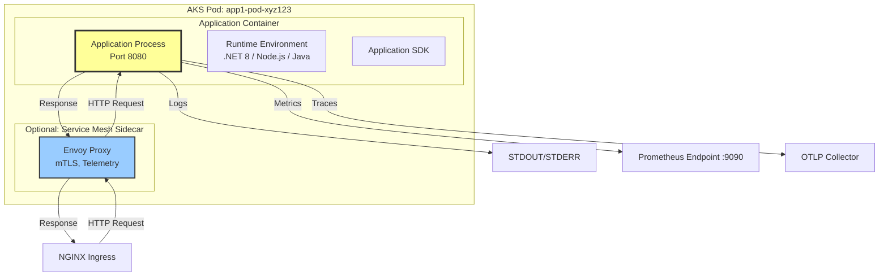
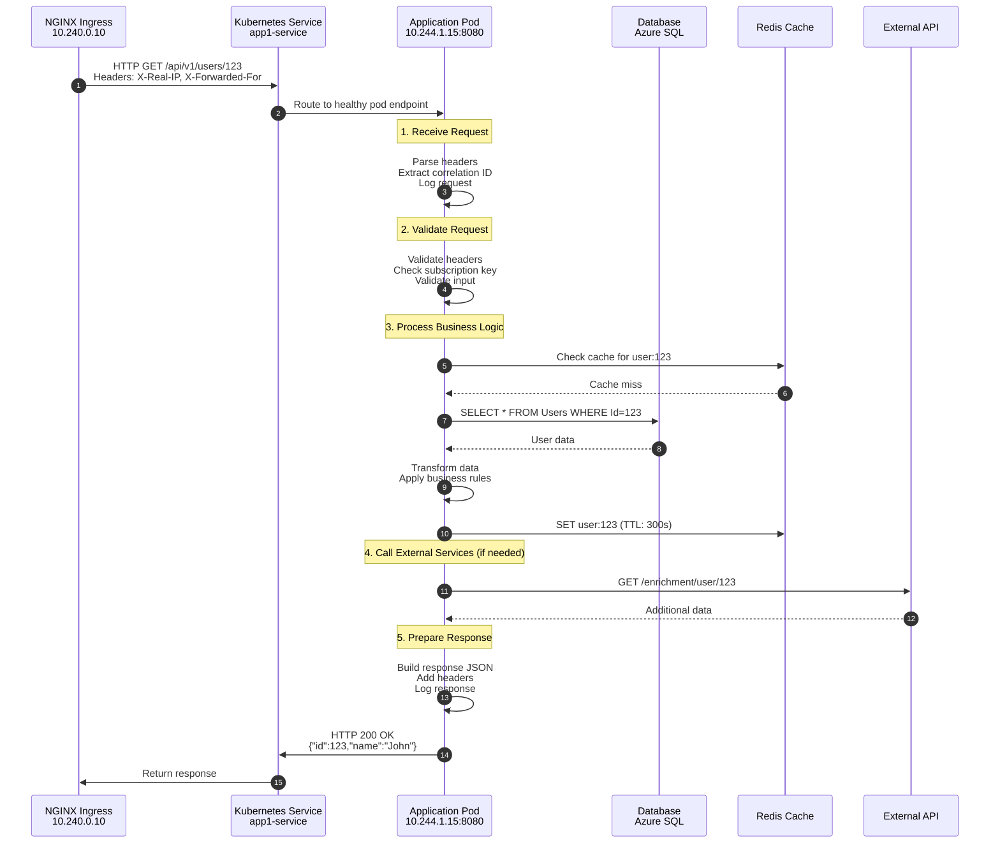
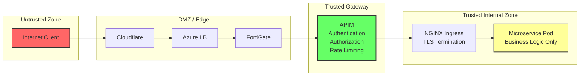
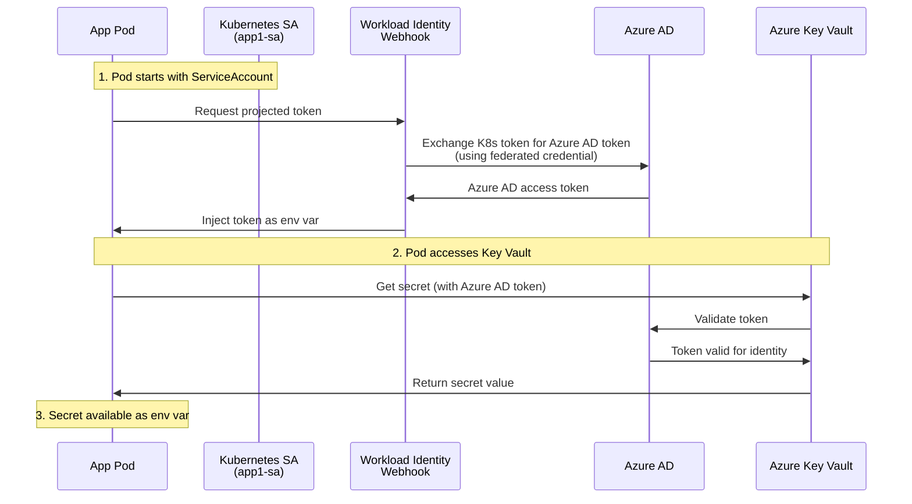

# AKS Microservice Application Guide

## Application Viewpoint: Microservices in AKS Pods

This document describes the expected behavior, implementation patterns, and best practices for microservices hosted in AKS pods within the ingress traffic flow architecture.

---

## Table of Contents
1. [Microservice Architecture Overview](#microservice-architecture-overview)
2. [Request Processing Behavior](#request-processing-behavior)
3. [Security Implementation](#security-implementation)
4. [Configuration Management](#configuration-management)
5. [Logging and Observability](#logging-and-observability)
6. [Health and Readiness](#health-and-readiness)
7. [Error Handling](#error-handling)
8. [Performance Considerations](#performance-considerations)

---

## Microservice Architecture Overview

### Application Stack in AKS Pod



### Microservice Responsibilities

**What the microservice SHOULD do:**
- ✅ Listen on HTTP port 8080 (or configured port)
- ✅ Handle requests from NGINX Ingress (internal cluster traffic)
- ✅ Validate incoming requests and headers
- ✅ Implement business logic
- ✅ Return appropriate HTTP status codes
- ✅ Log structured logs to STDOUT/STDERR
- ✅ Expose health check endpoints
- ✅ Expose metrics endpoint
- ✅ Handle graceful shutdown

**What the microservice should NOT do:**
- ❌ Implement TLS/SSL (handled by NGINX Ingress)
- ❌ Perform authentication (handled by APIM/NGINX)
- ❌ Implement rate limiting (handled by APIM)
- ❌ Handle CORS (handled by APIM/NGINX)
- ❌ Manage certificates
- ❌ Implement load balancing (handled by Kubernetes Service)

---

## Request Processing Behavior

### Incoming Request Flow to Microservice



### Expected Request Headers

The microservice receives these headers from NGINX Ingress:

```http
GET /api/v1/users/123 HTTP/1.1
Host: app1-service:8080
User-Agent: APIM/1.0
Accept: application/json
Content-Type: application/json
X-Real-IP: 10.100.2.20
X-Forwarded-For: 203.0.113.50
X-Forwarded-Proto: https
X-Forwarded-Host: api.example.com
X-Scheme: https
X-Request-ID: nginx-req-11223
X-Original-URI: /users/123
Ocp-Apim-Subscription-Key: a1b2c3d4e5f6g7h8i9j0
X-APIM-Request-Id: 12345678-1234-1234-1234-123456789abc
```

### Microservice Behavior: Header Processing

**C# (.NET 8) Example:**
```csharp
[ApiController]
[Route("api/v1/[controller]")]
public class UsersController : ControllerBase
{
    private readonly ILogger<UsersController> _logger;
    private readonly IUserService _userService;

    public UsersController(ILogger<UsersController> logger, IUserService userService)
    {
        _logger = logger;
        _userService = userService;
    }

    [HttpGet("{id}")]
    public async Task<IActionResult> GetUser(int id)
    {
        // 1. Extract correlation/request ID from headers
        var requestId = HttpContext.Request.Headers["X-Request-ID"].FirstOrDefault() 
                        ?? Guid.NewGuid().ToString();
        var apimRequestId = HttpContext.Request.Headers["X-APIM-Request-Id"].FirstOrDefault();
        var clientIp = HttpContext.Request.Headers["X-Forwarded-For"].FirstOrDefault() 
                       ?? HttpContext.Request.Headers["X-Real-IP"].FirstOrDefault();
        var originalHost = HttpContext.Request.Headers["X-Forwarded-Host"].FirstOrDefault();
        
        // 2. Create structured log context
        using (_logger.BeginScope(new Dictionary<string, object>
        {
            ["RequestId"] = requestId,
            ["ApimRequestId"] = apimRequestId,
            ["ClientIp"] = clientIp,
            ["UserId"] = id,
            ["OriginalHost"] = originalHost
        }))
        {
            _logger.LogInformation("Processing GetUser request for UserId: {UserId}", id);

            try
            {
                // 3. Validate input
                if (id <= 0)
                {
                    _logger.LogWarning("Invalid UserId: {UserId}", id);
                    return BadRequest(new { error = "Invalid user ID" });
                }

                // 4. Check subscription key (if required at app level)
                var subscriptionKey = HttpContext.Request.Headers["Ocp-Apim-Subscription-Key"].FirstOrDefault();
                if (string.IsNullOrEmpty(subscriptionKey))
                {
                    _logger.LogWarning("Missing subscription key");
                    return Unauthorized(new { error = "Missing subscription key" });
                }

                // 5. Execute business logic
                var user = await _userService.GetUserByIdAsync(id);
                
                if (user == null)
                {
                    _logger.LogInformation("User not found: {UserId}", id);
                    return NotFound(new { error = "User not found" });
                }

                // 6. Add custom response headers
                HttpContext.Response.Headers.Add("X-App-Version", "1.2.3");
                HttpContext.Response.Headers.Add("X-Request-ID", requestId);
                HttpContext.Response.Headers.Add("X-Response-Time", 
                    DateTime.UtcNow.ToString("o"));

                _logger.LogInformation("Successfully retrieved user: {UserId}", id);
                
                return Ok(user);
            }
            catch (Exception ex)
            {
                _logger.LogError(ex, "Error processing GetUser request for UserId: {UserId}", id);
                return StatusCode(500, new { error = "Internal server error", requestId });
            }
        }
    }
}
```

**Node.js (Express) Example:**
```javascript
const express = require('express');
const { v4: uuidv4 } = require('uuid');
const logger = require('./logger');
const userService = require('./services/userService');

const app = express();
app.use(express.json());

// Middleware to extract and log request context
app.use((req, res, next) => {
    // Extract headers
    req.requestId = req.headers['x-request-id'] || uuidv4();
    req.apimRequestId = req.headers['x-apim-request-id'];
    req.clientIp = req.headers['x-forwarded-for'] || req.headers['x-real-ip'];
    req.originalHost = req.headers['x-forwarded-host'];
    req.subscriptionKey = req.headers['ocp-apim-subscription-key'];
    
    // Create log context
    req.logContext = {
        requestId: req.requestId,
        apimRequestId: req.apimRequestId,
        clientIp: req.clientIp,
        originalHost: req.originalHost,
        method: req.method,
        path: req.path
    };
    
    logger.info('Incoming request', req.logContext);
    
    // Track response time
    req.startTime = Date.now();
    
    next();
});

// GET /api/v1/users/:id
app.get('/api/v1/users/:id', async (req, res) => {
    const userId = parseInt(req.params.id);
    
    try {
        // 1. Validate input
        if (isNaN(userId) || userId <= 0) {
            logger.warn('Invalid user ID', { ...req.logContext, userId });
            return res.status(400).json({ error: 'Invalid user ID' });
        }
        
        // 2. Validate subscription key (if required)
        if (!req.subscriptionKey) {
            logger.warn('Missing subscription key', req.logContext);
            return res.status(401).json({ error: 'Missing subscription key' });
        }
        
        // 3. Execute business logic
        const user = await userService.getUserById(userId);
        
        if (!user) {
            logger.info('User not found', { ...req.logContext, userId });
            return res.status(404).json({ error: 'User not found' });
        }
        
        // 4. Add response headers
        const responseTime = Date.now() - req.startTime;
        res.set({
            'X-App-Version': '1.2.3',
            'X-Request-ID': req.requestId,
            'X-Response-Time': `${responseTime}ms`
        });
        
        logger.info('Successfully retrieved user', { 
            ...req.logContext, 
            userId,
            responseTime 
        });
        
        res.json(user);
        
    } catch (error) {
        logger.error('Error processing request', { 
            ...req.logContext, 
            userId,
            error: error.message,
            stack: error.stack 
        });
        
        res.status(500).json({ 
            error: 'Internal server error', 
            requestId: req.requestId 
        });
    }
});

// Start server
const PORT = process.env.PORT || 8080;
app.listen(PORT, '0.0.0.0', () => {
    logger.info(`Server listening on port ${PORT}`);
});
```

**Python (FastAPI) Example:**
```python
from fastapi import FastAPI, Request, HTTPException, Header
from typing import Optional
import logging
import time
import uuid
from datetime import datetime

app = FastAPI()

# Configure structured logging
logging.basicConfig(
    level=logging.INFO,
    format='{"time":"%(asctime)s","level":"%(levelname)s","message":"%(message)s","extra":%(extra)s}'
)
logger = logging.getLogger(__name__)

@app.middleware("http")
async def log_requests(request: Request, call_next):
    # Extract headers
    request_id = request.headers.get("x-request-id", str(uuid.uuid4()))
    apim_request_id = request.headers.get("x-apim-request-id")
    client_ip = request.headers.get("x-forwarded-for") or request.headers.get("x-real-ip")
    original_host = request.headers.get("x-forwarded-host")
    
    # Store in request state
    request.state.request_id = request_id
    request.state.apim_request_id = apim_request_id
    request.state.client_ip = client_ip
    request.state.original_host = original_host
    
    # Log request
    log_context = {
        "request_id": request_id,
        "apim_request_id": apim_request_id,
        "client_ip": client_ip,
        "method": request.method,
        "path": request.url.path
    }
    logger.info("Incoming request", extra=log_context)
    
    # Process request
    start_time = time.time()
    response = await call_next(request)
    process_time = (time.time() - start_time) * 1000
    
    # Add response headers
    response.headers["X-App-Version"] = "1.2.3"
    response.headers["X-Request-ID"] = request_id
    response.headers["X-Response-Time"] = f"{process_time:.2f}ms"
    
    # Log response
    log_context["status_code"] = response.status_code
    log_context["response_time_ms"] = process_time
    logger.info("Request completed", extra=log_context)
    
    return response

@app.get("/api/v1/users/{user_id}")
async def get_user(
    user_id: int,
    request: Request,
    ocp_apim_subscription_key: Optional[str] = Header(None)
):
    log_context = {
        "request_id": request.state.request_id,
        "user_id": user_id
    }
    
    try:
        # 1. Validate input
        if user_id <= 0:
            logger.warning("Invalid user ID", extra=log_context)
            raise HTTPException(status_code=400, detail="Invalid user ID")
        
        # 2. Validate subscription key (if required)
        if not ocp_apim_subscription_key:
            logger.warning("Missing subscription key", extra=log_context)
            raise HTTPException(status_code=401, detail="Missing subscription key")
        
        # 3. Execute business logic
        user = await user_service.get_user_by_id(user_id)
        
        if not user:
            logger.info("User not found", extra=log_context)
            raise HTTPException(status_code=404, detail="User not found")
        
        logger.info("Successfully retrieved user", extra=log_context)
        return user
        
    except HTTPException:
        raise
    except Exception as e:
        logger.error(f"Error processing request: {str(e)}", extra=log_context, exc_info=True)
        raise HTTPException(
            status_code=500, 
            detail={"error": "Internal server error", "request_id": request.state.request_id}
        )
```

---

## Security Implementation

### 1. Trust Boundary Understanding



**Key Security Principles for Microservices:**

1. **Trust but Verify**: Even though APIM handles authentication, validate critical headers
2. **Defense in Depth**: Implement input validation at the application layer
3. **Least Privilege**: Only access resources the service needs
4. **Fail Secure**: Default to deny on errors

### 2. Header Validation

```csharp
public class SecurityMiddleware
{
    private readonly RequestDelegate _next;
    private readonly ILogger<SecurityMiddleware> _logger;
    private readonly SecuritySettings _settings;

    public SecurityMiddleware(
        RequestDelegate next, 
        ILogger<SecurityMiddleware> logger,
        IOptions<SecuritySettings> settings)
    {
        _next = next;
        _logger = logger;
        _settings = settings.Value;
    }

    public async Task InvokeAsync(HttpContext context)
    {
        // 1. Validate request comes from NGINX Ingress
        var forwardedProto = context.Request.Headers["X-Forwarded-Proto"].FirstOrDefault();
        if (forwardedProto != "https")
        {
            _logger.LogWarning("Request not forwarded via HTTPS");
            context.Response.StatusCode = 400;
            await context.Response.WriteAsJsonAsync(new { error = "Invalid request" });
            return;
        }

        // 2. Validate required headers are present
        var requiredHeaders = new[] { "X-Request-ID", "X-Real-IP" };
        foreach (var header in requiredHeaders)
        {
            if (!context.Request.Headers.ContainsKey(header))
            {
                _logger.LogWarning("Missing required header: {Header}", header);
                context.Response.StatusCode = 400;
                await context.Response.WriteAsJsonAsync(new { error = $"Missing header: {header}" });
                return;
            }
        }

        // 3. Validate subscription key (if required at app level)
        if (_settings.RequireSubscriptionKey)
        {
            var subscriptionKey = context.Request.Headers["Ocp-Apim-Subscription-Key"].FirstOrDefault();
            if (string.IsNullOrEmpty(subscriptionKey))
            {
                _logger.LogWarning("Missing subscription key");
                context.Response.StatusCode = 401;
                await context.Response.WriteAsJsonAsync(new { error = "Unauthorized" });
                return;
            }
            
            // Optional: Validate subscription key format
            if (!IsValidSubscriptionKeyFormat(subscriptionKey))
            {
                _logger.LogWarning("Invalid subscription key format");
                context.Response.StatusCode = 401;
                await context.Response.WriteAsJsonAsync(new { error = "Unauthorized" });
                return;
            }
        }

        // 4. Validate source IP (optional - if using IP whitelisting)
        if (_settings.EnableIpWhitelist)
        {
            var clientIp = context.Request.Headers["X-Real-IP"].FirstOrDefault();
            if (!_settings.AllowedIps.Contains(clientIp))
            {
                _logger.LogWarning("Request from unauthorized IP: {ClientIp}", clientIp);
                context.Response.StatusCode = 403;
                await context.Response.WriteAsJsonAsync(new { error = "Forbidden" });
                return;
            }
        }

        // 5. Add security headers to response
        context.Response.OnStarting(() =>
        {
            context.Response.Headers.Add("X-Content-Type-Options", "nosniff");
            context.Response.Headers.Add("X-Frame-Options", "DENY");
            context.Response.Headers.Add("X-XSS-Protection", "1; mode=block");
            context.Response.Headers.Remove("Server");
            context.Response.Headers.Remove("X-Powered-By");
            return Task.CompletedTask;
        });

        await _next(context);
    }

    private bool IsValidSubscriptionKeyFormat(string key)
    {
        // Example: Validate key is 32 character hex string
        return !string.IsNullOrEmpty(key) && 
               key.Length == 32 && 
               key.All(c => char.IsLetterOrDigit(c));
    }
}
```

### 3. Secrets Management

**DO NOT hardcode secrets in application code or store them in Kubernetes Secrets!**

```csharp
// ❌ WRONG - Hardcoded secrets
var connectionString = "Server=myserver;Database=mydb;User=sa;Password=P@ssw0rd123";

// ❌ WRONG - Secrets in Kubernetes manifests
stringData:
  database-password: "P@ssw0rd123"  // Never do this!

// ✅ CORRECT - Use Azure Key Vault with Workload Identity
public class DatabaseSettings
{
    public string ConnectionString { get; set; }  // Loaded from Azure Key Vault
}

// Program.cs
var builder = WebApplication.CreateBuilder(args);

// Option 1: Direct Azure Key Vault integration (for local dev)
if (builder.Environment.IsDevelopment())
{
    var keyVaultName = builder.Configuration["KeyVault:Name"];
    builder.Configuration.AddAzureKeyVault(
        new Uri($"https://{keyVaultName}.vault.azure.net/"),
        new DefaultAzureCredential());
}

// Option 2: In AKS, secrets are injected via CSI driver (production)
// No code changes needed - environment variables are populated automatically

builder.Services.Configure<DatabaseSettings>(
    builder.Configuration.GetSection("Database"));
```

**Azure Key Vault Setup with Workload Identity:**

```bash
# 1. Enable Workload Identity on AKS cluster
az aks update \
  --resource-group rg-aks-prod \
  --name aks-prod \
  --enable-oidc-issuer \
  --enable-workload-identity

# Get OIDC Issuer URL
OIDC_ISSUER=$(az aks show \
  --resource-group rg-aks-prod \
  --name aks-prod \
  --query "oidcIssuerProfile.issuerUrl" -o tsv)

# 2. Create Azure Key Vault
az keyvault create \
  --name kv-aks-prod-secrets \
  --resource-group rg-aks-prod \
  --location eastus \
  --enable-rbac-authorization true

# 3. Store secrets in Key Vault (NOT in Kubernetes)
az keyvault secret set \
  --vault-name kv-aks-prod-secrets \
  --name app1-db-connection \
  --value "Server=sqlserver.database.windows.net;Database=mydb;User ID=appuser;Password=<secure-password>"

az keyvault secret set \
  --vault-name kv-aks-prod-secrets \
  --name app1-redis-connection \
  --value "redis-cache.redis.cache.windows.net:6380,password=<secure-password>,ssl=True"

# 4. Create Managed Identity for Workload Identity
az identity create \
  --name id-app1-workload \
  --resource-group rg-aks-prod \
  --location eastus

IDENTITY_CLIENT_ID=$(az identity show \
  --name id-app1-workload \
  --resource-group rg-aks-prod \
  --query clientId -o tsv)

IDENTITY_OBJECT_ID=$(az identity show \
  --name id-app1-workload \
  --resource-group rg-aks-prod \
  --query principalId -o tsv)

# 5. Grant identity access to Key Vault
az role assignment create \
  --role "Key Vault Secrets User" \
  --assignee-object-id $IDENTITY_OBJECT_ID \
  --assignee-principal-type ServicePrincipal \
  --scope $(az keyvault show --name kv-aks-prod-secrets --query id -o tsv)

# 6. Create federated identity credential (links K8s SA to Azure Identity)
az identity federated-credential create \
  --name app1-federated-credential \
  --identity-name id-app1-workload \
  --resource-group rg-aks-prod \
  --issuer $OIDC_ISSUER \
  --subject system:serviceaccount:default:app1-sa \
  --audience api://AzureADTokenExchange

# 7. Enable Azure Key Vault CSI Driver
az aks enable-addons \
  --resource-group rg-aks-prod \
  --name aks-prod \
  --addons azure-keyvault-secrets-provider \
  --enable-secret-rotation
```

**Kubernetes Configuration with Workload Identity:**

```yaml
# 1. ServiceAccount with Workload Identity annotation
apiVersion: v1
kind: ServiceAccount
metadata:
  name: app1-sa
  namespace: default
  annotations:
    azure.workload.identity/client-id: "<IDENTITY_CLIENT_ID>"  # From step 4
    azure.workload.identity/tenant-id: "<TENANT_ID>"
---
# 2. SecretProviderClass - Maps Azure Key Vault secrets
apiVersion: secrets-store.csi.x-k8s.io/v1
kind: SecretProviderClass
metadata:
  name: app1-secrets
  namespace: default
spec:
  provider: azure
  parameters:
    usePodIdentity: "false"
    useVMManagedIdentity: "false"
    clientID: "<IDENTITY_CLIENT_ID>"  # Workload Identity client ID
    keyvaultName: "kv-aks-prod-secrets"
    cloudName: "AzurePublicCloud"
    objects: |
      array:
        - |
          objectName: app1-db-connection
          objectType: secret
          objectVersion: ""
        - |
          objectName: app1-redis-connection
          objectType: secret
          objectVersion: ""
    tenantId: "<TENANT_ID>"
  secretObjects:
  - secretName: app1-kv-secrets
    type: Opaque
    data:
    - objectName: app1-db-connection
      key: database-connection
    - objectName: app1-redis-connection
      key: redis-connection
---
# 3. Deployment using Workload Identity
apiVersion: apps/v1
kind: Deployment
metadata:
  name: app1
  namespace: default
spec:
  replicas: 3
  selector:
    matchLabels:
      app: app1
  template:
    metadata:
      labels:
        app: app1
        azure.workload.identity/use: "true"  # Enable Workload Identity
    spec:
      serviceAccountName: app1-sa  # Use service account with federated identity
      containers:
      - name: app1
        image: myregistry.azurecr.io/app1:1.2.3
        ports:
        - containerPort: 8080
        
        # Secrets from Azure Key Vault (via CSI driver + Workload Identity)
        env:
        - name: Database__ConnectionString
          valueFrom:
            secretKeyRef:
              name: app1-kv-secrets  # Synced from Key Vault
              key: database-connection
        - name: Redis__ConnectionString
          valueFrom:
            secretKeyRef:
              name: app1-kv-secrets
              key: redis-connection
        
        # Mount secrets as files (optional)
        volumeMounts:
        - name: secrets-store
          mountPath: "/mnt/secrets-store"
          readOnly: true
      
      volumes:
      - name: secrets-store
        csi:
          driver: secrets-store.csi.k8s.io
          readOnly: true
          volumeAttributes:
            secretProviderClass: "app1-secrets"
```

**Key Benefits of Workload Identity:**
- ✅ **No credentials in Kubernetes**: Service account uses federated identity
- ✅ **No managed identity on nodes**: More secure than node-level identity
- ✅ **Pod-level identity**: Each pod gets its own identity
- ✅ **Automatic token refresh**: Azure AD tokens refreshed automatically
- ✅ **Audit trail**: All Key Vault access logged with pod identity
- ✅ **Zero secrets in Git**: No credentials anywhere in code or manifests

**How Workload Identity Works:**



---

## Configuration Management

### Environment-Based Configuration

```csharp
// appsettings.json (base)
{
  "Logging": {
    "LogLevel": {
      "Default": "Information",
      "Microsoft.AspNetCore": "Warning"
    }
  },
  "App": {
    "Name": "UserService",
    "Version": "1.2.3"
  }
}

// appsettings.Development.json
{
  "Logging": {
    "LogLevel": {
      "Default": "Debug"
    }
  },
  "Database": {
    "ConnectionString": "Server=localhost;Database=dev_db"
  }
}

// appsettings.Production.json
{
  "Logging": {
    "LogLevel": {
      "Default": "Information"
    }
  }
  // Connection strings from environment variables/Key Vault
}
```

**Kubernetes ConfigMap:**
```yaml
apiVersion: v1
kind: ConfigMap
metadata:
  name: app1-config
  namespace: default
data:
  ASPNETCORE_ENVIRONMENT: "Production"
  App__Name: "UserService"
  App__Version: "1.2.3"
  Logging__LogLevel__Default: "Information"
  Cache__DefaultTtlSeconds: "300"
  Api__Timeout: "30"
---
apiVersion: apps/v1
kind: Deployment
metadata:
  name: app1
spec:
  template:
    spec:
      containers:
      - name: app1
        envFrom:
        - configMapRef:
            name: app1-config
```

---

## Logging and Observability

### Structured Logging

**Log Format (JSON):**
```json
{
  "timestamp": "2024-12-02T03:42:15.123Z",
  "level": "Information",
  "message": "Processing GetUser request",
  "requestId": "nginx-req-11223",
  "apimRequestId": "12345678-1234-1234-1234-123456789abc",
  "clientIp": "203.0.113.50",
  "userId": 123,
  "responseTime": 45.2,
  "statusCode": 200,
  "service": "UserService",
  "version": "1.2.3",
  "environment": "Production",
  "podName": "app1-pod-xyz123",
  "nodeName": "aks-nodepool1-12345"
}
```

**Logging Configuration (.NET):**
```csharp
// Program.cs
builder.Logging.ClearProviders();
builder.Logging.AddJsonConsole(options =>
{
    options.IncludeScopes = true;
    options.TimestampFormat = "yyyy-MM-ddTHH:mm:ss.fffZ";
    options.JsonWriterOptions = new JsonWriterOptions
    {
        Indented = false
    };
});

// Add enrichment
builder.Services.AddSingleton<ILogEnricher, PodInfoEnricher>();

public class PodInfoEnricher : ILogEnricher
{
    public void Enrich(LogEntry logEntry)
    {
        logEntry.Properties["podName"] = Environment.GetEnvironmentVariable("POD_NAME");
        logEntry.Properties["nodeName"] = Environment.GetEnvironmentVariable("NODE_NAME");
        logEntry.Properties["namespace"] = Environment.GetEnvironmentVariable("POD_NAMESPACE");
    }
}
```

**Deployment with Pod Info:**
```yaml
apiVersion: apps/v1
kind: Deployment
metadata:
  name: app1
spec:
  template:
    spec:
      containers:
      - name: app1
        env:
        - name: POD_NAME
          valueFrom:
            fieldRef:
              fieldPath: metadata.name
        - name: POD_NAMESPACE
          valueFrom:
            fieldRef:
              fieldPath: metadata.namespace
        - name: NODE_NAME
          valueFrom:
            fieldRef:
              fieldPath: spec.nodeName
```

### Metrics Exposure

**Prometheus Metrics Endpoint:**
```csharp
// Program.cs
using Prometheus;

var app = builder.Build();

// Enable metrics endpoint
app.UseMetricServer(); // Exposes /metrics on port 9090
app.UseHttpMetrics();  // Tracks HTTP request metrics

// Custom metrics
public class MetricsService
{
    private static readonly Counter RequestCounter = Metrics
        .CreateCounter("app_requests_total", "Total requests", 
            new CounterConfiguration
            {
                LabelNames = new[] { "method", "endpoint", "status" }
            });

    private static readonly Histogram RequestDuration = Metrics
        .CreateHistogram("app_request_duration_seconds", "Request duration",
            new HistogramConfiguration
            {
                LabelNames = new[] { "method", "endpoint" },
                Buckets = Histogram.ExponentialBuckets(0.001, 2, 10)
            });

    private static readonly Gauge ActiveRequests = Metrics
        .CreateGauge("app_active_requests", "Active requests");

    public void RecordRequest(string method, string endpoint, int statusCode, double duration)
    {
        RequestCounter.WithLabels(method, endpoint, statusCode.ToString()).Inc();
        RequestDuration.WithLabels(method, endpoint).Observe(duration);
    }
}
```

**Service Monitor for Prometheus:**
```yaml
apiVersion: v1
kind: Service
metadata:
  name: app1-metrics
  labels:
    app: app1
spec:
  ports:
  - name: metrics
    port: 9090
    targetPort: 9090
  selector:
    app: app1
---
apiVersion: monitoring.coreos.com/v1
kind: ServiceMonitor
metadata:
  name: app1-monitor
spec:
  selector:
    matchLabels:
      app: app1
  endpoints:
  - port: metrics
    interval: 30s
    path: /metrics
```

### Distributed Tracing

**OpenTelemetry Configuration:**
```csharp
using OpenTelemetry.Resources;
using OpenTelemetry.Trace;

builder.Services.AddOpenTelemetry()
    .WithTracing(tracerProviderBuilder =>
    {
        tracerProviderBuilder
            .AddSource("UserService")
            .SetResourceBuilder(ResourceBuilder.CreateDefault()
                .AddService("UserService", serviceVersion: "1.2.3"))
            .AddAspNetCoreInstrumentation(options =>
            {
                options.RecordException = true;
                options.EnrichWithHttpRequest = (activity, request) =>
                {
                    activity.SetTag("client.ip", request.Headers["X-Real-IP"].FirstOrDefault());
                    activity.SetTag("request.id", request.Headers["X-Request-ID"].FirstOrDefault());
                };
            })
            .AddHttpClientInstrumentation()
            .AddSqlClientInstrumentation()
            .AddOtlpExporter(options =>
            {
                options.Endpoint = new Uri("http://otel-collector:4317");
            });
    });
```

---

## Health and Readiness

### Health Check Endpoints

```csharp
// Program.cs
builder.Services.AddHealthChecks()
    .AddCheck("self", () => HealthCheckResult.Healthy())
    .AddSqlServer(
        connectionString: builder.Configuration["Database:ConnectionString"],
        name: "database",
        timeout: TimeSpan.FromSeconds(3))
    .AddRedis(
        redisConnectionString: builder.Configuration["Redis:ConnectionString"],
        name: "redis",
        timeout: TimeSpan.FromSeconds(3))
    .AddUrlGroup(
        new Uri("https://external-api.example.com/health"),
        name: "external-api",
        timeout: TimeSpan.FromSeconds(5));

var app = builder.Build();

// Liveness probe - is the app running?
app.MapHealthChecks("/health/live", new HealthCheckOptions
{
    Predicate = (check) => check.Name == "self"
});

// Readiness probe - is the app ready to serve traffic?
app.MapHealthChecks("/health/ready", new HealthCheckOptions
{
    Predicate = (check) => check.Tags.Contains("ready"),
    ResponseWriter = async (context, report) =>
    {
        context.Response.ContentType = "application/json";
        var result = JsonSerializer.Serialize(new
        {
            status = report.Status.ToString(),
            checks = report.Entries.Select(e => new
            {
                name = e.Key,
                status = e.Value.Status.ToString(),
                duration = e.Value.Duration.TotalMilliseconds,
                description = e.Value.Description
            })
        });
        await context.Response.WriteAsync(result);
    }
});
```

**Kubernetes Probes:**
```yaml
apiVersion: apps/v1
kind: Deployment
metadata:
  name: app1
spec:
  template:
    spec:
      containers:
      - name: app1
        image: myregistry.azurecr.io/app1:1.2.3
        ports:
        - containerPort: 8080
          name: http
        - containerPort: 9090
          name: metrics
        
        # Liveness probe - restart if unhealthy
        livenessProbe:
          httpGet:
            path: /health/live
            port: 8080
          initialDelaySeconds: 10
          periodSeconds: 10
          timeoutSeconds: 3
          failureThreshold: 3
        
        # Readiness probe - remove from service if not ready
        readinessProbe:
          httpGet:
            path: /health/ready
            port: 8080
          initialDelaySeconds: 5
          periodSeconds: 5
          timeoutSeconds: 3
          failureThreshold: 3
        
        # Startup probe - for slow-starting apps
        startupProbe:
          httpGet:
            path: /health/live
            port: 8080
          initialDelaySeconds: 0
          periodSeconds: 5
          timeoutSeconds: 3
          failureThreshold: 30  # 30 * 5s = 150s max startup time
        
        resources:
          requests:
            memory: "256Mi"
            cpu: "250m"
          limits:
            memory: "512Mi"
            cpu: "500m"
```

---

## Error Handling

### Consistent Error Response Format

```csharp
public class ErrorResponse
{
    public string Error { get; set; }
    public string Message { get; set; }
    public string RequestId { get; set; }
    public int StatusCode { get; set; }
    public DateTime Timestamp { get; set; }
    public Dictionary<string, string[]> ValidationErrors { get; set; }
}

public class GlobalExceptionHandler : IExceptionHandler
{
    private readonly ILogger<GlobalExceptionHandler> _logger;

    public GlobalExceptionHandler(ILogger<GlobalExceptionHandler> logger)
    {
        _logger = logger;
    }

    public async ValueTask<bool> TryHandleAsync(
        HttpContext httpContext,
        Exception exception,
        CancellationToken cancellationToken)
    {
        var requestId = httpContext.Request.Headers["X-Request-ID"].FirstOrDefault() 
                        ?? Guid.NewGuid().ToString();

        var errorResponse = new ErrorResponse
        {
            RequestId = requestId,
            Timestamp = DateTime.UtcNow
        };

        switch (exception)
        {
            case ValidationException validationEx:
                errorResponse.StatusCode = 400;
                errorResponse.Error = "Validation Failed";
                errorResponse.Message = validationEx.Message;
                errorResponse.ValidationErrors = validationEx.Errors;
                _logger.LogWarning(validationEx, "Validation error for request {RequestId}", requestId);
                break;

            case UnauthorizedAccessException:
                errorResponse.StatusCode = 401;
                errorResponse.Error = "Unauthorized";
                errorResponse.Message = "Authentication required";
                _logger.LogWarning("Unauthorized access attempt for request {RequestId}", requestId);
                break;

            case NotFoundException notFoundEx:
                errorResponse.StatusCode = 404;
                errorResponse.Error = "Not Found";
                errorResponse.Message = notFoundEx.Message;
                _logger.LogInformation("Resource not found for request {RequestId}", requestId);
                break;

            case TimeoutException:
                errorResponse.StatusCode = 504;
                errorResponse.Error = "Gateway Timeout";
                errorResponse.Message = "The request timed out";
                _logger.LogError(exception, "Timeout for request {RequestId}", requestId);
                break;

            default:
                errorResponse.StatusCode = 500;
                errorResponse.Error = "Internal Server Error";
                errorResponse.Message = "An unexpected error occurred";
                _logger.LogError(exception, "Unhandled exception for request {RequestId}", requestId);
                break;
        }

        httpContext.Response.StatusCode = errorResponse.StatusCode;
        httpContext.Response.ContentType = "application/json";
        
        await httpContext.Response.WriteAsJsonAsync(errorResponse, cancellationToken);
        
        return true;
    }
}
```

---

## Performance Considerations

### 1. Connection Pooling

```csharp
// Database connection pooling (automatic in Entity Framework)
builder.Services.AddDbContext<ApplicationDbContext>(options =>
{
    options.UseSqlServer(
        builder.Configuration["Database:ConnectionString"],
        sqlOptions =>
        {
            sqlOptions.EnableRetryOnFailure(
                maxRetryCount: 3,
                maxRetryDelay: TimeSpan.FromSeconds(5),
                errorNumbersToAdd: null);
            sqlOptions.CommandTimeout(30);
        });
});

// HTTP client pooling
builder.Services.AddHttpClient("ExternalApi", client =>
{
    client.BaseAddress = new Uri("https://external-api.example.com");
    client.Timeout = TimeSpan.FromSeconds(30);
})
.SetHandlerLifetime(TimeSpan.FromMinutes(5))
.AddPolicyHandler(GetRetryPolicy());

static IAsyncPolicy<HttpResponseMessage> GetRetryPolicy()
{
    return HttpPolicyExtensions
        .HandleTransientHttpError()
        .WaitAndRetryAsync(3, retryAttempt => 
            TimeSpan.FromSeconds(Math.Pow(2, retryAttempt)));
}
```

### 2. Caching Strategy

```csharp
public class UserService
{
    private readonly IDistributedCache _cache;
    private readonly IUserRepository _repository;
    private readonly ILogger<UserService> _logger;

    public async Task<User> GetUserByIdAsync(int userId)
    {
        var cacheKey = $"user:{userId}";
        
        // Try cache first
        var cachedUser = await _cache.GetStringAsync(cacheKey);
        if (cachedUser != null)
        {
            _logger.LogDebug("Cache hit for user {UserId}", userId);
            return JsonSerializer.Deserialize<User>(cachedUser);
        }
        
        _logger.LogDebug("Cache miss for user {UserId}", userId);
        
        // Fetch from database
        var user = await _repository.GetByIdAsync(userId);
        
        if (user != null)
        {
            // Cache for 5 minutes
            var cacheOptions = new DistributedCacheEntryOptions
            {
                AbsoluteExpirationRelativeToNow = TimeSpan.FromMinutes(5)
            };
            
            await _cache.SetStringAsync(
                cacheKey,
                JsonSerializer.Serialize(user),
                cacheOptions);
        }
        
        return user;
    }
}
```

### 3. Async/Await Best Practices

```csharp
// ✅ CORRECT - Async all the way
public async Task<IActionResult> GetUserAsync(int id)
{
    var user = await _userService.GetUserByIdAsync(id);
    return Ok(user);
}

// ❌ WRONG - Blocking on async code (causes thread pool starvation)
public IActionResult GetUser(int id)
{
    var user = _userService.GetUserByIdAsync(id).Result; // DON'T DO THIS!
    return Ok(user);
}

// ✅ CORRECT - Parallel execution when possible
public async Task<IActionResult> GetUserWithDetails(int id)
{
    var userTask = _userService.GetUserByIdAsync(id);
    var ordersTask = _orderService.GetOrdersByUserIdAsync(id);
    var preferencesTask = _preferenceService.GetPreferencesByUserIdAsync(id);
    
    await Task.WhenAll(userTask, ordersTask, preferencesTask);
    
    return Ok(new
    {
        User = userTask.Result,
        Orders = ordersTask.Result,
        Preferences = preferencesTask.Result
    });
}
```

### 4. Graceful Shutdown

```csharp
// Program.cs
var app = builder.Build();

var lifetime = app.Services.GetRequiredService<IHostApplicationLifetime>();

lifetime.ApplicationStopping.Register(() =>
{
    // Kubernetes sends SIGTERM, then waits terminationGracePeriodSeconds before SIGKILL
    Console.WriteLine("Application is stopping - draining connections...");
    
    // Stop accepting new requests (health checks will fail)
    // Existing requests have time to complete
});

app.Run();
```

**Deployment Configuration:**
```yaml
apiVersion: apps/v1
kind: Deployment
metadata:
  name: app1
spec:
  template:
    spec:
      terminationGracePeriodSeconds: 30  # Wait 30s before force kill
      containers:
      - name: app1
        lifecycle:
          preStop:
            exec:
              command: ["/bin/sh", "-c", "sleep 5"]  # Give load balancer time to remove pod
```

---

## Summary: Microservice Behavioral Checklist

### ✅ Required Behaviors
- [ ] Listen on HTTP port 8080 (no TLS)
- [ ] Extract and log correlation IDs from headers
- [ ] Validate input and return appropriate HTTP status codes
- [ ] Implement structured JSON logging to STDOUT/STDERR
- [ ] Expose `/health/live` and `/health/ready` endpoints
- [ ] Expose `/metrics` endpoint for Prometheus
- [ ] Use environment variables/ConfigMaps for configuration
- [ ] Use Kubernetes Secrets for sensitive data
- [ ] Implement graceful shutdown handling
- [ ] Return consistent error response format
- [ ] Add request ID to all log entries and error responses

### ✅ Recommended Behaviors
- [ ] Implement distributed tracing with OpenTelemetry
- [ ] Use connection pooling for databases and HTTP clients
- [ ] Implement caching for frequently accessed data
- [ ] Use async/await throughout the application
- [ ] Implement circuit breakers for external dependencies
- [ ] Add custom metrics for business operations
- [ ] Enrich logs with pod/node information
- [ ] Implement request timeout handling
- [ ] Add response time tracking

### ❌ Avoid These Behaviors
- [ ] Don't implement TLS/SSL (handled by NGINX)
- [ ] Don't hardcode secrets in code or config files
- [ ] Don't block on async operations (.Result, .Wait())
- [ ] Don't log sensitive data (passwords, keys, PII)
- [ ] Don't trust client input without validation
- [ ] Don't ignore health check failures
- [ ] Don't use synchronous I/O operations
- [ ] Don't create unbounded caches (use TTL)

