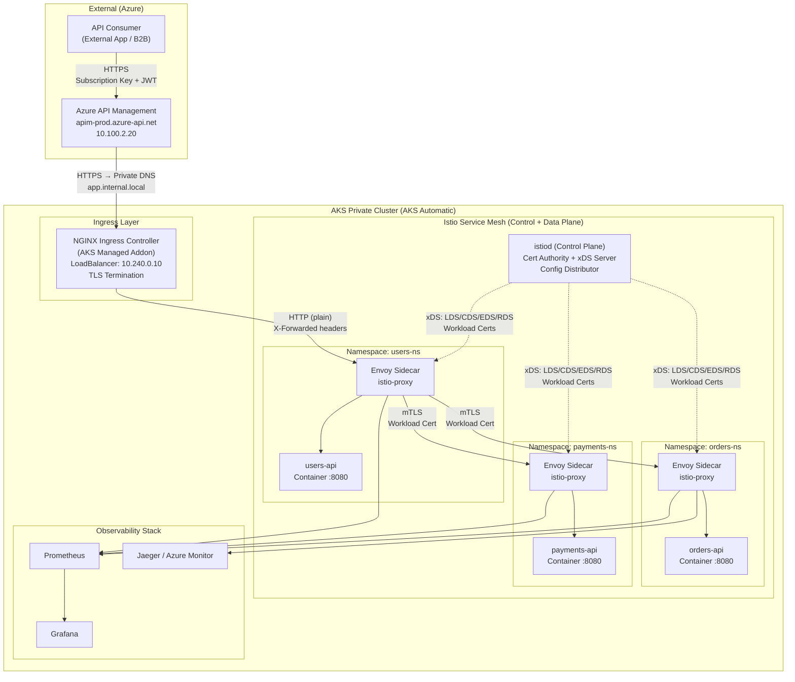
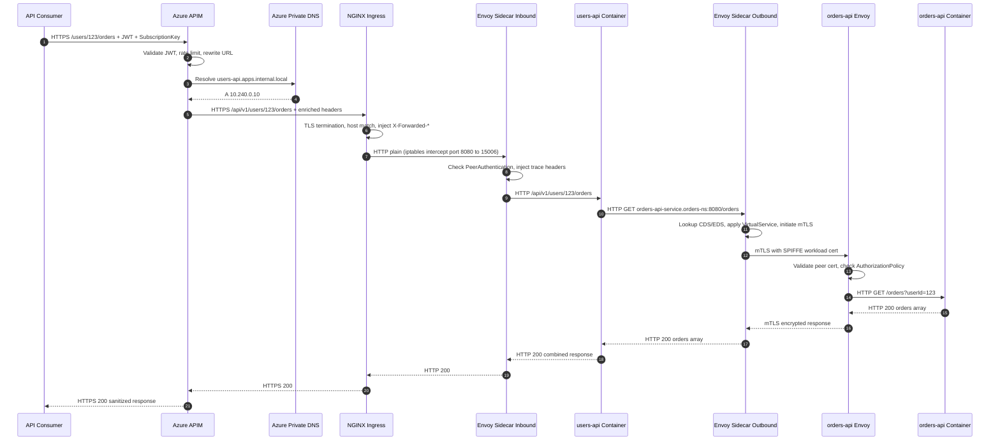
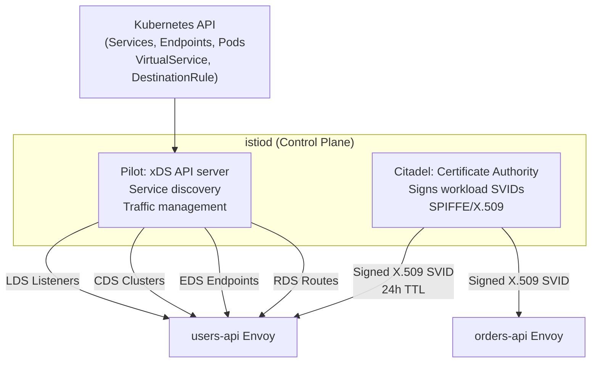
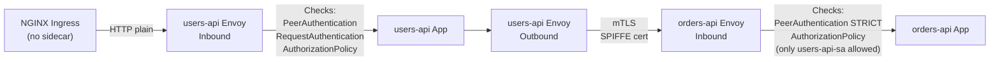

# AKS Service Mesh Engineering: Deep-Dive Architecture & Design

> **Document Type:** nth-Level Engineering Reference  
> **Audience:** Platform Engineers, Solution Architects, Senior Developers  
> **Scope:** AKS Service Mesh (Istio) — Full inbound request lifecycle from APIM through to application microservices  
> **Version:** 1.0 | **Last Updated:** February 2026

---

## Table of Contents

1. [Executive Summary](#1-executive-summary)
2. [Architecture Overview](#2-architecture-overview)
3. [Layer-by-Layer Component Breakdown](#3-layer-by-layer-component-breakdown)
4. [End-to-End Inbound Request Flow (APIM → AKS)](#4-end-to-end-inbound-request-flow-apim--aks)
5. [Istio Service Mesh Deep Dive](#5-istio-service-mesh-deep-dive)
6. [Envoy Sidecar Proxy — The Engine Room](#6-envoy-sidecar-proxy--the-engine-room)
7. [mTLS: Zero-Trust Pod-to-Pod Communication](#7-mtls-zero-trust-pod-to-pod-communication)
8. [Traffic Management & Routing Primitives](#8-traffic-management--routing-primitives)
9. [Observability: Metrics, Traces & Logs](#9-observability-metrics-traces--logs)
10. [Security: Authorization Policies & Mesh Hardening](#10-security-authorization-policies--mesh-hardening)
11. [Microservice Developer Contract](#11-microservice-developer-contract)
12. [Production Configuration Reference](#12-production-configuration-reference)
13. [Troubleshooting Playbook](#13-troubleshooting-playbook)

---

## 1. Executive Summary

### What This Document Covers

This document provides a precise, engineering-level deep dive into how an **AKS-hosted service mesh** (Istio) handles the complete lifecycle of an inbound API request — from the moment it leaves **Azure API Management (APIM)**, transits the AKS ingress boundary, traverses Envoy sidecar proxies, and ultimately reaches an application microservice container.

It is written for engineers who need to understand **not just what** happens, but **exactly how and why** — covering control plane mechanics, data plane packet flow, xDS configuration propagation, certificate lifecycle, header enrichment at every hop, and what microservice code must and must not do.

### Architecture Philosophy

```
┌─────────────────────────────────────────────────────────────────┐
│  PRINCIPLE: The service mesh is infrastructure — microservices  │
│  should be mesh-aware (for context propagation) but             │
│  mesh-agnostic (for business logic). The mesh handles           │
│  mTLS, retries, circuit breaking, and telemetry transparently.  │
└─────────────────────────────────────────────────────────────────┘
```

### Key Design Decisions

| Decision | Choice | Rationale |
|----------|--------|-----------|
| Ingress controller | NGINX (AKS-managed addon) | Native AKS automatic support; APIM terminates TLS before ingress |
| Service mesh | Istio (AKS addon) | Production-grade; native AKS support; Envoy proven at scale |
| mTLS mode | `STRICT` for mesh namespaces | Zero-trust; all pod-to-pod traffic encrypted |
| Certificate authority | Istio CA (istiod) + Azure Key Vault integration | Automatic workload cert rotation; no manual intervention |
| Observability | Prometheus + Grafana + Azure Monitor | Native Istio telemetry v2 + Azure integration |
| Traffic management | VirtualService + DestinationRule | Declarative; GitOps-compatible |

---

## 2. Architecture Overview

### Physical Architecture — Request Journey



### Logical Network Segments

| Segment | CIDR | Description |
|---------|------|-------------|
| APIM Subnet | `10.100.2.0/24` | APIM internal VIP |
| AKS Node Subnet | `10.240.0.0/16` | Node VMs + NGINX LB |
| Pod CIDR | `10.244.0.0/16` | Pod overlay network (Azure CNI Overlay) |
| Service CIDR | `10.0.0.0/16` | ClusterIP services (CoreDNS: `10.0.0.10`) |
| Istio Control Plane | `istio-system` namespace | Dedicated namespace; not mesh-injected |

---

## 3. Layer-by-Layer Component Breakdown

### Layer 1: Azure API Management (APIM)

**Role:** API gateway — authentication, rate limiting, policy enforcement, and backend routing.

**APIM responsibilities on the inbound path:**
1. Validates `Ocp-Apim-Subscription-Key` (subscription key auth)
2. Validates `Authorization: Bearer <JWT>` (Azure Entra ID / OAuth2)
3. Enforces rate limits and quota policies
4. Rewrites the request URL for AKS backend (e.g., `/users/{id}` → `/api/v1/users/{id}`)
5. Resolves backend via **Private DNS** (`users-api.apps.internal.local` → `10.240.0.10`)
6. Establishes TLS connection to **NGINX Ingress** and forwards the enriched request

**APIM adds these headers:**

| Header | Value | Purpose |
|--------|-------|---------|
| `X-Forwarded-For` | Original client IP | Client traceability |
| `X-Forwarded-Proto` | `https` | Preserve original scheme |
| `X-Original-Host` | `api.example.com` | Original public domain |
| `Ocp-Apim-Subscription-Key` | Subscription key | Passed downstream for logging |
| `X-APIM-Request-Id` | UUID | Correlation across APIM logs |
| `Authorization` | `Bearer <JWT>` | Propagated JWT for downstream validation |

**APIM Backend Policy (targeting AKS ingress):**

```xml
<policies>
  <inbound>
    <base />
    <!-- Rate limiting: 200 calls/min per subscription -->
    <rate-limit-by-key calls="200" renewal-period="60"
      counter-key="@(context.Subscription.Id)" />

    <!-- JWT Validation against Entra ID -->
    <validate-jwt header-name="Authorization" failed-validation-httpcode="401"
                  failed-validation-error-message="Unauthorized">
      <openid-config url="https://login.microsoftonline.com/{tenant-id}/v2.0/.well-known/openid-configuration" />
      <required-claims>
        <claim name="aud" match="any">
          <value>{api-app-registration-client-id}</value>
        </claim>
      </required-claims>
    </validate-jwt>

    <!-- Route to AKS backend -->
    <set-backend-service backend-id="aks-users-api-backend" />

    <!-- URL rewrite: /users/{id} → /api/v1/users/{id} -->
    <rewrite-uri template="/api/v1/users/{id}" copy-unmatched-params="true" />

    <!-- Enrich headers -->
    <set-header name="X-Original-Host" exists-action="override">
      <value>@(context.Request.OriginalUrl.Host)</value>
    </set-header>
    <set-header name="X-APIM-Request-Id" exists-action="override">
      <value>@(context.RequestId)</value>
    </set-header>
  </inbound>
  <backend>
    <base />
  </backend>
  <outbound>
    <!-- Strip internal headers before returning to client -->
    <set-header name="X-Powered-By" exists-action="delete" />
    <set-header name="Server" exists-action="delete" />
    <base />
  </outbound>
  <on-error>
    <base />
  </on-error>
</policies>
```

**APIM Backend definition:**

```bash
# Create APIM backend pointing to NGINX Ingress (via Private DNS)
az apim backend create \
  --resource-group rg-aks-prod \
  --service-name apim-prod \
  --backend-id aks-users-api-backend \
  --url "https://users-api.apps.internal.local" \
  --protocol https \
  --tls-validate-certificate-chain true \
  --tls-validate-certificate-name true
```

---

### Layer 2: NGINX Ingress Controller (AKS Managed Addon)

**Role:** L7 reverse proxy — TLS termination at the cluster boundary, host/path-based routing to Kubernetes Services.

**How NGINX integrates with AKS:**
- Deployed as a `DaemonSet` on dedicated ingress nodes (or as a `Deployment`)
- Exposed via an Azure Internal Load Balancer (`LoadBalancer` type Service)
- IP: `10.240.0.10` — registered in Azure Private DNS Zone (`*.apps.internal.local → 10.240.0.10`)
- Reads `Ingress` resources via the Kubernetes API; auto-generates `nginx.conf`
- TLS: cert-manager issues `*.apps.internal.local` certificate (Let's Encrypt or internal CA)

**NGINX Ingress Resource for users-api:**

```yaml
apiVersion: networking.k8s.io/v1
kind: Ingress
metadata:
  name: users-api-ingress
  namespace: users-ns
  annotations:
    kubernetes.io/ingress.class: nginx
    cert-manager.io/cluster-issuer: internal-ca-issuer
    nginx.ingress.kubernetes.io/ssl-redirect: "true"
    nginx.ingress.kubernetes.io/proxy-body-size: "10m"
    nginx.ingress.kubernetes.io/proxy-connect-timeout: "30"
    nginx.ingress.kubernetes.io/proxy-read-timeout: "60"
    nginx.ingress.kubernetes.io/proxy-send-timeout: "60"
    # Pass real client IP to pods
    nginx.ingress.kubernetes.io/use-forwarded-headers: "true"
    nginx.ingress.kubernetes.io/compute-full-forwarded-for: "true"
spec:
  tls:
  - hosts:
    - users-api.apps.internal.local
    secretName: users-api-apps-tls
  rules:
  - host: users-api.apps.internal.local
    http:
      paths:
      - path: /api/v1
        pathType: Prefix
        backend:
          service:
            name: users-api-service
            port:
              number: 8080
```

**What NGINX does to the request:**
1. **TLS termination**: Decrypts the HTTPS request from APIM using `*.apps.internal.local` cert
2. **Host matching**: Matches `users-api.apps.internal.local` → routes to `users-api-service:8080`
3. **Header injection**: Adds `X-Real-IP`, `X-Forwarded-For`, `X-Forwarded-Proto`, `X-Forwarded-Host`
4. **Forwards**: Plain HTTP to Kubernetes Service ClusterIP (`10.0.150.20:8080`)

> **Key insight:** NGINX terminates TLS. Pods receive plain HTTP. It is Istio's job to re-encrypt pod-to-pod traffic via mTLS.

**Headers after NGINX processing (what the pod receives):**

```http
GET /api/v1/users/123 HTTP/1.1
Host: users-api-service.users-ns.svc.cluster.local:8080
X-Real-IP: 10.100.2.20
X-Forwarded-For: 203.0.113.50, 10.100.2.20
X-Forwarded-Proto: https
X-Forwarded-Host: users-api.apps.internal.local
X-Original-Host: api.example.com
X-APIM-Request-Id: 12345678-1234-1234-1234-123456789abc
Authorization: Bearer eyJhbGci...
```

---

### Layer 3: Kubernetes Service (ClusterIP)

**Role:** Stable virtual IP and load balancing across pod replicas. Implemented in the kernel via `kube-proxy` (iptables/IPVS rules).

```yaml
apiVersion: v1
kind: Service
metadata:
  name: users-api-service
  namespace: users-ns
  labels:
    app: users-api
    version: v1
spec:
  type: ClusterIP
  selector:
    app: users-api
  ports:
  - name: http
    port: 8080
    targetPort: http
    protocol: TCP
  - name: metrics
    port: 9090
    targetPort: metrics
    protocol: TCP
```

**How traffic reaches the pod:**
1. NGINX resolves `users-api-service.users-ns.svc.cluster.local` via CoreDNS → `10.0.150.20`
2. Packet hits ClusterIP `10.0.150.20:8080`
3. `kube-proxy` iptables rules DNAT the packet to one of the pod endpoints (e.g., `10.244.1.15:8080`)
4. **BUT** — with Istio installed, the Envoy sidecar intercepts the packet *before* the app container receives it (via iptables `ISTIO_INBOUND` chain)

---

### Layer 4: Envoy Sidecar Proxy (Istio Data Plane)

This is the most critical layer for understanding the service mesh. Every pod in a mesh-labelled namespace has an `istio-proxy` (Envoy) container injected alongside the application container.

**Sidecar injection is triggered by namespace label:**

```yaml
apiVersion: v1
kind: Namespace
metadata:
  name: users-ns
  labels:
    istio-injection: enabled   # ← This triggers automatic sidecar injection
```

**Pod structure after injection:**

```
users-api-pod
├── initContainer: istio-init (sets up iptables rules)
├── container: users-api (your app on port 8080)
└── container: istio-proxy (Envoy on ports 15001, 15006, 15020, 15090)
```

**iptables rules set by `istio-init`:**

```
# ALL outbound traffic is redirected to Envoy port 15001
-A ISTIO_OUTPUT -p tcp -j REDIRECT --to-ports 15001

# ALL inbound traffic is redirected to Envoy port 15006
-A ISTIO_INBOUND -p tcp --dport 8080 -j REDIRECT --to-ports 15006

# Exceptions: Envoy itself (UID 1337) bypasses to prevent loops
-A ISTIO_OUTPUT -m owner --uid-owner 1337 -j RETURN
```

**Result:** Neither incoming nor outgoing TCP connections from the app container ever directly reach the network. **All traffic flows through Envoy first.**

---

## 4. End-to-End Inbound Request Flow (APIM → AKS)

### Complete Annotated Sequence



### Header State at Each Hop

| Hop | Added Headers | Purpose |
|-----|--------------|---------|
| Client → APIM | `Authorization`, `Ocp-Apim-Subscription-Key` | Client authentication |
| APIM → NGINX | `X-Original-Host`, `X-APIM-Request-Id`, `X-Forwarded-For` | Enrichment + correlation |
| NGINX → Envoy | `X-Real-IP`, `X-Forwarded-Host`, `X-Scheme` | Downstream context |
| Envoy → App | `x-b3-traceid`, `x-b3-spanid`, `x-b3-sampled` | Distributed tracing |
| Envoy ↔ Envoy (mTLS) | `x-forwarded-client-cert` (XFCC) | Peer SPIFFE identity |
| APIM → Client (response) | CF-Ray (if Cloudflare used) | Strips internal headers |

---

## 5. Istio Service Mesh Deep Dive

### 5.1 Control Plane — istiod

`istiod` consolidates Pilot (service discovery + traffic management), Citadel (CA), and Galley (config validation) into a single pod in `aks-istio-system`.



### 5.2 xDS API — How Envoy Gets Its Config

When a pod starts, Envoy bootstraps and connects to istiod via gRPC (ADS — Aggregated Discovery Service):

```
1. Envoy starts → reads bootstrap: istiod.aks-istio-system.svc.cluster.local:15010
2. Envoy → istiod: DiscoveryRequest { type_url: "LDS" }
   istiod → Envoy: Listeners for all cluster services
3. Envoy → istiod: DiscoveryRequest { type_url: "CDS" }
   istiod → Envoy: Clusters (one per Service×port)
4. Envoy → istiod: DiscoveryRequest { type_url: "EDS", cluster: "orders-api..." }
   istiod → Envoy: Pod endpoints { 10.244.2.23:8080, 10.244.2.24:8080 }
5. Envoy → istiod: CSR for workload cert
   istiod → Envoy: X.509 SVID (spiffe://cluster.local/ns/users-ns/sa/users-api-sa)
```

**Kubernetes → xDS translation:**

| K8s Object | Translated to | xDS Type |
|-----------|--------------|----------|
| `Service users-api-service` | Cluster: `outbound\|8080\|\|users-api-service.users-ns.svc.cluster.local` | CDS |
| `EndpointSlice` | Endpoints: `[10.244.1.15:8080, 10.244.1.16:8080]` | EDS |
| `VirtualService` retries/timeouts | Route config with retry policy | RDS |
| `DestinationRule` mTLS | TLS context added to Cluster | CDS |
| `PeerAuthentication STRICT` | Inbound listener requires client cert | LDS |
| `AuthorizationPolicy` | RBAC filter on inbound listener | LDS |

### 5.3 AKS Managed Istio Addon

```bash
# Enable Istio addon
az aks mesh enable \
  --resource-group rg-aks-prod \
  --name aks-prod

# Verify istiod
kubectl get pods -n aks-istio-system
# istiod-asm-1-20-xxx   1/1   Running

# Enable sidecar injection (AKS addon uses revision labels)
kubectl label namespace users-ns istio.io/rev=asm-1-20
kubectl label namespace orders-ns istio.io/rev=asm-1-20
kubectl label namespace payments-ns istio.io/rev=asm-1-20

# Restart existing pods to inject sidecars
kubectl rollout restart deployment -n users-ns
kubectl rollout restart deployment -n orders-ns

# Verify injection
kubectl get pod -n users-ns -o jsonpath='{.items[*].spec.containers[*].name}'
# users-api istio-proxy
```

---

## 6. Envoy Sidecar Proxy — The Engine Room

### 6.1 Envoy's Internal Processing Pipeline

Every request through Envoy passes through this pipeline:

```
Inbound (port 15006):
  Network Filter Chain
    └── HTTP Connection Manager (HCM)
          ├── HTTP Filter: istio_stats (generate metrics)
          ├── HTTP Filter: jwt_authn (if RequestAuthentication exists)
          ├── HTTP Filter: rbac (AuthorizationPolicy enforcement)
          ├── HTTP Filter: envoy.router
          └── Route → Upstream Cluster

Outbound (port 15001):
  Listener: 0.0.0.0:15001 (catch-all)
    └── Original destination filter → determine target
          └── Cluster: outbound|8080||orders-api-service.orders-ns.svc.cluster.local
                ├── Load balancer (round-robin by default)
                ├── Outlier detection (passive health check)
                ├── TLS context: ISTIO_MUTUAL (mTLS)
                └── Endpoint: 10.244.2.23:8080
```

### 6.2 Key Envoy Ports

| Port | Name | Purpose |
|------|------|---------|
| `15001` | Outbound | All outbound traffic from app container |
| `15006` | Inbound | All inbound traffic to app container |
| `15008` | HBONE | HTTP/2 tunnel for ambient mesh (future) |
| `15020` | Merged Prometheus | Merged metrics (Envoy + app, if configured) |
| `15021` | Health check | `curl localhost:15021/healthz/ready` |
| `15090` | Envoy Prometheus | Raw Envoy stats export |

### 6.3 Checking Envoy Config in Production

```bash
# Get Envoy's current listener configuration
kubectl exec -n users-ns deploy/users-api -c istio-proxy -- \
  curl -s localhost:15000/listeners | jq '.[].name'

# Get Envoy's cluster health
kubectl exec -n users-ns deploy/users-api -c istio-proxy -- \
  curl -s localhost:15000/clusters | grep orders-api

# Get current routes
kubectl exec -n users-ns deploy/users-api -c istio-proxy -- \
  curl -s localhost:15000/config_dump | jq '.configs[] | select(.["@type"] | contains("RouteConfiguration"))'

# Use istioctl for a human-readable view
istioctl proxy-config listeners deploy/users-api.users-ns
istioctl proxy-config clusters deploy/users-api.users-ns
istioctl proxy-config endpoints deploy/users-api.users-ns
istioctl proxy-config routes deploy/users-api.users-ns

# Check sync status with istiod
istioctl proxy-status
```

---

## 7. mTLS: Zero-Trust Pod-to-Pod Communication

### 7.1 SPIFFE Identity Model

Every workload in the mesh gets a SPIFFE (Secure Production Identity Framework For Everyone) identity encoded in its X.509 certificate:

```
SPIFFE URI format:
  spiffe://cluster.local/ns/<namespace>/sa/<serviceaccount>

Examples:
  users-api:    spiffe://cluster.local/ns/users-ns/sa/users-api-sa
  orders-api:   spiffe://cluster.local/ns/orders-ns/sa/orders-api-sa
  payments-api: spiffe://cluster.local/ns/payments-ns/sa/payments-api-sa
```

### 7.2 mTLS Handshake (TLS 1.3)

```
Client Envoy (users-api) → Server Envoy (orders-api):

1. ClientHello → TLS 1.3, cipher suites, key share
2. ServerHello + Certificate {orders-api SPIFFE cert, istiod CA chain}
3. Client verifies: cert signed by mesh CA? SPIFFE URI matches expected service?
4. Client sends its own Certificate {users-api SPIFFE cert}
5. Server verifies: cert signed by mesh CA? Is caller allowed by AuthorizationPolicy?
6. Encrypted communication established
   Application data tunnelled over this mTLS connection
```

### 7.3 PeerAuthentication — Enforce STRICT mTLS

```yaml
# Apply STRICT mTLS to entire namespace
apiVersion: security.istio.io/v1beta1
kind: PeerAuthentication
metadata:
  name: default
  namespace: orders-ns
spec:
  mtls:
    mode: STRICT    # Reject all plaintext traffic; only mTLS accepted
---
# Per-port exception: allow plaintext health checks from kubelet
apiVersion: security.istio.io/v1beta1
kind: PeerAuthentication
metadata:
  name: orders-api-health-exception
  namespace: orders-ns
spec:
  selector:
    matchLabels:
      app: orders-api
  mtls:
    mode: STRICT
  portLevelMtls:
    9090:           # Metrics port
      mode: PERMISSIVE   # Prometheus scrape does not use mTLS
```

### 7.4 DestinationRule — Configure Client-Side mTLS

```yaml
apiVersion: networking.istio.io/v1beta1
kind: DestinationRule
metadata:
  name: orders-api-dr
  namespace: orders-ns
spec:
  host: orders-api-service.orders-ns.svc.cluster.local
  trafficPolicy:
    tls:
      mode: ISTIO_MUTUAL    # Use Envoy-managed workload cert (not custom cert)
    connectionPool:
      tcp:
        maxConnections: 100
        connectTimeout: 5s
      http:
        http2MaxRequests: 1000
        maxRequestsPerConnection: 10
    outlierDetection:
      consecutive5xxErrors: 5
      interval: 10s
      baseEjectionTime: 30s
      maxEjectionPercent: 50
  subsets:
  - name: v1
    labels:
      version: v1
  - name: v2
    labels:
      version: v2
```

### 7.5 Verifying mTLS is Active

```bash
# Check mTLS status across the mesh
istioctl x check-inject -n orders-ns

# Verify peer authentication policy
kubectl get peerauthentication -A

# Check if mTLS is enforced between two services
istioctl authn tls-check deploy/users-api.users-ns \
  orders-api-service.orders-ns.svc.cluster.local
# HOST:PORT                                          STATUS    SERVER    CLIENT
# orders-api-service.orders-ns.svc.cluster.local:8080  OK       STRICT    ISTIO_MUTUAL

# Watch live mTLS connections in Envoy stats
kubectl exec -n users-ns deploy/users-api -c istio-proxy -- \
  curl -s localhost:15000/stats | grep "ssl.handshake"
```

---

## 8. Traffic Management & Routing Primitives

### 8.1 VirtualService — L7 Routing Rules

```yaml
apiVersion: networking.istio.io/v1beta1
kind: VirtualService
metadata:
  name: orders-api-vs
  namespace: orders-ns
spec:
  hosts:
  - orders-api-service.orders-ns.svc.cluster.local
  http:
  # Canary: 10% traffic to v2
  - match:
    - headers:
        x-canary:
          exact: "true"
    route:
    - destination:
        host: orders-api-service.orders-ns.svc.cluster.local
        subset: v2
      weight: 100

  # Default: 90% v1, 10% v2 (gradual rollout)
  - route:
    - destination:
        host: orders-api-service.orders-ns.svc.cluster.local
        subset: v1
      weight: 90
    - destination:
        host: orders-api-service.orders-ns.svc.cluster.local
        subset: v2
      weight: 10
    # Timeout
    timeout: 10s
    # Retry policy
    retries:
      attempts: 3
      perTryTimeout: 3s
      retryOn: "gateway-error,connect-failure,retriable-4xx"
    # Fault injection (for chaos engineering)
    fault:
      delay:
        percentage:
          value: 0.1    # 0.1% of requests
        fixedDelay: 5s
```

### 8.2 Circuit Breaking

```yaml
apiVersion: networking.istio.io/v1beta1
kind: DestinationRule
metadata:
  name: payments-api-circuit-breaker
  namespace: payments-ns
spec:
  host: payments-api-service.payments-ns.svc.cluster.local
  trafficPolicy:
    outlierDetection:
      # Eject host after 5 consecutive 5xx errors
      consecutive5xxErrors: 5
      # Check interval
      interval: 10s
      # Minimum ejection duration
      baseEjectionTime: 30s
      # Maximum % of hosts that can be ejected
      maxEjectionPercent: 100
      # Also track gateway errors
      consecutiveGatewayErrors: 3
      # Minimum healthy hosts before circuit trips
      minHealthPercent: 0
```

### 8.3 Ingress Gateway vs NGINX — When to Use Each

| Scenario | Use NGINX Ingress | Use Istio IngressGateway |
|----------|-------------------|--------------------------|
| Standard APIM → AKS routing | ✅ Default | ❌ Overkill |
| East-west inter-mesh routing | ❌ N/A | ✅ |
| L7 traffic between mesh clusters | ❌ N/A | ✅ |
| Advanced TLS policy at entry | Partially | ✅ Full control |
| Header-based routing at entry | Via annotations | ✅ VirtualService |

> In this architecture, **NGINX handles the north-south ingress** (APIM → cluster). Istio handles **east-west traffic** (service-to-service inside the mesh). This separation of concerns reduces complexity.

---

## 9. Observability: Metrics, Traces & Logs

### 9.1 Automatic Metrics from Envoy Telemetry v2

Every Envoy sidecar emits these standard metrics **without any application code changes:**

```
# Inbound (server-side) metrics on users-api:
istio_requests_total{
  reporter="destination",
  source_workload="nginx-ingress",
  destination_workload="users-api",
  destination_service="users-api-service.users-ns.svc.cluster.local",
  request_protocol="http",
  response_code="200",
  connection_security_policy="mutual_tls"
}

# Outbound (client-side) metrics on users-api → orders-api:
istio_requests_total{
  reporter="source",
  source_workload="users-api",
  destination_workload="orders-api",
  destination_service="orders-api-service.orders-ns.svc.cluster.local",
  response_code="200",
  connection_security_policy="mutual_tls"
}

# Latency histogram
istio_request_duration_milliseconds_bucket{le="10"} 124
istio_request_duration_milliseconds_bucket{le="25"} 890
```

### 9.2 Distributed Tracing — Header Propagation (Critical!)

Istio injects trace context headers at the first Envoy sidecar. However, **your application MUST propagate these headers** to downstream calls — Envoy cannot do this automatically because it does not know which upstream call corresponds to which incoming request.

**Headers to propagate:**

```
x-request-id          (Envoy unique request ID)
x-b3-traceid          (Zipkin/Jaeger trace ID)
x-b3-spanid           (Current span ID)
x-b3-parentspanid     (Parent span ID)
x-b3-sampled          (Sampling decision)
x-b3-flags            (Trace flags)
traceparent           (W3C TraceContext format — prefer this)
tracestate            (W3C TraceContext state)
```

**Implementation in .NET (Recommended approach):**

```csharp
// Middleware to capture and propagate trace headers
public class TraceContextPropagationMiddleware
{
    private static readonly string[] TraceHeaders = {
        "x-request-id", "x-b3-traceid", "x-b3-spanid", "x-b3-parentspanid",
        "x-b3-sampled", "x-b3-flags", "traceparent", "tracestate"
    };

    private readonly RequestDelegate _next;

    public TraceContextPropagationMiddleware(RequestDelegate next) => _next = next;

    public async Task InvokeAsync(HttpContext context)
    {
        // Store incoming trace headers in AsyncLocal (via Activity)
        var traceHeaders = TraceHeaders
            .Where(h => context.Request.Headers.ContainsKey(h))
            .ToDictionary(h => h, h => context.Request.Headers[h].ToString());

        context.Items["TraceHeaders"] = traceHeaders;
        await _next(context);
    }
}

// DelegatingHandler for HttpClient — propagates headers on all outbound calls
public class TraceContextDelegatingHandler : DelegatingHandler
{
    private readonly IHttpContextAccessor _httpContextAccessor;

    public TraceContextDelegatingHandler(IHttpContextAccessor httpContextAccessor)
        => _httpContextAccessor = httpContextAccessor;

    protected override async Task<HttpResponseMessage> SendAsync(
        HttpRequestMessage request, CancellationToken cancellationToken)
    {
        var ctx = _httpContextAccessor.HttpContext;
        if (ctx?.Items["TraceHeaders"] is Dictionary<string, string> traceHeaders)
        {
            foreach (var (key, value) in traceHeaders)
            {
                if (!request.Headers.Contains(key))
                    request.Headers.TryAddWithoutValidation(key, value);
            }
        }

        // Also propagate using Activity (OpenTelemetry)
        if (Activity.Current != null)
        {
            request.Headers.TryAddWithoutValidation(
                "traceparent", Activity.Current.Id);
        }

        return await base.SendAsync(request, cancellationToken);
    }
}

// Register in Program.cs
builder.Services.AddHttpContextAccessor();
builder.Services.AddTransient<TraceContextDelegatingHandler>();
builder.Services.AddHttpClient("OrdersAPIClient",
    client => client.BaseAddress = new Uri("http://orders-api-service.orders-ns.svc.cluster.local:8080"))
    .AddHttpMessageHandler<TraceContextDelegatingHandler>();
```

### 9.3 Telemetry API — Configure Providers

```yaml
# Configure Azure Monitor as tracing provider
apiVersion: telemetry.istio.io/v1alpha1
kind: Telemetry
metadata:
  name: mesh-default
  namespace: istio-system
spec:
  tracing:
  - providers:
    - name: azure-monitor
    randomSamplingPercentage: 1.0   # 1% sampling in prod (adjust as needed)

---
# Per-service override: sample 100% for payments (compliance)
apiVersion: telemetry.istio.io/v1alpha1
kind: Telemetry
metadata:
  name: payments-full-tracing
  namespace: payments-ns
spec:
  tracing:
  - providers:
    - name: azure-monitor
    randomSamplingPercentage: 100.0
```

### 9.4 Access Log Format (JSON)

```yaml
# MeshConfig accessLogFormat
accessLogFormat: |
  {
    "timestamp": "%START_TIME%",
    "method": "%REQ(:METHOD)%",
    "path": "%REQ(X-ENVOY-ORIGINAL-PATH?:PATH)%",
    "protocol": "%PROTOCOL%",
    "response_code": "%RESPONSE_CODE%",
    "duration_ms": "%DURATION%",
    "upstream_service_time": "%RESP(X-ENVOY-UPSTREAM-SERVICE-TIME)%",
    "x_forwarded_for": "%REQ(X-FORWARDED-FOR)%",
    "apim_request_id": "%REQ(X-APIM-REQUEST-ID)%",
    "traceid": "%REQ(X-B3-TRACEID)%",
    "upstream_host": "%UPSTREAM_HOST%",
    "upstream_cluster": "%UPSTREAM_CLUSTER%",
    "bytes_received": "%BYTES_RECEIVED%",
    "bytes_sent": "%BYTES_SENT%",
    "tls_version": "%DOWNSTREAM_TLS_VERSION%",
    "peer_principal": "%DOWNSTREAM_PEER_PRINCIPAL%"
  }
```

---

## 10. Security: Authorization Policies & Mesh Hardening

### 10.1 AuthorizationPolicy — Zero-Trust Service Access

```yaml
# Default deny-all for orders-ns
apiVersion: security.istio.io/v1beta1
kind: AuthorizationPolicy
metadata:
  name: deny-all
  namespace: orders-ns
spec: {}   # empty spec = deny all

---
# Explicit allow: only users-api can call orders-api
apiVersion: security.istio.io/v1beta1
kind: AuthorizationPolicy
metadata:
  name: allow-users-api-to-orders
  namespace: orders-ns
spec:
  selector:
    matchLabels:
      app: orders-api
  action: ALLOW
  rules:
  - from:
    - source:
        # SPIFFE identity of the caller
        principals:
          - "cluster.local/ns/users-ns/sa/users-api-sa"
    to:
    - operation:
        methods: ["GET", "POST"]
        paths: ["/api/v1/orders*"]
---
# Allow NGINX ingress to reach users-api
apiVersion: security.istio.io/v1beta1
kind: AuthorizationPolicy
metadata:
  name: allow-nginx-to-users-api
  namespace: users-ns
spec:
  selector:
    matchLabels:
      app: users-api
  action: ALLOW
  rules:
  - from:
    - source:
        # NGINX ingress namespace
        namespaces: ["ingress-nginx"]
    to:
    - operation:
        methods: ["GET", "POST", "PUT", "DELETE"]
```

### 10.2 RequestAuthentication — Validate JWT at the Mesh

```yaml
# Validate Entra ID JWTs at the Envoy proxy (before reaching app)
apiVersion: security.istio.io/v1beta1
kind: RequestAuthentication
metadata:
  name: users-api-jwt-auth
  namespace: users-ns
spec:
  selector:
    matchLabels:
      app: users-api
  jwtRules:
  - issuer: "https://sts.windows.net/{tenant-id}/"
    jwksUri: "https://login.microsoftonline.com/{tenant-id}/discovery/v2.0/keys"
    audiences:
    - "{api-app-registration-client-id}"
    forwardOriginalToken: true   # Forward JWT to app for claims extraction
```

> **Note:** RequestAuthentication makes JWT validation *optional* (unauthenticated requests pass through). Combine with AuthorizationPolicy `notPrincipals` to reject unauthenticated requests.

### 10.3 Mesh Security Summary



---

## 11. Microservice Developer Contract

### 11.1 What the Mesh Handles (Do NOT implement in code)

| Capability | Handled By | Developer action |
|-----------|-----------|-----------------|
| TLS between services | Envoy mTLS | Nothing — transparent |
| Retry on failure | VirtualService retryPolicy | Configure in YAML |
| Circuit breaking | DestinationRule outlierDetection | Configure in YAML |
| Load balancing | Envoy (round-robin / least-conn) | Configure in DestinationRule |
| Metrics (request count, latency) | Envoy telemetry v2 | Nothing — automatic |
| Access logs | Envoy access log | Nothing — configure format in MeshConfig |

### 11.2 What App Code MUST Do

```csharp
// 1. Propagate trace headers on all outbound calls (mandatory)
// See TraceContextDelegatingHandler above

// 2. Use Kubernetes internal FQDNs for service-to-service calls
// Good:
var ordersUrl = "http://orders-api-service.orders-ns.svc.cluster.local:8080";
// Bad (unreliable, breaks cross-namespace):
var ordersUrl = "http://orders-api-service";

// 3. Implement health check endpoints (used by readiness probe + Istio)
app.MapHealthChecks("/health/live", new HealthCheckOptions
{
    Predicate = _ => false   // Liveness: always return 200 unless deadlocked
});
app.MapHealthChecks("/health/ready", new HealthCheckOptions
{
    Predicate = check => check.Tags.Contains("ready")   // Readiness: check DB etc
});

// 4. Return appropriate HTTP status codes (Envoy uses these for retries)
// 503 Service Unavailable → Envoy retries
// 429 Too Many Requests → Envoy can retry with backoff
// 500 Internal Server Error → retry if retriable-4xx configured

// 5. Set graceful shutdown timeout > Envoy drain time
builder.WebHost.UseShutdownTimeout(TimeSpan.FromSeconds(30));
// Ensure Envoy drains connections before pod terminates

// 6. Do NOT implement retry loops for inter-service calls
// The mesh handles retries. Double retries amplify traffic.
```

### 11.3 Recommended Deployment Manifest

```yaml
apiVersion: apps/v1
kind: Deployment
metadata:
  name: users-api
  namespace: users-ns
  labels:
    app: users-api
    version: v1
spec:
  replicas: 3
  selector:
    matchLabels:
      app: users-api
      version: v1
  template:
    metadata:
      labels:
        app: users-api      # Required: Istio uses this for traffic management
        version: v1         # Required: Used in DestinationRule subsets
      annotations:
        prometheus.io/scrape: "true"
        prometheus.io/port: "9090"
        prometheus.io/path: "/metrics"
        # Sidecar resource tuning
        sidecar.istio.io/proxyCPU: "100m"
        sidecar.istio.io/proxyMemory: "128Mi"
        sidecar.istio.io/proxyCPULimit: "500m"
        sidecar.istio.io/proxyMemoryLimit: "256Mi"
    spec:
      serviceAccountName: users-api-sa   # Required: maps to SPIFFE identity
      terminationGracePeriodSeconds: 60  # > Envoy drainDuration (30s default)
      containers:
      - name: users-api
        image: myregistry.azurecr.io/users-api:1.2.3
        ports:
        - name: http
          containerPort: 8080
        - name: metrics
          containerPort: 9090
        env:
        - name: ASPNETCORE_ENVIRONMENT
          value: Production
        resources:
          requests:
            cpu: "250m"
            memory: "256Mi"
          limits:
            cpu: "1000m"
            memory: "512Mi"
        # Readiness probe — Istio waits for this before routing traffic
        readinessProbe:
          httpGet:
            path: /health/ready
            port: 8080
          initialDelaySeconds: 10
          periodSeconds: 5
          timeoutSeconds: 3
          failureThreshold: 3
        livenessProbe:
          httpGet:
            path: /health/live
            port: 8080
          initialDelaySeconds: 30
          periodSeconds: 10
```

---

## 12. Production Configuration Reference

### 12.1 Namespace Bootstrap Checklist

```bash
# For each new application namespace:

# 1. Create namespace with Istio injection
kubectl create namespace orders-ns
kubectl label namespace orders-ns istio.io/rev=asm-1-20

# 2. Create ServiceAccount (maps to SPIFFE identity)
kubectl create serviceaccount orders-api-sa -n orders-ns

# 3. Apply PeerAuthentication (STRICT mTLS)
kubectl apply -f peer-authentication-strict.yaml -n orders-ns

# 4. Apply default deny-all AuthorizationPolicy
kubectl apply -f authz-deny-all.yaml -n orders-ns

# 5. Apply specific allow policies
kubectl apply -f authz-allow-users-to-orders.yaml

# 6. Deploy application
kubectl apply -f orders-api-deployment.yaml

# 7. Verify sidecar injected
kubectl get pod -n orders-ns -o jsonpath='{.items[0].spec.initContainers[*].name}'
# istio-init

# 8. Verify mTLS
istioctl authn tls-check deploy/users-api.users-ns \
  orders-api-service.orders-ns.svc.cluster.local
```

### 12.2 Private DNS Zone for NGINX Ingress

```bash
# Create Private DNS Zone
az network private-dns zone create \
  --resource-group rg-aks-prod \
  --name apps.internal.local

# Link to AKS VNet
az network private-dns link vnet create \
  --resource-group rg-aks-prod \
  --zone-name apps.internal.local \
  --name aks-vnet-link \
  --virtual-network aks-prod-vnet \
  --registration-enabled false

# Link to APIM VNet
az network private-dns link vnet create \
  --resource-group rg-aks-prod \
  --zone-name apps.internal.local \
  --name apim-vnet-link \
  --virtual-network apim-vnet \
  --registration-enabled false

# Wildcard record → NGINX Ingress Internal LB IP
az network private-dns record-set a add-record \
  --resource-group rg-aks-prod \
  --zone-name apps.internal.local \
  --record-set-name "*.apps" \
  --ipv4-address 10.240.0.10

# Per-service records (recommended for clarity)
az network private-dns record-set a add-record \
  --resource-group rg-aks-prod \
  --zone-name apps.internal.local \
  --record-set-name "users-api.apps" \
  --ipv4-address 10.240.0.10

az network private-dns record-set a add-record \
  --resource-group rg-aks-prod \
  --zone-name apps.internal.local \
  --record-set-name "orders-api.apps" \
  --ipv4-address 10.240.0.10
```

---

## 13. Troubleshooting Playbook

### 13.1 Request Not Reaching Pod

```bash
# Step 1: Is NGINX reaching the Kubernetes Service?
kubectl exec -n ingress-nginx deploy/ingress-nginx-controller -- \
  curl -s http://users-api-service.users-ns.svc.cluster.local:8080/health/live

# Step 2: Is the pod endpoint registered?
kubectl get endpoints users-api-service -n users-ns
# NAME                ENDPOINTS                         AGE
# users-api-service   10.244.1.15:8080,10.244.1.16:8080   1d

# Step 3: Is the sidecar injected and running?
kubectl get pod -n users-ns -l app=users-api \
  -o jsonpath='{.items[*].status.containerStatuses[*].name}'
# users-api istio-proxy ← both should be present

# Step 4: Is AuthorizationPolicy blocking?
kubectl logs -n users-ns deploy/users-api -c istio-proxy | grep "denied"
# Look for: "rbac_access_denied_fast_path"

# Step 5: Check PeerAuthentication conflict
kubectl get peerauthentication -A
istioctl x check-inject -n users-ns
```

### 13.2 mTLS Handshake Failure

```bash
# Check certificate validity
kubectl exec -n users-ns deploy/users-api -c istio-proxy -- \
  openssl s_client -connect orders-api-service.orders-ns.svc.cluster.local:8080 \
  -cert /var/run/secrets/istio/cert-chain.pem \
  -key /var/run/secrets/istio/key.pem \
  -CAfile /var/run/secrets/istio/root-cert.pem 2>&1 | head -20

# Check cert expiry
kubectl exec -n users-ns deploy/users-api -c istio-proxy -- \
  openssl x509 -in /var/run/secrets/istio/cert-chain.pem -noout -dates
# notAfter=... (should be ~24h from now, auto-rotated)

# Force cert rotation (if stuck)
kubectl rollout restart deployment/users-api -n users-ns
```

### 13.3 APIM Cannot Reach NGINX

```bash
# Verify Private DNS resolution from APIM subnet
# (Run from a VM in the APIM VNet)
nslookup users-api.apps.internal.local 168.63.129.16
# Should return: 10.240.0.10

# Test HTTPS connectivity to NGINX
curl -vk https://users-api.apps.internal.local/health/live

# Verify NGINX Ingress backend service
kubectl describe ingress users-api-ingress -n users-ns
# Check: Default backend, TLS secret present, rules correct

# Check NGINX controller logs
kubectl logs -n ingress-nginx deploy/ingress-nginx-controller | tail -50
```

### 13.4 High Latency Between Services

```bash
# Check Envoy outlier detection (hosts ejected?)
kubectl exec -n users-ns deploy/users-api -c istio-proxy -- \
  curl -s localhost:15000/clusters | grep "outlier_detection"

# Check connection pool exhausted
kubectl exec -n users-ns deploy/users-api -c istio-proxy -- \
  curl -s localhost:15000/stats | grep "overflow"

# Get P99 latency from Prometheus
kubectl port-forward -n monitoring svc/prometheus 9090:9090
# Query: histogram_quantile(0.99, sum(rate(istio_request_duration_milliseconds_bucket{
#   destination_service="orders-api-service.orders-ns.svc.cluster.local"}[5m])) by (le))

# Check if retries are amplifying load
# istio_requests_total with response_code="503" and reporter="source"
# High 503 rate on source = retries happening
```

---

## Appendix: Quick Reference Card

### FQDN Resolution Chain

```
Public:  api.example.com → Cloudflare → 20.123.45.67 (Azure Public IP)
         → FortiGate → APIM (10.100.2.20)

Private: users-api.apps.internal.local → Azure Private DNS → 10.240.0.10 (NGINX)

K8s:     users-api-service.users-ns.svc.cluster.local → CoreDNS → 10.0.150.20 (ClusterIP)
         → kube-proxy DNAT → 10.244.1.15:8080 (Pod)
         → iptables ISTIO_INBOUND → Envoy :15006 → App :8080
```

### TLS Termination Points

| Layer | Terminates | Certificate |
|-------|-----------|-------------|
| Cloudflare (edge) | Client TLS | `*.example.com` (Cloudflare managed) |
| FortiGate (optional) | SSL inspection | Internal CA |
| APIM | APIM gateway TLS | `apim-prod.azure-api.net` (Azure managed) |
| NGINX Ingress | North-south TLS | `*.apps.internal.local` (cert-manager) |
| Envoy sidecar | East-west mTLS | SPIFFE SVID (istiod Citadel, 24h TTL) |

### Istio CRD Summary

| CRD | Layer | Purpose |
|-----|-------|---------|
| `VirtualService` | L7 routing | Traffic splits, retries, timeouts, fault injection |
| `DestinationRule` | Client-side | mTLS mode, load balancing, circuit breaking |
| `PeerAuthentication` | Server-side | Enforce mTLS STRICT/PERMISSIVE per namespace/port |
| `AuthorizationPolicy` | Authz | RBAC — which service can call which endpoint |
| `RequestAuthentication` | AuthN | JWT validation at Envoy (offload from app) |
| `Telemetry` | Observability | Configure tracing provider and sampling rate |
| `EnvoyFilter` | Advanced | Direct Envoy config patching (use sparingly) |


