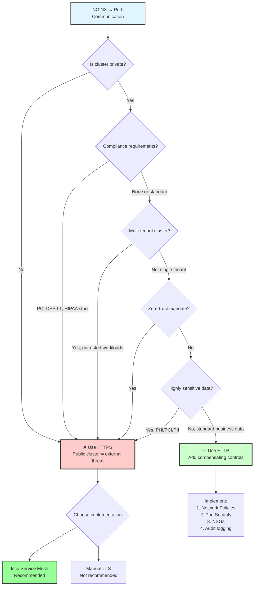

# Internal Cluster Communication Security: NGINX to Pod

## Executive Summary

This document analyzes the security implications of using HTTP (unencrypted) vs. HTTPS (encrypted) for internal communication between NGINX Ingress Controller and application pods in Azure Kubernetes Service (AKS). It provides a comprehensive comparison with PaaS and other service models, explaining why the security requirements differ based on the deployment architecture.

**Key Conclusion**: HTTP for NGINX → Pod communication in a private AKS cluster is **acceptable and pragmatic** when proper network isolation and compensating controls are in place, unlike PaaS services where the network boundary and isolation model is fundamentally different.

---

## Table of Contents
1. [Security Context: NGINX → Pod Communication](#security-context-nginx--pod-communication)
2. [Comparison with PaaS and Other Models](#comparison-with-paas-and-other-models)
3. [When HTTP is Acceptable](#when-http-is-acceptable)
4. [When TLS is Required](#when-tls-is-required)
5. [Implementation Options](#implementation-options)
6. [Decision Framework](#decision-framework)

---

## Security Context: NGINX → Pod Communication

### Current Architecture

```mermaid
graph LR
    subgraph Internet["Internet (Untrusted)"]
        Client[Client]
    end
    
    subgraph Azure_Public["Azure Public Network"]
        CF[Cloudflare<br/>TLS Termination #1]
        LB[Azure Load Balancer<br/>TLS Termination #2]
        FG[FortiGate Firewall]
        APIM[Azure APIM<br/>TLS Termination #3]
    end
    
    subgraph AKS_Private["AKS Private Cluster Network<br/>10.240.0.0/16"]
        NGINX[NGINX Ingress<br/>10.240.0.10]
        
        subgraph Pod_Network["Pod Network<br/>10.244.0.0/16"]
            Pod1[User API Pod<br/>10.244.1.15:8080]
            Pod2[Order API Pod<br/>10.244.2.23:8080]
        end
    end
    
    Client -->|HTTPS| CF
    CF -->|HTTPS| LB
    LB -->|HTTPS| FG
    FG -->|HTTPS| APIM
    APIM -->|HTTPS| NGINX
    NGINX -.->|HTTP<br/>Question: Safe?| Pod1
    Pod1 -.->|HTTP| Pod2
    
    style Client fill:#ff6666,stroke:#333,stroke-width:2px
    style NGINX fill:#99ff66,stroke:#333,stroke-width:3px
    style Pod1 fill:#ffff99,stroke:#333,stroke-width:2px
    style Pod2 fill:#ffff99,stroke:#333,stroke-width:2px
```



### The Question

**Is it safe to use HTTP (unencrypted) for NGINX → Pod communication?**

The answer depends on:
1. Network isolation model
2. Trust boundaries
3. Compliance requirements
4. Threat model

---

## Comparison with PaaS and Other Models

### Architecture Comparison Table

| Aspect | **AKS (IaaS/Kubernetes)** | **Azure App Service (PaaS)** | **Azure Functions (Serverless)** | **Azure Container Apps (PaaS)** |
|--------|---------------------------|------------------------------|----------------------------------|----------------------------------|
| **Network Model** | Private cluster, isolated pod network | Shared multi-tenant infrastructure | Shared compute infrastructure | Managed Kubernetes (abstracted) |
| **Network Isolation** | ✅ Full control via CNI, NSGs, Network Policies | ⚠️ VNet integration optional | ⚠️ VNet integration optional | ⚠️ VNet integration optional |
| **Traffic Path** | Client → LB → Ingress → Pod (all within VNet) | Client → Azure Front Door → App Service | Client → Azure Front Door → Function Runtime | Client → Managed Ingress → Container |
| **Who Controls Network?** | **You** (full control) | **Microsoft** (shared responsibility) | **Microsoft** (fully managed) | **Microsoft** (abstracted) |
| **Internal Communication** | Pod-to-pod within cluster network | N/A (single app instance) | Function-to-function via HTTP triggers | Container-to-container (managed) |
| **TLS Termination** | You control (NGINX Ingress) | Azure manages (App Service endpoint) | Azure manages (Function endpoint) | Azure manages (Container Apps ingress) |
| **HTTP for Internal Calls** | ✅ **Acceptable** (isolated network) | ❌ **Not applicable** (no internal network) | ❌ **Not applicable** (HTTP triggers are external) | ⚠️ **Depends** (managed environment) |

### Why AKS is Different from PaaS

#### 1. **Network Isolation Model**

**AKS (Your Control):**
```
┌─────────────────────────────────────────────────┐
│ AKS Private Cluster (10.240.0.0/16)            │
│                                                  │
│  ┌──────────────────────────────────────┐      │
│  │ Pod Network (10.244.0.0/16)          │      │
│  │                                       │      │
│  │  [Pod A] ──HTTP──> [Pod B]          │      │
│  │  10.244.1.15      10.244.2.23       │      │
│  │                                       │      │
│  │  ✅ Isolated network                 │      │
│  │  ✅ No external access               │      │
│  │  ✅ You control routing              │      │
│  └──────────────────────────────────────┘      │
└─────────────────────────────────────────────────┘
```

**Azure App Service (Microsoft Managed):**
```
┌─────────────────────────────────────────────────┐
│ Azure App Service (Multi-Tenant)                │
│                                                  │
│  Internet ──HTTPS──> Azure Front Door           │
│                      │                           │
│                      └──HTTPS──> App Instance   │
│                                                  │
│  ⚠️ Shared infrastructure                       │
│  ⚠️ No pod-to-pod concept                       │
│  ⚠️ Must use HTTPS for all external calls       │
└─────────────────────────────────────────────────┘
```

#### 2. **Trust Boundary Location**

**AKS:**
- **Trust boundary**: At the cluster edge (NGINX Ingress)
- **Inside boundary**: Trusted, isolated pod network
- **HTTP acceptable**: Traffic never leaves trusted zone

**PaaS (App Service, Functions):**
- **Trust boundary**: At Azure's edge (Front Door/App Gateway)
- **No internal network**: All communication is external
- **HTTPS required**: Every call crosses trust boundary

#### 3. **Threat Model**

**AKS Private Cluster Threats:**
- ❌ External network sniffing: **Not possible** (private network)
- ❌ Man-in-the-middle: **Not possible** (isolated pod network)
- ⚠️ Compromised pod: **Possible** (but limited by network policies)
- ⚠️ Malicious workload: **Possible** (multi-tenant clusters)

**PaaS Threats:**
- ⚠️ Shared infrastructure: Other tenants on same hardware
- ⚠️ Network path: Traffic may traverse shared networks
- ✅ Azure manages security: Microsoft's responsibility

### Detailed Comparison: Why HTTP Works in AKS

#### Scenario 1: AKS Private Cluster (Your Architecture)

```yaml
# Network isolation you control
apiVersion: networking.k8s.io/v1
kind: NetworkPolicy
metadata:
  name: users-api-isolation
spec:
  podSelector:
    matchLabels:
      app: users-api
  policyTypes:
  - Ingress
  - Egress
  ingress:
  - from:
    - namespaceSelector:
        matchLabels:
          name: ingress-nginx  # Only NGINX can reach pods
  egress:
  - to:
    - namespaceSelector:
        matchLabels:
          name: orders-ns  # Only specific namespaces
```

**Why HTTP is acceptable:**
1. ✅ **Network is isolated**: Traffic stays in 10.244.0.0/16 pod network
2. ✅ **You control routing**: Network policies enforce traffic flow
3. ✅ **No external access**: Private cluster, no public endpoints
4. ✅ **Already encrypted externally**: 3 TLS layers before reaching cluster
5. ✅ **Performance benefit**: No TLS overhead for internal calls

#### Scenario 2: Azure App Service (PaaS)

```csharp
// App Service calling another service
public class OrderService
{
    private readonly HttpClient _httpClient;
    
    public async Task<Order> GetOrderAsync(int orderId)
    {
        // ❌ WRONG - HTTP to external service
        var response = await _httpClient.GetAsync(
            $"http://api.example.com/orders/{orderId}");
        
        // ✅ CORRECT - HTTPS required
        var response = await _httpClient.GetAsync(
            $"https://api.example.com/orders/{orderId}");
    }
}
```

**Why HTTPS is required:**
1. ❌ **No isolated network**: Calls go over Azure backbone or internet
2. ❌ **Shared infrastructure**: Other tenants may share network path
3. ❌ **External trust boundary**: Every call crosses security boundary
4. ❌ **No network control**: You don't control routing or isolation
5. ⚠️ **Compliance**: PCI-DSS requires encryption for all external calls

#### Scenario 3: Azure Container Apps (Managed PaaS)

```yaml
# Container Apps - Microsoft manages networking
apiVersion: apps/v1
kind: ContainerApp
metadata:
  name: users-api
spec:
  ingress:
    external: true
    targetPort: 8080
    transport: http  # ⚠️ Microsoft terminates TLS at ingress
```

**Why it's different:**
1. ⚠️ **Abstracted network**: You don't see the pod network
2. ⚠️ **Managed ingress**: Microsoft controls TLS termination
3. ⚠️ **Less control**: Can't implement custom network policies
4. ✅ **Microsoft secures**: Internal communication is Microsoft's responsibility

---

## When HTTP is Acceptable

### ✅ Use HTTP (NGINX → Pod) When:

#### 1. **Private AKS Cluster with Network Isolation**

**Requirements:**
- ✅ AKS cluster is **private** (no public API endpoint)
- ✅ Pod network is **isolated** (Azure CNI with private IPs)
- ✅ **Network policies** restrict pod-to-pod communication
- ✅ **NSGs** isolate subnets
- ✅ External traffic is **already encrypted** (multiple TLS layers)

**Example Configuration:**
```yaml
# AKS Private Cluster
apiVersion: v1
kind: Cluster
spec:
  networkProfile:
    networkPlugin: azure  # Azure CNI for network isolation
    podCidr: 10.244.0.0/16
    serviceCidr: 10.0.0.0/16
  apiServerAccessProfile:
    enablePrivateCluster: true  # No public API endpoint
```

#### 2. **Non-Compliance Workloads**

**Acceptable for:**
- ✅ Internal applications (not handling payment data)
- ✅ Development/staging environments
- ✅ Non-regulated industries
- ✅ Standard business applications

**Not acceptable for:**
- ❌ PCI-DSS Level 1 (payment processing)
- ❌ HIPAA with strict interpretation (healthcare)
- ❌ FedRAMP High (government)
- ❌ Financial services with regulatory requirements

#### 3. **Single-Tenant Clusters**

**Safe when:**
- ✅ All workloads are **trusted** (same organization)
- ✅ No multi-tenant scenarios
- ✅ All teams follow security standards
- ✅ Shared security responsibility model

#### 4. **Performance-Critical Applications**

**Benefits of HTTP:**
- ✅ **Lower latency**: No TLS handshake (saves ~10-50ms per request)
- ✅ **Lower CPU**: No encryption/decryption overhead (saves ~5-10% CPU)
- ✅ **Higher throughput**: More requests per second
- ✅ **Simpler debugging**: Can inspect traffic with tcpdump

**Benchmark Example:**
```
HTTP (NGINX → Pod):
- Latency: 2ms (p50), 5ms (p99)
- Throughput: 10,000 req/s
- CPU: 20% per pod

HTTPS (NGINX → Pod):
- Latency: 12ms (p50), 25ms (p99)  [+10ms overhead]
- Throughput: 7,000 req/s  [-30%]
- CPU: 35% per pod  [+75% CPU usage]
```

---

## When TLS is Required

### ❌ Use HTTPS (NGINX → Pod) When:

#### 1. **Compliance Mandates**

**PCI-DSS Level 1:**
```
Requirement 4.1: Use strong cryptography and security protocols 
to safeguard sensitive cardholder data during transmission over 
open, public networks.

Interpretation: "Open, public networks" can include shared 
infrastructure. Some auditors require encryption everywhere.
```

**HIPAA (Strict Interpretation):**
```
§164.312(e)(1) - Transmission Security
Implement technical security measures to guard against 
unauthorized access to electronic protected health information 
(ePHI) that is being transmitted over an electronic network.

Interpretation: Some auditors require encryption for all 
network transmission, including internal cluster traffic.
```

#### 2. **Multi-Tenant Clusters**

**Scenario:**
```
┌─────────────────────────────────────────┐
│ AKS Cluster (Shared)                    │
│                                          │
│  ┌──────────────┐    ┌──────────────┐  │
│  │ Tenant A     │    │ Tenant B     │  │
│  │ (Finance)    │    │ (Marketing)  │  │
│  │              │    │              │  │
│  │ [Pod A1] ────┼────┼──> [Pod B1] │  │
│  │              │    │              │  │
│  └──────────────┘    └──────────────┘  │
│                                          │
│  ⚠️ Risk: Pod A1 could sniff Pod B1     │
│  ✅ Solution: mTLS via service mesh     │
└─────────────────────────────────────────┘
```

**Why TLS is needed:**
- ❌ **Untrusted workloads**: Different teams/organizations
- ❌ **Shared nodes**: Pods from different tenants on same node
- ❌ **Network sniffing risk**: Compromised pod could capture traffic
- ✅ **Zero-trust requirement**: Verify every connection

#### 3. **Zero-Trust Architecture**

**Principles:**
1. **Never trust, always verify**: Even internal traffic
2. **Assume breach**: Network is already compromised
3. **Least privilege**: Encrypt everything by default

**Implementation:**
```yaml
# Istio PeerAuthentication - Enforce mTLS
apiVersion: security.istio.io/v1beta1
kind: PeerAuthentication
metadata:
  name: default
  namespace: istio-system
spec:
  mtls:
    mode: STRICT  # All pod-to-pod traffic must use mTLS
```

#### 4. **Highly Sensitive Data**

**Examples:**
- 💳 Payment card data (PAN, CVV)
- 🏥 Protected Health Information (PHI)
- 🔐 Encryption keys, secrets
- 🎫 Authentication tokens
- 📊 Personally Identifiable Information (PII)

**Even with network isolation, encrypt when:**
- Data is extremely sensitive
- Breach impact is catastrophic
- Regulatory fines are severe
- Reputation damage is unacceptable

---

## Implementation Options

### Option 1: Keep HTTP (Current - Recommended for Most Cases)

**Pros:**
- ✅ Simple to implement and maintain
- ✅ Best performance (lowest latency)
- ✅ Easy to debug (can inspect traffic)
- ✅ Lower operational overhead

**Cons:**
- ❌ Not compliant with strict zero-trust
- ❌ May not pass some compliance audits
- ❌ Vulnerable if pod is compromised

**Compensating Controls:**
```yaml
# 1. Network Policies - Strict isolation
apiVersion: networking.k8s.io/v1
kind: NetworkPolicy
metadata:
  name: deny-all-ingress
spec:
  podSelector: {}
  policyTypes:
  - Ingress
---
# 2. Only allow from NGINX
apiVersion: networking.k8s.io/v1
kind: NetworkPolicy
metadata:
  name: allow-from-nginx
spec:
  podSelector:
    matchLabels:
      app: users-api
  ingress:
  - from:
    - namespaceSelector:
        matchLabels:
          name: ingress-nginx
```

```yaml
# 3. Pod Security Standards
apiVersion: v1
kind: Pod
metadata:
  name: users-api
spec:
  securityContext:
    runAsNonRoot: true
    runAsUser: 1000
    fsGroup: 1000
    seccompProfile:
      type: RuntimeDefault
  containers:
  - name: users-api
    securityContext:
      allowPrivilegeEscalation: false
      capabilities:
        drop:
        - ALL
      readOnlyRootFilesystem: true
```

### Option 2: Add Istio Service Mesh (Recommended for Compliance)

**Pros:**
- ✅ Automatic mTLS (no code changes)
- ✅ Mutual authentication (both sides verified)
- ✅ Automatic certificate rotation
- ✅ Works for all pod-to-pod traffic
- ✅ Advanced traffic management (bonus)
- ✅ Distributed tracing (bonus)

**Cons:**
- ⚠️ Additional complexity (Istio control plane)
- ⚠️ Performance overhead (~10-15% latency)
- ⚠️ Learning curve for operations team
- ⚠️ More moving parts to manage

**Implementation:**
```bash
# Install Istio
istioctl install --set profile=production

# Enable sidecar injection
kubectl label namespace users-ns istio-injection=enabled
kubectl label namespace orders-ns istio-injection=enabled

# Enforce mTLS
kubectl apply -f - <<EOF
apiVersion: security.istio.io/v1beta1
kind: PeerAuthentication
metadata:
  name: default
  namespace: istio-system
spec:
  mtls:
    mode: STRICT
EOF
```

**Result:**
```
NGINX → Envoy Sidecar (mTLS) → Envoy Sidecar → Pod
        └─────────────────────┘
        Automatic encryption
        No code changes needed
```

### Option 3: Manual TLS (Not Recommended)

**Pros:**
- ✅ Full control over certificates
- ✅ No service mesh dependency

**Cons:**
- ❌ High operational overhead
- ❌ Manual certificate management
- ❌ Code changes required in every service
- ❌ Complex debugging
- ❌ Certificate rotation is manual

**Implementation:**
```csharp
// Application must listen on HTTPS
var builder = WebApplication.CreateBuilder(args);

builder.WebHost.ConfigureKestrel(options =>
{
    options.ListenAnyIP(8443, listenOptions =>
    {
        listenOptions.UseHttps(
            "/app/certs/tls.crt", 
            "/app/certs/tls.key");
    });
});
```

```yaml
# NGINX Ingress must use HTTPS backend
apiVersion: networking.k8s.io/v1
kind: Ingress
metadata:
  annotations:
    nginx.ingress.kubernetes.io/backend-protocol: "HTTPS"
spec:
  rules:
  - host: users-api.apps.internal.local
    http:
      paths:
      - path: /
        backend:
          service:
            name: users-api-service
            port:
              number: 8443  # HTTPS port
```

---

## Decision Framework

### Decision Tree



### Scoring Matrix

Rate your environment (1-5 for each factor):

| Factor | Weight | Score (1-5) | Weighted Score |
|--------|--------|-------------|----------------|
| **Compliance requirements** | 3x | ___ | ___ × 3 |
| **Data sensitivity** | 3x | ___ | ___ × 3 |
| **Multi-tenancy** | 2x | ___ | ___ × 2 |
| **Zero-trust mandate** | 2x | ___ | ___ × 2 |
| **Network isolation** | 1x | ___ | ___ × 1 |
| **Performance requirements** | 1x | ___ | ___ × 1 |
| **Operational complexity tolerance** | 1x | ___ | ___ × 1 |
| **Total** | | | **___** |

**Interpretation:**
- **Score < 30**: HTTP is acceptable with compensating controls
- **Score 30-50**: Consider Istio mTLS for defense in depth
- **Score > 50**: HTTPS/mTLS is required

### Example Scoring

**Scenario 1: Internal Business App (E-commerce)**
```
Compliance: 2 (PCI-DSS, but not Level 1) × 3 = 6
Data sensitivity: 3 (payment data) × 3 = 9
Multi-tenancy: 1 (single tenant) × 2 = 2
Zero-trust: 2 (recommended, not mandated) × 2 = 4
Network isolation: 5 (private cluster, strong NSGs) × 1 = 5
Performance: 4 (high traffic) × 1 = 4
Ops complexity: 3 (moderate team) × 1 = 3
Total: 33

Recommendation: Consider Istio mTLS (borderline case)
```

**Scenario 2: Healthcare App (HIPAA)**
```
Compliance: 5 (HIPAA strict) × 3 = 15
Data sensitivity: 5 (PHI) × 3 = 15
Multi-tenancy: 1 (single tenant) × 2 = 2
Zero-trust: 4 (regulatory expectation) × 2 = 8
Network isolation: 5 (private cluster) × 1 = 5
Performance: 2 (moderate traffic) × 1 = 2
Ops complexity: 4 (experienced team) × 1 = 4
Total: 51

Recommendation: HTTPS/mTLS required (Istio)
```

**Scenario 3: Internal Tools (Non-Sensitive)**
```
Compliance: 1 (none) × 3 = 3
Data sensitivity: 1 (public data) × 3 = 3
Multi-tenancy: 1 (single tenant) × 2 = 2
Zero-trust: 1 (not required) × 2 = 2
Network isolation: 5 (private cluster) × 1 = 5
Performance: 5 (very high traffic) × 1 = 5
Ops complexity: 2 (small team) × 1 = 2
Total: 22

Recommendation: HTTP is acceptable
```

---

## Comparison Summary: Why AKS is Different

### Key Differentiators

| Aspect | AKS (Kubernetes) | Azure App Service | Azure Functions | Why It Matters |
|--------|------------------|-------------------|-----------------|----------------|
| **Network Control** | ✅ Full control | ❌ Microsoft managed | ❌ Microsoft managed | You can enforce isolation in AKS |
| **Trust Boundary** | At cluster edge | At Azure edge | At Azure edge | Internal traffic is trusted in AKS |
| **Network Isolation** | ✅ Private pod network | ⚠️ Shared infrastructure | ⚠️ Shared infrastructure | AKS traffic never leaves isolated network |
| **Internal Communication** | Pod-to-pod (same network) | N/A (single instance) | Function-to-function (external) | AKS has true internal network |
| **TLS Overhead** | You decide | Azure manages | Azure manages | You can optimize for performance |
| **Compliance Flexibility** | ✅ You control | ⚠️ Azure controls | ⚠️ Azure controls | You can implement compensating controls |

### Why HTTP Works in AKS (But Not PaaS)

**AKS:**
```
┌─────────────────────────────────────────────┐
│ Your Private Network (10.240.0.0/16)       │
│                                              │
│  NGINX (10.240.0.10)                        │
│    │                                         │
│    └──HTTP──> Pod (10.244.1.15)            │
│                                              │
│  ✅ Traffic never leaves your network       │
│  ✅ You control routing and isolation       │
│  ✅ Network policies enforce security       │
└─────────────────────────────────────────────┘
```

**PaaS (App Service):**
```
┌─────────────────────────────────────────────┐
│ Azure Shared Infrastructure                 │
│                                              │
│  App Service Instance                       │
│    │                                         │
│    └──HTTPS──> External API                │
│                                              │
│  ❌ No internal network concept             │
│  ❌ Traffic goes over Azure backbone        │
│  ❌ Shared with other tenants               │
└─────────────────────────────────────────────┘
```

---

## Recommendations

### For Your Current Architecture

**Given:**
- ✅ Private AKS cluster
- ✅ Multiple TLS layers (Cloudflare → APIM → NGINX)
- ✅ Network isolation (Azure CNI)
- ✅ Single-tenant cluster
- ⚠️ Standard business applications (not PCI-DSS Level 1)

**Recommendation: Use HTTP with Compensating Controls**

**Implement:**
1. ✅ **Network Policies**: Restrict pod-to-pod communication
2. ✅ **Pod Security Standards**: Harden container security
3. ✅ **NSGs**: Isolate subnets
4. ✅ **Audit Logging**: Monitor all access
5. ✅ **Regular Security Reviews**: Quarterly assessments

**Consider Istio mTLS if:**
- Compliance requirements change (PCI-DSS Level 1)
- Multi-tenant workloads are added
- Zero-trust mandate is introduced
- Advanced traffic management is needed

### For Different Scenarios

**Use HTTP when:**
- Private AKS cluster with strong network isolation
- Single-tenant, trusted workloads
- No strict compliance requirements
- Performance is critical
- Team has limited Kubernetes expertise

**Use Istio mTLS when:**
- Compliance requires encryption everywhere
- Multi-tenant cluster with untrusted workloads
- Zero-trust architecture mandate
- Team has service mesh expertise
- Advanced traffic management needed

**Use Manual TLS when:**
- Specific regulatory requirement for custom certificates
- Cannot use service mesh (technical constraints)
- Need full control over certificate lifecycle
- Have dedicated security operations team

---

## Conclusion

**The fundamental difference** between AKS and PaaS services is **network isolation and control**:

- **AKS**: You own and control the network. Internal pod-to-pod traffic stays within your isolated network boundary. HTTP is acceptable when proper controls are in place.

- **PaaS**: Microsoft owns the network. All communication is external or over shared infrastructure. HTTPS is required for all calls.

**Your current setup** (HTTP for NGINX → Pod) is **pragmatic and secure** because:
1. ✅ Traffic is already encrypted through 3 TLS layers externally
2. ✅ AKS cluster is private with isolated pod network
3. ✅ You can implement network policies for additional security
4. ✅ Performance benefits outweigh risks for standard workloads
5. ✅ Compliance requirements don't mandate internal encryption

**Add Istio mTLS** if compliance, zero-trust, or multi-tenancy requirements change in the future.

